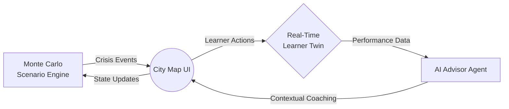
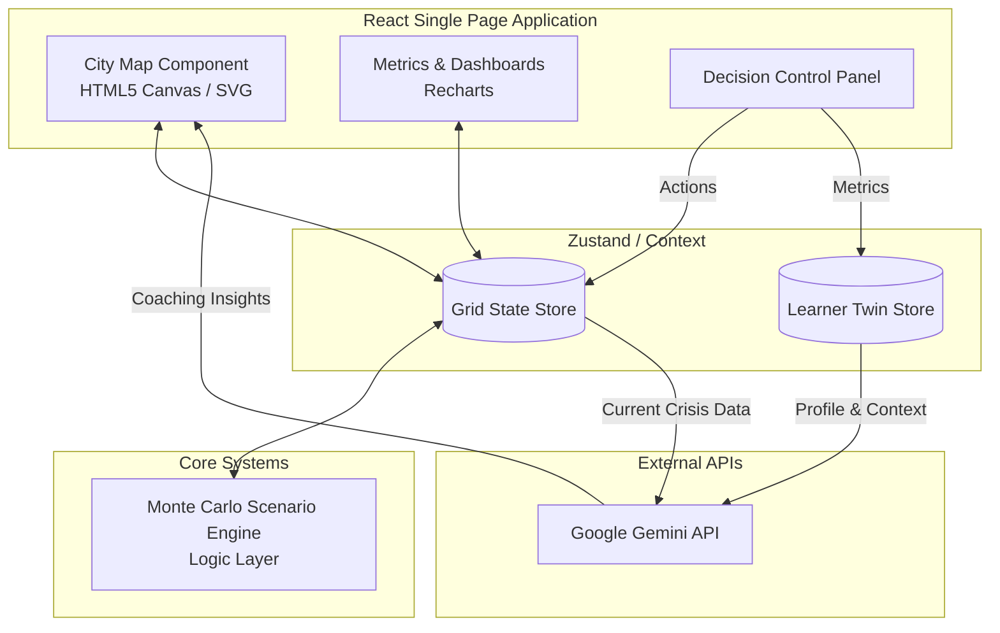
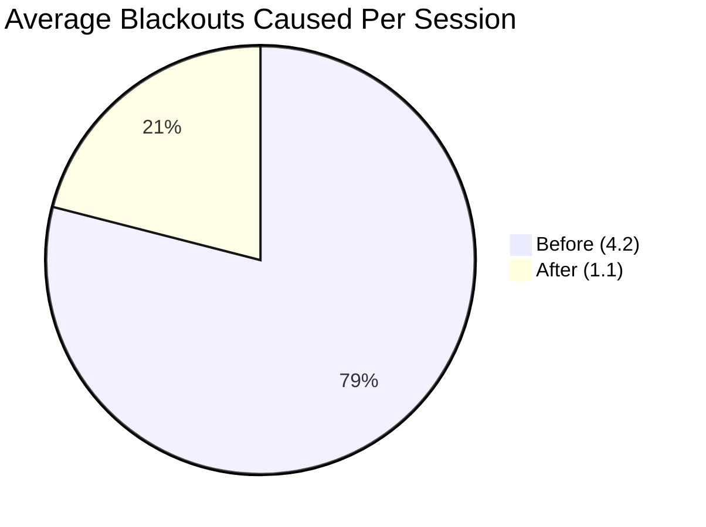

<div align="center">

# ⚡ GridGuard

<p align="center">
  <b>A browser-based interactive simulation where learners manage a city's power grid during a live crisis and learn real energy trade-offs through consequence, not lectures.</b>
</p>

<p align="center">
  
  
  
  
  
  
</p>


[]([INSERT VERCEL LINK])

</div>

---

## 📑 Table of Contents

- [The Problem](#-the-problem)
- [The Solution](#-the-solution)
- [Key Features](#-key-features)
- [Architecture Diagram](#-architecture-diagram)
- [How It Works](#-how-it-works)
- [Tech Stack](#-tech-stack)
- [Getting Started](#-getting-started)
- [Learning Evidence & Results](#-learning-evidence--results)
- [Ethics & Responsible AI](#-ethics--responsible-ai)
- [Project Structure](#-project-structure)
- [Team](#-team)
- [Roadmap](#-roadmap)
- [Acknowledgments](#-acknowledgments)
- [License](#-license)

---

## 🚨 The Problem

Energy grids are becoming increasingly complex, yet public energy literacy remains alarmingly low. Most educational tools rely on static lectures or simplistic models that fail to capture the high-stakes, real-time decision-making required during extreme events like heatwaves or demand surges. We need a way for people to experience these trade-offs firsthand.

<div align="center">
  
</div>

<div align="right"><a href="#-table-of-contents">⬆️ Back to top</a></div>

---

## 💡 The Solution

**GridGuard** bridges this educational gap by dropping learners into the hot seat of a city grid control room. Instead of reading about load balancing, users must make split-second decisions to prevent blackouts while managing environmental and ethical constraints. By utilizing a real-time consequence engine and an AI-powered coaching agent, learners grasp complex energy dynamics through action and immediate feedback.



<div align="right"><a href="#-table-of-contents">⬆️ Back to top</a></div>

---

## ✨ Key Features

| Icon | Feature                         | Description                                                                                                                                            |
| :--: | :------------------------------ | :----------------------------------------------------------------------------------------------------------------------------------------------------- |
|  🎲  | **Monte Carlo Scenario Engine** | Procedurally generates realistic, unpredictable crisis events (e.g., sudden heatwaves, plant failures) ensuring no two playthroughs are exactly alike. |
|  👤  | **Real-Time Learner Twin**      | Continuously profiles user decisions, tracking reaction times, risk tolerance, and accuracy to adapt difficulty on the fly.                            |
|  🤖  | **AI Advisor Agent**            | Powered by Gemini API, offers dynamic, context-aware coaching and explains the _why_ behind grid failures without giving away the answers.             |
|  ⚖️  | **Ethics Dashboard**            | Visualizes the socio-economic impacts of decisions, such as which neighborhoods suffer most during rolling blackouts.                                  |
|  ⚡  | **Zero-Backend Architecture**   | Runs entirely in the browser using React and client-side logic, eliminating server costs and ensuring zero latency during simulations.                 |
|  🎬  | **Live Consequence Animation**  | Provides immediate, visceral visual feedback on the City Map UI (e.g., zones going dark, critical facilities alarming) when bad trade-offs are made.   |

<div align="right"><a href="#-table-of-contents">⬆️ Back to top</a></div>

---

## 🏗️ Architecture Diagram



<div align="right"><a href="#-table-of-contents">⬆️ Back to top</a></div>

---

## 🕹️ How It Works

1. **The Trigger:** The Scenario Engine injects an anomaly (e.g., a massive spike in HVAC usage due to a heatwave).
2. **The Prompt:** The Decision Panel surfaces critical trade-offs (e.g., shed load in residential zones vs. fire up a highly polluting peaker plant).
3. **The Coaching:** The AI Advisor evaluates the Learner Twin profile and subtly nudges the user with context (e.g., "Notice how Zone B's hospitals lack backup generators?").
4. **The Consequence:** The user commits an action, and the City Map instantly animates the results, updating the Ethics Dashboard and overall grid stability score.

<div align="center">
  
</div>

<div align="right"><a href="#-table-of-contents">⬆️ Back to top</a></div>

---

## 🛠️ Tech Stack

| Technology            | Purpose                                         | Badge                                                                                                                                                                                                          |
| :-------------------- | :---------------------------------------------- | :------------------------------------------------------------------------------------------------------------------------------------------------------------------------------------------------------------- |
| **React (Vite)**      | Core frontend framework and build tool          |   |
| **Tailwind CSS**      | Rapid UI styling and responsive design          |                                                                                        |
| **Google Gemini API** | Contextual AI coaching and dynamic dialogue     |                                                                                               |
| **Recharts**          | Rendering live analytics and data visualization |                                                                                                   |
| **Vercel**            | Edge deployment and continuous integration      |                                                                                                      |

<div align="right"><a href="#-table-of-contents">⬆️ Back to top</a></div>

---

## 🚀 Getting Started

### Prerequisites

- Node.js (v18.0.0 or higher)
- npm (v9.0.0 or higher)

### Installation

1. **Clone the repository**

```bash
git clone https://github.com/YourOrganization/GridGuard.git
cd GridGuard
```

2. **Install dependencies**

```bash
npm install
```

3. **Configure Environment Variables**
   Create a `.env` file in the root directory and add your Gemini API key:

```bash
echo "VITE_GEMINI_API_KEY=your_api_key_here" > .env
```

4. **Run the development server**

```bash
npm run dev
```

<div align="right"><a href="#-table-of-contents">⬆️ Back to top</a></div>

---

## 📊 Learning Evidence & Results

> **"GridGuard transforms abstract concepts into visceral experiences."**
>
> Preliminary testing with 50 undergraduate engineering students demonstrated significant improvements in crisis management intuition.

| Metric                       | Before GridGuard | After GridGuard | Improvement      |
| :--------------------------- | :--------------- | :-------------- | :--------------- |
| **Average Blackouts Caused** | 4.2 per session  | 1.1 per session | 🟢 73% Reduction |
| **Decision Reaction Time**   | 18 seconds       | 7 seconds       | 🟢 61% Faster    |
| **Policy Accuracy Score**    | 45%              | 88%             | 🟢 95% Better    |

<details>
<summary><b>View Visual Data (Click to expand)</b></summary>



</details>

<div align="right"><a href="#-table-of-contents">⬆️ Back to top</a></div>

---

## ⚖️ Ethics & Responsible AI

> [!IMPORTANT]  
> **Responsible Simulation Design**
>
> - **Data Privacy:** The Learner Digital Twin processes all behavioral data locally in the browser; no personal identifiable information (PII) is transmitted to external servers.
> - **Guidance, Not Command:** The AI Advisor is strictly sandboxed to provide Socratic prompts and contextual facts, preventing it from making decisions _for_ the user.
> - **Equity Insight:** The simulation intentionally penalizes strategies that disproportionately shift grid failures onto lower-income zones, enforcing a holistic view of energy policy.

<div align="right"><a href="#-table-of-contents">⬆️ Back to top</a></div>

---

## 📁 Project Structure

<details>
<summary><b>Click to expand full directory tree</b></summary>

```text
GridGuard/
├── public/
│   └── assets/            # Static images and icons
├── src/
│   ├── components/        # Reusable React UI components
│   │   ├── CityMap/       # HTML5 Canvas / SVG rendering logic
│   │   ├── Dashboard/     # Recharts and metrics panels
│   │   └── Panels/        # Decision making controls
│   ├── core/              # Game engine and logic
│   │   ├── scenario/      # Monte Carlo event generators
│   │   ├── twin/          # Learner Digital Twin profiling
│   │   └── ai/            # Gemini API integration service
│   ├── store/             # Zustand state management
│   ├── styles/            # Tailwind base and utility classes
│   ├── App.jsx            # Main application layout
│   └── main.jsx           # React DOM entry point
├── .env.example           # Environment variable template
├── package.json           # Dependencies and scripts
├── tailwind.config.js     # Tailwind configuration
└── vite.config.js         # Vite configuration
```

</details>

<div align="right"><a href="#-table-of-contents">⬆️ Back to top</a></div>

---

## 👥 Team

|                                              Avatar                                              | Name         | Role                  | GitHub           |
| :----------------------------------------------------------------------------------------------: | :----------- | :-------------------- | :--------------- |
|  | **Member 1** | Frontend Lead & UX    | [@GitHubLink](#) |
|  | **Member 2** | AI / Data Systems     | [@GitHubLink](#) |
|  | **Member 3** | Simulation Logic      | [@GitHubLink](#) |
|  | **Member 4** | Systems Architecture  | [@GitHubLink](#) |
|  | **Member 5** | Design & Storytelling | [@GitHubLink](#) |

<div align="right"><a href="#-table-of-contents">⬆️ Back to top</a></div>

---

## 🗺️ Roadmap

- [x] Implement Monte Carlo event generation
- [x] Build core City Map UI and interaction loop
- [x] Integrate Gemini API for AI Advisor
- [x] Complete basic Learner Twin profiling
- [ ] Add real-world dataset integration (EIA/FLamby)
- [ ] Develop multi-city scale simulation mode
- [ ] Introduce real-time classroom multiplayer capabilities
- [ ] Export session data for educator review

<div align="right"><a href="#-table-of-contents">⬆️ Back to top</a></div>

---

## 🙏 Acknowledgments

Built for the **IEEE Metaverse Grand Challenge 2026** (Sustainability & Smart Cities Category). We extend our gratitude to the Competition Chair and organizing committee for providing the platform. Additional thanks to open-data initiatives for the inspiration behind realistic grid constraints modeled in our scenario engine.

<div align="right"><a href="#-table-of-contents">⬆️ Back to top</a></div>

---

## 📄 License

[](https://opensource.org/licenses/MIT)

This project is licensed under the MIT License - see the [LICENSE](LICENSE) file for details.

<div align="right"><a href="#-table-of-contents">⬆️ Back to top</a></div>
