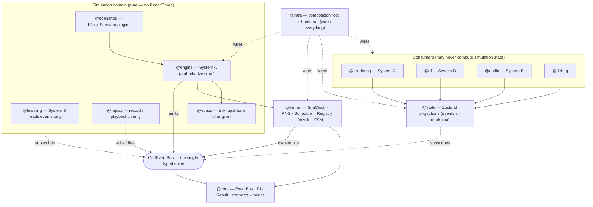

# 01 · High-Level Architecture

GridGuard is built as **six systems (A–F)** sitting on a pure **Simulation Kernel**, which in turn sits on **`core` primitives**. Everything communicates through a single strongly-typed event bus. Dependencies point strictly **down** toward `core`; nothing pure ever points up toward a framework or a consumer.

## The governing shape

- **The simulation is the source of truth.** System A (the engine) owns all authoritative state.
- **Consumers only display.** Systems C/D/E (rendering, UI, audio), plus `state`, `replay`, and `debug`, subscribe to events and read projections. They never compute simulation state.
- **The kernel is domain-agnostic.** It drives systems, owns deterministic time and randomness, and owns the event bus — but knows no physics.
- **Infrastructure is the only layer allowed to see everything.** It wires concrete implementations to tokens at the composition root; it contains no logic.

## Systems and the kernel

| Layer                  | Alias                                                                      | Role                                                                                                                    | Phase-1 state              |
| ---------------------- | -------------------------------------------------------------------------- | ----------------------------------------------------------------------------------------------------------------------- | -------------------------- |
| `core`                 | `@core`                                                                    | EventBus type, DI container, `Result`, errors, branded contracts (Clock/Rng/Logger/Serializer/SimulationSystem), tokens | Real + tested              |
| Simulation Kernel      | `@kernel`                                                                  | `createSimClock`, `createMulberry32`, scheduler, system registry, lifecycle manager, FSM, `createSimulationKernel`      | Real + tested              |
| **A · Simulation**     | `@engine`                                                                  | topology, weather, generation, loads, powerflow, protection, cascade, restoration, director + `SimulationEngine` facade | Placeholders               |
| Crisis scenarios       | `@scenarios`                                                               | `ICrisisScenario` plugin contract + registry + `HeatwaveScenario`                                                       | Registry real, plugin stub |
| **B · Learning**       | `@learning`                                                                | Learner Twin, knowledge tracer, concept graph, reference policy, decision scorer, analytics                             | Placeholders               |
| Ethics                 | `@ethics`                                                                  | EIA snapshot, calibration, equity — pure data, upstream of the engine                                                   | Placeholders               |
| Replay                 | `@replay`                                                                  | recording, playback, serialization, verification, timeline, snapshots                                                   | Placeholders               |
| **C · Presentation**   | `@rendering`                                                               | `scene-graph` (camera/lighting/world) + `visual-effects` (particles/postFX)                                             | Shells                     |
| **D · UI**             | `@ui`                                                                      | app shell, HUD, decision wheel, timeline, replay controls, settings, accessibility, foundation screen                   | Shells                     |
| **E · Audio**          | `@audio`                                                                   | audio engine, adaptive music, ambient, SFX, mixer                                                                       | Placeholders               |
| **F · Infrastructure** | `@infra`                                                                   | composition root, bootstrap, console logger, JSON serializer                                                            | Real                       |
| Projections            | `@state`                                                                   | Zustand read-models updated **by events only**                                                                          | Real                       |
| Support                | `@debug` `@config` `@workers` `@utils` `@constants` `@app-types` `@assets` | overlays, profiles, worker stub, pure helpers, constants, type vocabulary, assets                                       | Mixed                      |

## Layer diagram

## How the layers cooperate at runtime

1. **`@infra`** resolves the active profile and builds a DI container (the composition root), binding each interface token to a concrete implementation.
2. **`@kernel`** owns the single `GridEventBus`, a deterministic `SimClock`, a seeded `mulberry32` RNG, the system registry, and the lifecycle FSM. Each tick it steps registered systems in order, then emits `SimulationTick`.
3. **`@engine`** (System A) is the one `SimulationSystem` that owns authoritative `GridState`. Each tick it runs `weather → generation → load → powerflow → protection → cascade → restoration → director`, emitting typed events for every meaningful change.
4. **`@state`** subscribes to those events and copies payloads into Zustand projections — no computation, just projection.
5. **Consumers** (`@rendering`, `@ui`, `@audio`, `@debug`) read those projections (and, where appropriate, subscribe to events directly) and produce visuals/sound. They never write back.
6. **`@replay`** records the event stream; because the run is deterministic (`seed + events`), it can be re-verified bit-for-bit.

## Why this shape

- **Testability:** the entire simulation is pure data + pure functions, driven by a deterministic clock and RNG. It is unit-testable with no DOM.
- **Independence:** "the simulation compiles if React/Three/UI are deleted" is proven mechanically by `pnpm typecheck:engine` and ESLint import boundaries (see [03](./03-dependency-graph.md)).
- **Extensibility:** new crisis scenarios and new consumers are added at the edges without touching the engine core (open/closed).

See [renderer-purity.md](./renderer-purity.md) for the doctrine and [03](./03-dependency-graph.md) for the enforcement mechanics.
