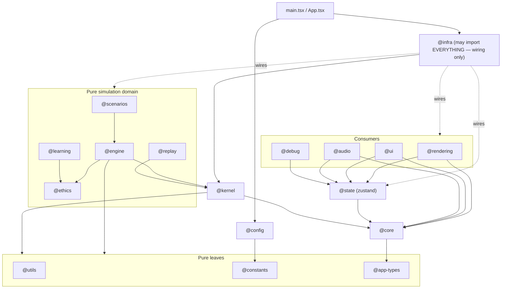
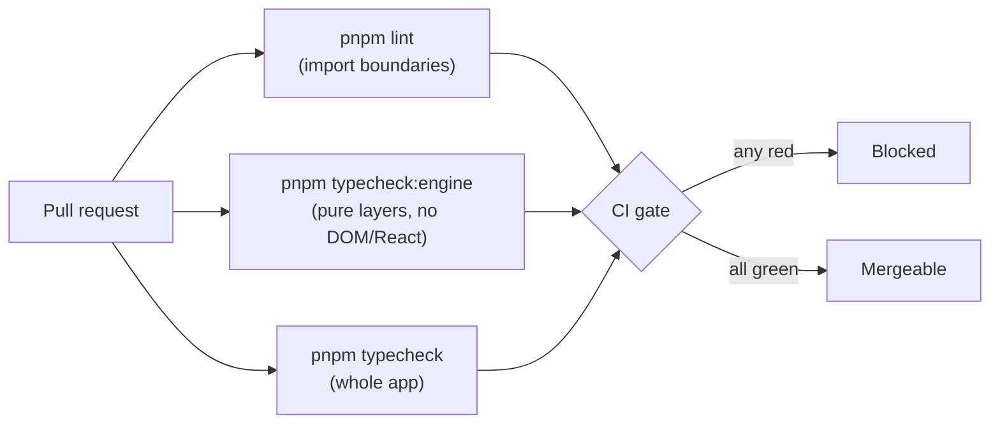

# 03 · Dependency Graph

The single rule: **dependency arrows point down, toward `core`.** A pure layer may only import layers below it. No pure layer may import a UI framework or a consumer. The engine core may not even import its own scenario plugins. These rules are enforced mechanically — a violation fails CI, not code review.

## Allowed import directions

## Per-layer import allow-list

| Layer                                   | May import                                                          | Must never import                                 |
| --------------------------------------- | ------------------------------------------------------------------- | ------------------------------------------------- |
| `@app-types`                            | _(nothing)_                                                         | everything                                        |
| `@utils`, `@constants`                  | `@app-types`                                                        | frameworks, consumers, engine                     |
| `@core`                                 | `@app-types` (+ own submodules)                                     | `@kernel`, `@engine`, frameworks, consumers       |
| `@kernel`                               | `@core`, `@utils`, `@constants`, `@app-types`                       | `@engine`, frameworks, consumers                  |
| `@ethics`                               | `@core`, `@utils`, `@app-types`                                     | `@engine` (it is upstream), frameworks, consumers |
| `@engine`                               | `@core`, `@kernel`, `@ethics`, `@utils`, `@constants`, `@app-types` | **`@scenarios`**, frameworks, consumers           |
| `@scenarios`                            | `@core`, `@engine`, `@kernel`, `@app-types`                         | frameworks, consumers                             |
| `@learning`                             | `@core`, `@ethics`, `@utils`, `@app-types`                          | `@engine`, frameworks, consumers                  |
| `@replay`                               | `@core`, `@kernel`, `@app-types`                                    | frameworks, consumers                             |
| `@state`                                | `@core`, `@app-types`, `@constants`, `zustand`                      | `@engine`, `@kernel`                              |
| `@rendering`, `@ui`, `@audio`, `@debug` | `@core`, `@state`, `@app-types`, frameworks                         | **`@engine`, `@kernel`**                          |
| `@config`                               | `@constants`, `@app-types`                                          | frameworks, consumers                             |
| `@infra`                                | **everything**                                                      | _(nothing — it is the wiring layer)_              |

## The forbidden edges (and why)

| Forbidden edge                                                                            | Why it is banned                                                                                                                                                                              |
| ----------------------------------------------------------------------------------------- | --------------------------------------------------------------------------------------------------------------------------------------------------------------------------------------------- |
| pure layer → `react` / `three` / `@react-three/*` / `gsap` / `howler` / `zustand`         | Guarantees the simulation compiles with the UI deleted. A physics module must not know a renderer exists.                                                                                     |
| pure layer → `@rendering` / `@ui` / `@audio` / `@state` / `@debug` / `@infra` / `@config` | The arrow only points down. Consumers depend on the simulation, never the reverse.                                                                                                            |
| `@engine` (core) → `@scenarios`                                                           | Open/closed: scenarios depend on the engine's `ICrisisScenario`; the engine core references only the interface. Reversing it would make every new scenario an engine change.                  |
| `@rendering` / `@ui` / `@audio` → `@engine` / `@kernel`                                   | Consumers must not touch authoritative state directly. They read projections and subscribe to events. This is the renderer-purity guarantee (see [renderer-purity.md](./renderer-purity.md)). |

## How it is enforced

Two mechanisms, both in CI:

### 1. ESLint `no-restricted-imports` (import boundaries)

`eslint.config.js` defines the enforcement sets:

- `FRAMEWORK_PACKAGES` — `react`, `react-dom`, `three`, `@react-three/*`, `gsap`, `howler`, `zustand`.
- `CONSUMER_ALIASES` — `@rendering`, `@ui`, `@audio`, `@state`, `@debug`, `@infra`, `@config`.
- `PURE_LAYER_GLOBS` — `core`, `kernel`, `engine`, `scenarios`, `learning`, `ethics`, `replay`, `utils`, `constants`, `types`. These may import **neither** framework packages **nor** consumer aliases.
- `ENGINE_CORE_GLOBS` — `core`, `kernel`, `engine`. These additionally may not import `@scenarios`.

A violating import is an **error**, so `pnpm lint` (and CI) fails.

### 2. `tsconfig.engine.json` + `pnpm typecheck:engine` (standalone compilation)

A second TypeScript project that `include`s only the pure layers, with `lib: ["ES2022"]` and `types: []` — **no DOM, no Node, no Vite client types in scope**. If any pure layer references `window`, `document`, a React type, or a Three type, this typecheck fails. This is the literal proof that _"the simulation compiles if React/Three/UI are deleted."_

The `pnpm validate` script chains `typecheck → typecheck:engine → lint → test`, so the whole boundary contract is checkable with one command.
