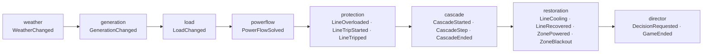
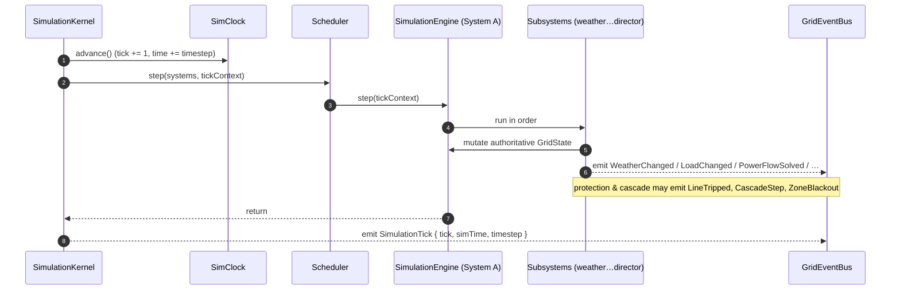

# 04 · Simulation Data Flow

This is the **producer** side: how one tick of simulated time advances the engine and emits events. All authoritative computation happens here and nowhere else. The rendering path ([05](./05-rendering-data-flow.md)) is a pure consumer of what this flow emits.

> Phase 1 note: the kernel tick loop is real and tested, but `SimulationEngine.step` is a placeholder that throws `NotImplementedError`. This document describes the intended flow the placeholders document; the ordering and event contract are already fixed.

## The tick boundary

Time only moves when the kernel calls `clock.advance()`. `createSimulationKernel().tick()` does exactly three things, in order:

1. `clock.advance()` — one fixed timestep (`DEFAULT_TIMESTEP` = 0.1 s at `DEFAULT_TICK_RATE_HZ` = 10 Hz).
2. `scheduler.step(registry.all(), tickContext)` — steps every registered system in **registration order**.
3. `events.emit('SimulationTick', { tick, simTime, timestep })`.

Because registration order _is_ execution order, the composition root registers the engine such that its subsystems run in physical order.

## Subsystem order within the engine

`SimulationEngine.step` orchestrates its subsystems in a fixed physical pipeline. Each stage reads the authoritative `GridState`, mutates it (engine-internal only), and emits typed events for meaningful changes.

| Stage           | Reads                                | Writes (engine-internal)           | Emits                                                         |
| --------------- | ------------------------------------ | ---------------------------------- | ------------------------------------------------------------- |
| **weather**     | scenario schedule, RNG               | current `WeatherKind`, temperature | `WeatherChanged`                                              |
| **generation**  | weather, dispatch                    | per-generator output               | `GenerationChanged`                                           |
| **load**        | weather, zone demand                 | per-zone demand                    | `LoadChanged`                                                 |
| **powerflow**   | topology, gen, load                  | `LineFlow[]` loadings, frequency   | `PowerFlowSolved`                                             |
| **protection**  | line loadings vs `TRIP_THRESHOLD_PU` | `LineState` transitions            | `LineOverloaded`, `LineTripStarted`, `LineTripped`            |
| **cascade**     | tripped lines, redistributed flow    | propagation sequence               | `CascadeStarted`, `CascadeStep`, `CascadeEnded`               |
| **restoration** | cooled lines, re-energisable zones   | `LineState`, `ZoneStatus`          | `LineCooling`, `LineRecovered`, `ZonePowered`, `ZoneBlackout` |
| **director**    | whole `GridState`, learner input     | crisis pacing, outcome             | `DecisionRequested`, `DecisionCommitted`, `GameEnded`         |

## Full tick sequence

## Scenario scripting

A `ICrisisScenario` (e.g. `HeatwaveScenario`) participates without being part of the engine core:

- `setup(context)` runs once before the run, configuring topology/weather via the engine facade.
- `onTick(tickContext)` runs each tick to inject escalation (rising temperature, forced faults, timed events).

The engine references only the `ICrisisScenario` interface, so new scenarios never modify engine code (see [03](./03-dependency-graph.md), open/closed edge).

## Determinism guarantee

Every stochastic decision draws from the kernel's seeded `mulberry32` RNG via `SystemContext.rng`; every time reference comes from `SimClock`. Given the same `seed`, the same registered systems, and the same sequence of `tick()`/`transition()` calls, **the emitted event stream is byte-identical**. This is the property `@replay` verification depends on and the reason `Math.random()` is banned in the engine (see [12](./12-testing-strategy.md), [13](./13-state-ownership.md)).

## What flows _out_ of this document

The only output is **events on the `GridEventBus`**. Nothing in the simulation pushes to a store, a component, or a canvas. Consumers pick the events up next — see [05 · Rendering Data Flow](./05-rendering-data-flow.md).
