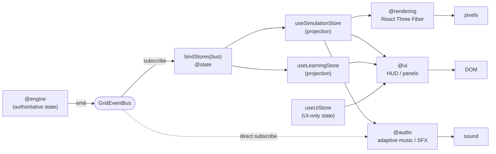

# 05 · Rendering Data Flow

This is the **consumer** side. The renderer, UI, audio, and debug overlay only ever _display_ what the simulation already computed. They read from event-driven projections and subscribe to events. They never compute, infer, cache, or mutate authoritative simulation state.

> The single sentence that governs this whole document: **if a pixel moves, an event caused it.** See [renderer-purity.md](./renderer-purity.md).

## The consumer path



## The three hops

### 1. Event → projection (`@state`)

`bindStores(bus)` is called once at bootstrap. It wires each store's binder to the bus. A binder does nothing but copy payload fields into a Zustand store — no branching logic, no derivation of simulation facts.

Example (the real `bindSimulationStore`):

| Event             | Store write                                        | Store field       |
| ----------------- | -------------------------------------------------- | ----------------- |
| `SimulationTick`  | `setState({ tick, simTime })`                      | `tick`, `simTime` |
| `SimStateChanged` | `setState({ lifecycle: payload.to })`              | `lifecycle`       |
| `PowerFlowSolved` | `setState({ maxLineLoading: payload.maxLoading })` | `maxLineLoading`  |

The store is a **read model**: `SimulationProjection` is a plain record of React-observable fields. Its docstring states the guarantee explicitly — "it never computes simulation."

### 2. Projection → React reads (`@rendering`, `@ui`, `@audio`)

Consumers subscribe to the Zustand stores with hooks (`useSimulationStore(...)`), so a change to a projected field re-renders exactly the components that read it. `RenderRoot` composes the R3F scene (`Lighting`, `CameraRig`, `SceneGraph`, `EffectsPipeline`); `AppShell` composes the DOM HUD; both are pure functions of projection state.

### 3. Reads → visuals

- **`@rendering`** maps `LineFlow.loading` to line color/emissive, `ZoneStatus.state` to district lighting, cascade events to particle bursts and postFX.
- **`@ui`** maps `lifecycle` to the HUD mode, `maxLineLoading` to gauges, `DecisionRequested` to the decision wheel.
- **`@audio`** maps `SimStateChanged`/severity to adaptive music intensity, discrete events (`LineTripped`, `ZoneBlackout`) to SFX.

## Why "pure consumer" is more than a convention

| Mechanism                       | Guarantee                                                                                                                  |
| ------------------------------- | -------------------------------------------------------------------------------------------------------------------------- |
| Projections are copy-only       | Stores have no logic beyond assigning event fields, so a consumer _cannot_ read a simulation fact the engine did not emit. |
| ESLint import boundary          | `@rendering`/`@ui`/`@audio` may not import `@engine` or `@kernel` — they physically cannot call into the simulation.       |
| `zustand` banned in pure layers | The engine cannot write to a store, so the data direction is one-way by construction.                                      |
| Events carry ids + scalars only | Payloads never contain engine model objects, so a consumer cannot hold a live reference to authoritative state.            |

## Zero polling

There is no render-loop that reads engine internals. The flow is strictly **push**: the engine emits, `@state` projects, React re-renders the affected subtree. A component that wants richer detail reads the projection — it never reaches back into the engine. (The R3F render loop itself runs per animation frame, but it only _reads_ already-projected values; it never advances or queries the simulation.)

## Interaction (the one upstream channel)

User input is **not** a back-door into simulation state. A decision travels forward as an event:

```mermaid
sequenceDiagram
    autonumber
    participant U as User
    participant W as DecisionWheel (@ui)
    participant BUS as GridEventBus
    participant E as SimulationEngine

    E-->>BUS: DecisionRequested { decisionId, prompt, options }
    BUS-->>W: render options
    U->>W: choose option
    W-->>BUS: DecisionCommitted { decisionId, optionIndex, simTime }
    BUS-->>E: director consumes on next tick
    Note over W,E: the UI never mutates GridState — it emits intent; the engine decides the effect
```

The UI emits _intent_; the engine remains the sole authority that decides the effect and emits the resulting state changes. See [13 · State Ownership](./13-state-ownership.md).
