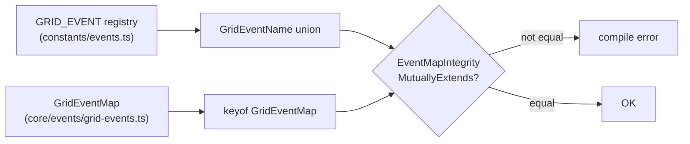

# 06 · Event Architecture

The event bus is the spine of the whole system. The simulation emits; consumers subscribe; there is **zero polling**. Every event name and every payload is strongly typed, and the compiler guarantees the name registry and the payload map can never drift apart.

## The typed `EventBus`

`createEventBus<TEventMap>(options?)` in `@core` returns a `TypedEventBus<TEventMap>` — an in-memory, synchronous, ordered publish/subscribe bus generic over an event map (name → payload type). As of Phase 2 it is a production-grade bus: priority ordering, `once` listeners, wildcard tracing (`onAny`), emit/delivery statistics, optional payload freezing, payload validation, listener-leak detection, and a profiling hook.

| Method                                    | Signature (inferred)                | Purpose                                                                          |
| ----------------------------------------- | ----------------------------------- | -------------------------------------------------------------------------------- |
| `on(name, handler, { priority?, once? })` | payload inferred from `name`        | Subscribe; returns an `Unsubscribe`. Higher `priority` runs first.               |
| `once(name, handler)`                     | payload inferred                    | Subscribe for one dispatch, then auto-remove.                                    |
| `off(name, handler)`                      | payload inferred                    | Remove a specific handler.                                                       |
| `emit(name, payload)`                     | payload type-checked against `name` | Synchronously dispatch to all handlers.                                          |
| `onAny(handler)`                          | traced `EventEnvelope`              | Subscribe to **every** event (debug/replay). The seam `@replay` records through. |
| `clear()`                                 | —                                   | Remove every subscription and `onAny` listener (shutdown/reset).                 |
| `listenerCount(name)`                     | —                                   | Handlers for one event.                                                          |
| `totalListenerCount()`                    | —                                   | Handlers across all events.                                                      |
| `stats()` / `resetStats()`                | `{ emitted, delivered, perEvent }`  | Emit/delivery introspection for the debug overlay.                               |

Key properties:

- **Type inference:** `on('LineTripped', h)` infers `h`'s parameter as `LineTrippedPayload`. A wrong payload shape is a compile error; there are no untyped event strings.
- **Priority + subscription order:** within an event, handlers run `(priority desc, subscription order)`.
- **Snapshot dispatch:** `emit` iterates a copy (`[...handlers]`), so a handler may subscribe/unsubscribe during dispatch without corrupting the current fan-out.
- **`onAny` trace + `EventEnvelope`:** every emit can be observed as `{ name, payload, tick, timestamp, seq }`, where `seq` is a monotonic emit sequence — the deterministic ordering key `@replay` records.
- **Construction options:** `tickProvider`, `timeProvider`, `freezePayloads` (immutability), `leakThreshold` + `onLeak` (leak detection), `validate` (payload validation), `onProfile`.
- **Single instance:** the kernel owns the one `GridEventBus` (`TypedEventBus<GridEventMap>`) and exposes it to consumers via the `EVENT_BUS` token — which in Phase 2 resolves to `kernel.events`, so events are tick-tagged. No layer creates its own.

`GridEventBus = TypedEventBus<GridEventMap>`. The kernel creates the tick-aware bus and it is injected via `EVENT_BUS` into `@state` and every consumer.

## Kernel events vs. domain events

The kernel is **domain-agnostic**: it is generic over `TEvents extends KernelEventMap` and owns only two events. A domain map **extends** it, so kernel events flow on the same bus while the kernel never references a domain event name.

```ts
export interface KernelEventMap {
  SimulationTick: SimulationTickPayload; // { tick, simTime, timestep }
  KernelStateChanged: KernelStateChangedPayload; // { from, to, tick } — from/to are KernelState
}

export interface GridEventMap extends KernelEventMap {
  WeatherChanged: WeatherChangedPayload;
  /* … all electrical/gameplay events … */
}
```

`KernelStateChanged` (formerly `SimStateChanged`) reports the kernel's **runtime lifecycle** (`KernelState`), not a gameplay arc. See [docs/kernel](../kernel/README.md) for the full kernel documentation.

## The `GRID_EVENT` registry

Event names are never string literals in code. `constants/events.ts` exports `GRID_EVENT` (a `const` object) and the derived `GridEventName` union. All code references `GRID_EVENT.X`; the matching payload interface lives in `@core/events/grid-events` (`GridEventMap`).

### Catalogue

Payloads carry only **ids, scalars, and enums** — never engine model objects — which is what keeps `@core` independent of `@engine`.

| Event                | Payload summary                         | Typical emitter                     | Typical subscribers                           |
| -------------------- | --------------------------------------- | ----------------------------------- | --------------------------------------------- |
| `SimulationTick`     | `{ tick, simTime, timestep }`           | kernel (`KernelEventMap`)           | `@state`, `@replay`, `@debug`                 |
| `KernelStateChanged` | `{ from, to, tick }` (`KernelState`)    | kernel (bridged from lifecycle FSM) | `@state`, `@ui`, `@audio`, `@replay`          |
| `WeatherChanged`     | `{ kind, temperature }`                 | engine · weather                    | `@rendering`, `@audio`, `@state`              |
| `LoadChanged`        | `{ zone, demand }`                      | engine · loads                      | `@state`, `@ui`                               |
| `GenerationChanged`  | `{ generator, output }`                 | engine · generation                 | `@state`, `@ui`                               |
| `PowerFlowSolved`    | `{ converged, iterations, maxLoading }` | engine · powerflow                  | `@state`, `@rendering`, `@ui`                 |
| `LineOverloaded`     | `{ line, loading }`                     | engine · protection                 | `@rendering`, `@audio`, `@ui`                 |
| `LineTripStarted`    | `{ line, delay }`                       | engine · protection                 | `@rendering`, `@audio`                        |
| `LineTripped`        | `{ line, cause }`                       | engine · protection                 | `@rendering`, `@audio`, `@state`, `@learning` |
| `LineCooling`        | `{ line }`                              | engine · restoration                | `@rendering`                                  |
| `LineRecovered`      | `{ line }`                              | engine · restoration                | `@rendering`, `@audio`                        |
| `CascadeStarted`     | `{ cascadeId, originLine }`             | engine · cascade                    | `@rendering`, `@audio`, `@ui`, `@learning`    |
| `CascadeStep`        | `{ cascadeId, step, trippedLine }`      | engine · cascade                    | `@rendering`, `@audio`                        |
| `CascadeEnded`       | `{ cascadeId, totalSteps, contained }`  | engine · cascade                    | `@ui`, `@learning`, `@state`                  |
| `ZonePowered`        | `{ zone }`                              | engine · restoration                | `@rendering`, `@audio`                        |
| `ZoneBlackout`       | `{ zone, unservedLoad }`                | engine · restoration                | `@rendering`, `@audio`, `@ui`, `@learning`    |
| `DecisionRequested`  | `{ decisionId, prompt, options }`       | engine · director                   | `@ui` (decision wheel)                        |
| `DecisionCommitted`  | `{ decisionId, optionIndex, simTime }`  | `@ui` → engine                      | engine · director, `@learning`, `@replay`     |
| `LearningUpdated`    | `{ conceptId, mastery }`                | `@learning`                         | `@state` (learning store), `@ui`              |
| `ReplayStarted`      | `{ recordingId }`                       | `@replay`                           | `@ui`, `@rendering`, `@audio`                 |
| `ReplayFinished`     | `{ recordingId, verified }`             | `@replay`                           | `@ui`                                         |
| `GameEnded`          | `{ outcome, score }`                    | engine · director                   | `@ui`, `@audio`, `@learning`, `@replay`       |

> `DecisionCommitted` is the one event a consumer emits — user intent travelling _forward_ to the engine (see [05](./05-rendering-data-flow.md)). Everything else flows simulation → consumers.

## The `EventMapIntegrity` compile check

Adding an event means touching **two** places: `GRID_EVENT` (the name) and `GridEventMap` (the payload). A compile-time assertion in `grid-events.ts` guarantees they stay in lockstep:

```ts
type Assert<T extends true> = T;
type MutuallyExtends<A, B> = [A] extends [B] ? ([B] extends [A] ? true : false) : false;
export type EventMapIntegrity = Assert<MutuallyExtends<keyof GridEventMap, GridEventName>>;
```

If `keyof GridEventMap` and `GridEventName` are ever not the exact same set — a name added to one but not the other — `Assert` receives `false`, and the file fails to compile. There is no runtime cost and no way to forget the pairing.



## Emission and subscription rules

1. **No string literals.** Always `GRID_EVENT.X`; never `'X'`.
2. **The simulation emits; consumers subscribe.** The only forward-flowing exception is `DecisionCommitted`.
3. **Payloads are lightweight facts.** Ids + scalars + enums only; consumers read richer detail from `@state` projections.
4. **One bus.** Injected via `EVENT_BUS`; created once at the composition root; `clear()`ed on shutdown.
