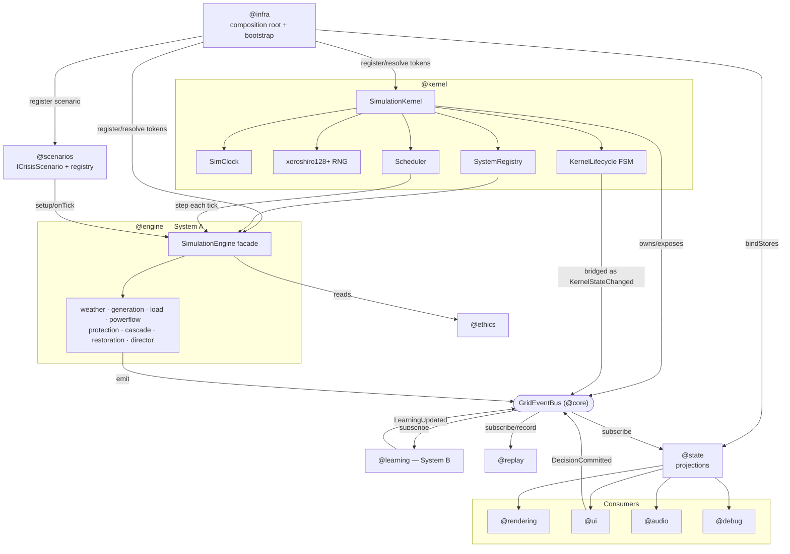
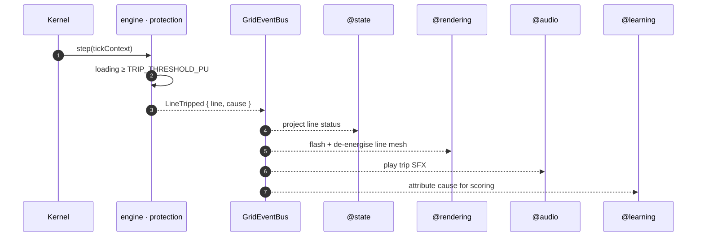

# 07 · Module Interaction

How the modules cooperate at **runtime** (not just at compile time). The composition root wires everything once; from then on all cross-module communication happens through the event bus and through injected interfaces — never through direct imports across the pure/consumer boundary.

## Runtime collaboration map

## Who talks to whom, and how

| From          | To                                | Channel                          | Notes                                                                            |
| ------------- | --------------------------------- | -------------------------------- | -------------------------------------------------------------------------------- |
| `@infra`      | all layers                        | direct import + DI token binding | The only layer allowed to import everything; wiring only, no logic.              |
| `@kernel`     | `@engine` (as `SimulationSystem`) | `registry` + `scheduler.step`    | Kernel drives systems by interface; knows no physics.                            |
| `@kernel` FSM | consumers                         | `KernelStateChanged` on the bus  | Kernel bridges every validated FSM change onto the bus.                          |
| `@scenarios`  | `@engine`                         | `ICrisisScenario.setup/onTick`   | Scenario scripts the engine via its facade; engine core never imports scenarios. |
| `@engine`     | `@ethics`                         | direct import (upstream)         | Ethics is pure data consumed by the engine; never the reverse.                   |
| `@engine`     | everyone                          | events on the bus                | The only way authoritative state leaves the engine.                              |
| `@state`      | `@engine` events                  | `bindStores(bus)` subscriptions  | Copies payloads into projections; no computation.                                |
| consumers     | `@state`                          | Zustand hooks                    | Read-only reactive reads.                                                        |
| consumers     | `@engine`                         | **none**                         | Blocked by ESLint boundary + typecheck:engine.                                   |
| `@ui`         | `@engine`                         | `DecisionCommitted` on the bus   | User intent flows forward as an event; the engine decides the effect.            |
| `@learning`   | consumers                         | `LearningUpdated` on the bus     | Learning observes events only; never imports the engine.                         |
| `@replay`     | the run                           | records/replays the event stream | `seed + events` reproduces a run bit-for-bit.                                    |

## Wiring vs. running

There are two distinct phases of interaction:

### Wiring (once, at bootstrap)

`createCompositionRoot(config)` registers every token → concrete implementation in the DI container:

- **Real:** `CONFIG_SERVICE`, `LOGGER`, `SERIALIZER`, `EVENT_BUS`, `SIMULATION_KERNEL`, `SCENARIO_REGISTRY` (+ `HeatwaveScenario`).
- **Placeholders:** every `@engine` subsystem (`TOPOLOGY_SERVICE`, `WEATHER_MODEL`, `POWER_FLOW_SOLVER`, `PROTECTION_SYSTEM`, `CASCADE_ENGINE`, `RESTORATION_CONTROLLER`, `DIRECTOR`, `SIMULATION_ENGINE`, …), all of `@learning`, `@ethics`, `@replay`, `@audio`, `@debug`, `@workers`.

Swapping a placeholder for a real implementation later is a **one-line change** at the composition root; nothing else depends on the concrete type.

### Running (every tick / every event)

Once bound, no module reaches across boundaries by name. The engine emits, `@state` projects, consumers render — all through the bus and the injected interfaces. This is what makes the system open for extension (add a scenario, add a consumer) but closed to accidental coupling.

## Example: a line trips

One authoritative fact, emitted once, consumed independently by four modules — none of which can touch the engine directly.
