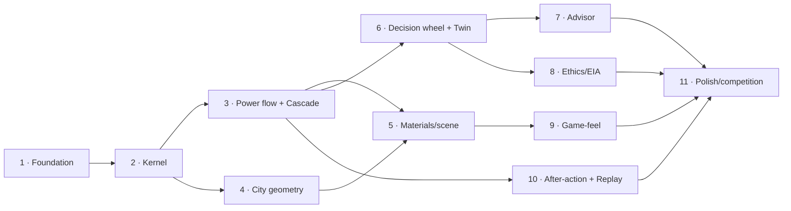

# 09 · Development Roadmap

Phase 1 delivered the **foundation**: the architecture, contracts, and placeholders. Phase 2 delivered the **deterministic simulation kernel** — now domain-agnostic, real, and heavily tested (see [docs/kernel](../kernel/README.md)). Every later phase swaps a placeholder for a real implementation behind an already-fixed interface — a one-line change at the composition root — so the boundaries never move again.

## Phase overview

| Phase  | Theme                            | Delivers                                                                                                                                                                                                                                                                                                                                                                                                                                                              | Status   |
| ------ | -------------------------------- | --------------------------------------------------------------------------------------------------------------------------------------------------------------------------------------------------------------------------------------------------------------------------------------------------------------------------------------------------------------------------------------------------------------------------------------------------------------------- | -------- |
| **1**  | Foundation & architecture        | Tooling, layers, `@core` primitives, `@kernel` (clock, RNG, scheduler, registry, lifecycle, FSM), event bus + `GRID_EVENT`, DI + composition root, scenario registry + heatwave stub, config profiles, all interface + placeholder surface, 17 architecture docs, 8 test files / 41 tests                                                                                                                                                                             | **Done** |
| **2**  | Deterministic Simulation Kernel  | Domain-agnostic `SimulationKernel<TEvents extends KernelEventMap>`: `xoroshiro128+` RNG, fixed-timestep clock, `KernelState` runtime lifecycle FSM, deterministic system registry + task scheduler, diagnostics, snapshots (canonicalize + FNV hash), production event bus (`onAny`/priority/stats/freeze/leak), **real `@replay`** (record/serialize/play/verify/snapshot-store), competition profile; 100 tests / 15 files. See [docs/kernel](../kernel/README.md). | **Done** |
| **3**  | Power flow, cascade & protection | Real `PowerFlowSolver` (DC → AC), `TopologyService`, `WeatherModel`, `GenerationModel`, `LoadModel`; register the engine as a kernel system and drive the tick loop; real `ProtectionSystem` (thermal trip vs `TRIP_THRESHOLD_PU`), `CascadeEngine` (flow redistribution + propagation), `RestorationController`; `PowerFlowSolved`/`LineTripped`/`CascadeStep`/`ZoneBlackout` become live                                                                            | Planned  |
| **4**  | City geometry                    | Procedural/authored city + grid topology in 3D; districts mapped to zones; scene-graph world structure                                                                                                                                                                                                                                                                                                                                                                | Planned  |
| **5**  | Materials & scene                | R3F `<Canvas>`, camera rig, lighting, PBR materials, line/zone visual mapping from projections                                                                                                                                                                                                                                                                                                                                                                        | Planned  |
| **6**  | Decision wheel + Learner Twin    | `Director` decision flow (`DecisionRequested`/`DecisionCommitted`); `LearnerTwin`, `KnowledgeTracer`, `ConceptGraph`, `DecisionScorer`; `LearningUpdated` live                                                                                                                                                                                                                                                                                                        | Planned  |
| **7**  | Advisor                          | LLM advisor as a **deferred `@infra` external-service adapter** (not a core system); consumes events, offers guidance                                                                                                                                                                                                                                                                                                                                                 | Planned  |
| **8**  | Ethics / EIA                     | Real `EiaSnapshot`, `CalibrationService`, `EquityAnalyzer`; equity-aware scoring feeding the director/learning                                                                                                                                                                                                                                                                                                                                                        | Planned  |
| **9**  | Game-feel                        | Audio (`AdaptiveMusic`, ambient, SFX, mixer), postFX pipeline, GSAP transitions, haptics of the console feel                                                                                                                                                                                                                                                                                                                                                          | Planned  |
| **10** | After-action & replay            | Replay **core already real in Phase 2** (record/serialize/play/verify/snapshots); remaining: `Timeline` marker extraction, the After-Action report, and `ReplayStarted`/`ReplayFinished` wired live                                                                                                                                                                                                                                                                   | Planned  |
| **11** | Polish & competition             | Performance passes, accessibility, competition profile hardening, demo scripting, judging evidence                                                                                                                                                                                                                                                                                                                                                                    | Planned  |

## Dependency of phases

## What each phase reuses from Phase 1

- **The event contract** (`GRID_EVENT` + `GridEventMap extends KernelEventMap`) is already fixed. Phase 3 turns already-catalogued domain events from documented-but-silent into live.
- **The kernel lifecycle FSM** (`KernelState`: `Boot → … → Idle → Running ⇄ Paused → Replay → Shutdown → Disposed`) is real now; later phases drive the transitions rather than redefine them. The gameplay arc (calm → cascade → recovery) is a future **domain** concern, no longer a kernel FSM.
- **The composition root** already binds every token to a placeholder. "Implementing phase N" means replacing `new PlaceholderX()` with the real factory — no consumer changes.
- **The projections** (`@state`) already subscribe to the events; as physics goes live the UI/renderer light up with no wiring changes.

## Explicitly deferred (by design, per the spec)

| Item                                            | Where it lands                                                                                                                                    |
| ----------------------------------------------- | ------------------------------------------------------------------------------------------------------------------------------------------------- |
| LLM Advisor                                     | Phase 7 — `@infra` external-service adapter, not a core system.                                                                                   |
| Web Worker offload                              | Contract stubbed now (`SIMULATION_WORKER_BRIDGE`); real worker when frame budget under cascade demands it (see [11](./11-performance-budget.md)). |
| Real physics (power flow, cascade, restoration) | Phase 3 — placeholders throw `NotImplementedError` today.                                                                                         |
| 3D city + scene                                 | Phases 4–5.                                                                                                                                       |
