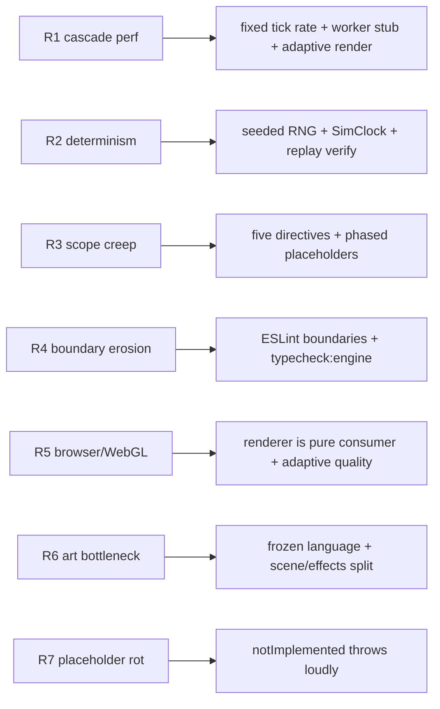

# 10 · Risk Analysis

The architecture is designed so the highest-impact risks are contained by _structure_, not vigilance. This document names the principal risks, their impact, and the mitigation already baked into the foundation.

## Risk register

| #   | Risk                                                                                                                                        | Likelihood | Impact | Mitigation (mostly structural)                                                                                                                                                                                                                                                                                                     |
| --- | ------------------------------------------------------------------------------------------------------------------------------------------- | ---------- | ------ | ---------------------------------------------------------------------------------------------------------------------------------------------------------------------------------------------------------------------------------------------------------------------------------------------------------------------------------- |
| R1  | **Performance collapse under cascade** — a large cascade emits many events + heavy power-flow solves in one tick, blowing the frame budget. | Medium     | High   | Fixed sim tick rate (10 Hz) decoupled from render frame rate; sim can run behind the frame loop. Stubbed `SIMULATION_WORKER_BRIDGE` lets the whole sim move off the main thread with zero consumer changes. Adaptive pixel ratio + postFX caps ([11](./11-performance-budget.md)). Events carry scalars only, so fan-out is cheap. |
| R2  | **Determinism drift** — a run stops reproducing, breaking replay verification and tests.                                                    | Medium     | High   | Single seeded `mulberry32` RNG + fixed-timestep `SimClock`; `Math.random()` and wall-clock time banned in pure layers ([08](./08-coding-standards.md)). Replay verification re-runs `seed + events` and compares. `typecheck:engine` keeps non-deterministic (DOM/time) APIs out of scope.                                         |
| R3  | **Scope creep** — "just one more feature" erodes the simulation-first discipline.                                                           | High       | Medium | The five governing directives are the acceptance lens; every feature must strengthen a pillar. Placeholders + phased roadmap ([09](./09-development-roadmap.md)) keep additions behind fixed interfaces. Renderer-purity doctrine forbids decorative state.                                                                        |
| R4  | **Boundary erosion** — a consumer quietly imports the engine, or a pure layer reaches for a framework.                                      | Medium     | High   | ESLint `no-restricted-imports` + `tsconfig.engine.json` fail CI on violation ([03](./03-dependency-graph.md)). This is mechanical, not review-dependent.                                                                                                                                                                           |
| R5  | **Browser compatibility / WebGL variance** — Three.js/WebGL behaves differently across GPUs, or WebGL2 is unavailable.                      | Medium     | Medium | Renderer is a pure consumer, so a degraded/absent renderer never affects the simulation. Adaptive quality (pixel ratio, shadows, postFX toggles) is profile-driven. Node 20+ / modern-evergreen target.                                                                                                                            |
| R6  | **Art / asset bottleneck** — 3D city, materials, and audio are slow, specialized work that can stall the schedule.                          | High       | Medium | Frozen visual language up front removes churn. Scene-graph/effects split lets structure land before final art. Assets sit behind `@assets` + the scene graph, so late art swaps are localized. Simulation ships and is judged even with placeholder visuals.                                                                       |
| R7  | **Placeholder rot** — a placeholder is wired but silently never implemented, or is called in production.                                    | Low        | Medium | `notImplemented()` throws loudly with the symbol + planned behavior; a placeholder call is an immediate, self-describing failure, never a silent wrong answer. Phase gating tracks which tokens are still placeholders.                                                                                                            |
| R8  | **Over-engineering the kernel** — abstraction cost outweighs benefit for a hackathon timeline.                                              | Low        | Low    | DI is a tiny hand-rolled container (no decorators/reflection); the event bus is ~90 lines; the kernel is domain-agnostic and already tested. Complexity is bounded and paid for by testability.                                                                                                                                    |

## Risk-to-mitigation map

## Residual risks to watch

- **AC power-flow convergence** (Phase 2): Newton-Raphson may not converge on stressed topologies. Mitigation plan: DC approximation first, iteration caps, and `PowerFlowSolved.converged` already in the payload so consumers can react to non-convergence.
- **Cascade combinatorics** (Phase 3): pathological topologies could cascade unboundedly. Mitigation plan: step caps, `CascadeEnded.contained` flag, and the fixed tick budget bounding per-tick work.
- **Learner-model validity** (Phase 6): knowledge tracing accuracy is a research risk, not an architectural one; it is isolated in `@learning` and observes events only, so a weak model never corrupts the simulation.
