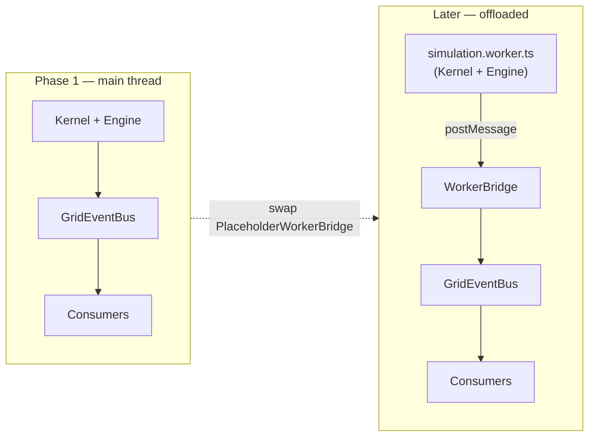

# 11 · Performance Budget

Performance is a first-class constraint because the demo is judged live. The core design decision — **decoupling the fixed-timestep simulation from the render frame rate** — is what lets the simulation stay correct and deterministic even when rendering is under pressure.

## Two independent clocks

| Clock          | Rate                                                        | Driven by                                    | Property                                                                     |
| -------------- | ----------------------------------------------------------- | -------------------------------------------- | ---------------------------------------------------------------------------- |
| **Simulation** | `DEFAULT_TICK_RATE_HZ` = 10 Hz (`DEFAULT_TIMESTEP` = 0.1 s) | `SimClock.advance()` in the kernel tick loop | Fixed timestep; deterministic; wall-clock-decoupled.                         |
| **Render**     | 60 fps target (30 fps floor)                                | R3F/browser animation frame                  | Variable; reads projections; may skip/interpolate without affecting the sim. |

Because they are independent, a heavy render frame never changes simulated physics, and a heavy sim tick never corrupts a frame — it only means the frame renders slightly stale projected state, which is acceptable and invisible at 10 Hz sim / 60 fps render.

## Frame budget

Target **16.7 ms/frame (60 fps)** on desktop, with a hard floor of **33.3 ms/frame (30 fps)** before adaptive quality intervenes.

| Slice                       | Budget (of 16.7 ms) | Notes                                                                         |
| --------------------------- | ------------------- | ----------------------------------------------------------------------------- |
| Simulation tick (amortized) | ~2–4 ms             | Only runs ~every 6th frame at 10 Hz vs 60 fps; can be moved to a worker (R1). |
| Event fan-out + projection  | < 1 ms              | Payloads are scalars; Zustand `setState` is cheap; zero polling.              |
| React reconciliation        | ~2–3 ms             | Only components reading changed projections re-render.                        |
| R3F scene render            | ~6–9 ms             | Draw calls, materials, shadows — the main variable cost.                      |
| Postprocessing              | ~1–3 ms             | Capped; first to be reduced under budget pressure.                            |

## Adaptive rendering levers

All render tunables live in `@config` `RenderConfig`, resolved per profile:

| Lever              | Constant / config            | Default               | Under pressure             |
| ------------------ | ---------------------------- | --------------------- | -------------------------- |
| Device pixel ratio | `MAX_DEVICE_PIXEL_RATIO` = 2 | clamp DPR to `[1, 2]` | drop toward 1              |
| Postprocessing     | `render.postProcessing`      | on                    | reduce passes, then off    |
| Shadows            | `render.shadows`             | on                    | lower resolution, then off |

The R3F `<Canvas>` mounts with `dpr={[1, cfg.render.maxPixelRatio]}` (documented in `RenderRoot`), so the renderer never pays for more than 2× pixels regardless of display density — a Retina/4K panel cannot silently quadruple fragment cost.

## Simulation cost controls

- **Fixed work per tick:** the subsystem pipeline runs once per tick; there is no unbounded loop except cascade propagation, which is bounded by step caps and `CascadeEnded.contained` ([10](./10-risk-analysis.md)).
- **Scalar events:** payloads never carry model objects, so emitting thousands of events during a cascade stays cheap and GC-friendly.
- **No polling:** consumers are push-driven; nothing scans engine state every frame.

## Worker-offload path (stubbed now)

The `SIMULATION_WORKER_BRIDGE` token + `ISimulationWorkerBridge` contract already exist (`@workers`). Phase 1 resolves them to `PlaceholderWorkerBridge`; the sim runs on the main thread. When cascade load threatens the frame budget, the real bridge moves the kernel into `simulation.worker.ts` with **zero changes to consumers** — they still subscribe to the same bus, marshaled across the worker boundary via `WorkerRequest`/`WorkerResponse`.

## Profiles and performance

| Profile       | Overlay | Log level | Intent                                      |
| ------------- | ------- | --------- | ------------------------------------------- |
| `development` | on      | debug     | full instrumentation; perf not primary      |
| `demo`        | off     | info      | full visuals, fixed seed, smooth showcase   |
| `production`  | off     | warn      | quiet, full visuals                         |
| `competition` | off     | info      | deterministic seed, overlay off, judged run |

All profiles currently keep `postProcessing` and `shadows` on with `maxPixelRatio = 2`; the adaptive levers exist to degrade gracefully under live conditions rather than to ship a permanently reduced mode.

## Measurement

`@debug` provides `DebugOverlay` + a metrics collector (`METRICS_COLLECTOR`) to surface frame time, tick time, draw calls, and event throughput during development. Because it is a consumer, enabling it never perturbs the simulation.
