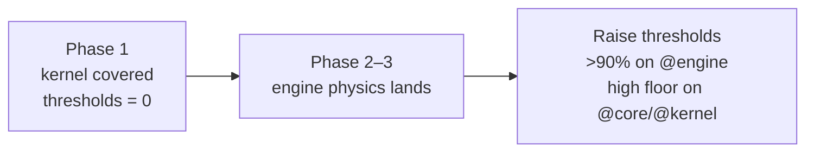

# 12 · Testing Strategy

The simulation is deterministic pure data, which makes it exceptionally testable: no mocks, no DOM, no time — just seed in, event stream out. Phase 2 proves the harness against the real, domain-agnostic kernel and the real `@replay` module; the `>90%` engine target is enforced as the physics lands.

## Tooling

| Concern             | Choice                                                                           |
| ------------------- | -------------------------------------------------------------------------------- |
| Runner              | Vitest (shares the Vite config, so aliases/plugins are identical to the app)     |
| Coverage            | `@vitest/coverage-v8` (`text`, `html`, `lcov` reporters → `./coverage`)          |
| Default environment | `node` — the deterministic kernel needs no DOM                                   |
| DOM tests           | opt-in per file with `// @vitest-environment jsdom` (jsdom available)            |
| Layout              | unit tests co-located as `*.test.ts`; shared fixtures/integration under `tests/` |

Test include glob: `src/**/*.{test,spec}.{ts,tsx}` and `tests/**/*.{test,spec}.{ts,tsx}`. Coverage excludes barrels (`index.ts`), `*.d.ts`, `main.tsx`, and `App.tsx` (pure composition).

## What is tested

The kernel foundation ships **100 tests passing across 15 files**, all covering the real, deterministic kernel, event bus, and replay:

| #     | Test file                                          | Tests | Proves                                                                                                                                                                             |
| ----- | -------------------------------------------------- | ----- | ---------------------------------------------------------------------------------------------------------------------------------------------------------------------------------- |
| 1     | `src/kernel/rng/xoroshiro128plus.test.ts`          | 13    | RNG determinism: identical seed ⇒ identical stream; `randomInt`/`randomFloat`/`randomBoolean`/`randomNormal`/`shuffle`/`pick`/`weightedPick`/`fork`/`clone`/`getState`/`setState`. |
| 2     | `src/kernel/time/sim-clock.test.ts`                | 7     | `SimClock`: fixed-timestep advance, tick/time accounting, `frequencyHz`, reset, get/set state.                                                                                     |
| 3     | `src/kernel/fsm/kernel-lifecycle.test.ts`          | 7     | `KernelState` FSM: legal transitions, illegal throw `InvalidStateTransitionError`, `can`, `onChange`.                                                                              |
| 4     | `src/kernel/registry/system-registry.test.ts`      | 7     | Registry: register/get/has/all/clear, deterministic `resolveOrder`, `CircularDependencyError`/`MissingDependencyError`.                                                            |
| 5     | `src/kernel/scheduler/task-scheduler.test.ts`      | 9     | Task scheduler: `atTick`/`afterTicks`/`atNextTick`/`everyTicks`/`atSimTime`, deterministic ordering, `cancel`, no timers.                                                          |
| 6     | `src/kernel/diagnostics/diagnostics.test.ts`       | 4     | Diagnostics: per-tick/per-system timing via injected wall-clock, `report`, `reset`.                                                                                                |
| 7     | `src/kernel/snapshot/snapshot.test.ts`             | 5     | Snapshots: `captureKernelSnapshot`/`restoreKernelSnapshot`, `canonicalize`, FNV `hashString`, `compareSnapshots`.                                                                  |
| 8     | `src/kernel/simulation-kernel.test.ts`             | 10    | `createSimulationKernel`: tick pipeline, lifecycle→`KernelStateChanged` bridging, register/boot/run/dispose/reset.                                                                 |
| 9     | `src/core/events/event-bus.test.ts`                | 14    | `createEventBus`: on/once/off/emit ordering, priority, `onAny` envelope, snapshot dispatch, stats, freeze, leak.                                                                   |
| 10    | `src/replay/replay.test.ts`                        | 5     | Replay: record via `onAny`, serialize/deserialize (JSON backend), playback re-emit, verifier determinism + divergence.                                                             |
| 11–15 | config, DI, math, App smoke, bootstrap integration | —     | `resolveProfile` mapping + defaulting, DI container behavior, pure math helpers, App composition, end-to-end bootstrap wiring.                                                     |

These are the pieces the whole simulation's determinism depends on — if they hold, `seed + events` reproduces any run.

## Coverage policy

`vitest.config.ts` currently sets coverage **thresholds to 0** deliberately: Phases 1–2 prove the harness against the kernel, event bus, and replay, and failing CI on line coverage of unimplemented placeholders would be noise. As real physics lands, thresholds ramp:



Rationale: coverage gates should apply to code that has real behavior. Gating placeholder branches (`notImplemented()` throws) measures nothing. The `>90%` engine target becomes enforceable exactly when there is engine logic to cover.

## Test design principles

| Principle                           | Why                                                                                                                                                              |
| ----------------------------------- | ---------------------------------------------------------------------------------------------------------------------------------------------------------------- |
| **Deterministic by construction**   | Inject a fixed `seed` and a real `SimClock`; never `Math.random()` or wall-clock — matching the engine's own discipline ([08](./08-coding-standards.md)).        |
| **No mocks for the kernel**         | The kernel is pure; tests use real instances. Mocks appear only at true I/O seams (logger, serializer) via the DI container.                                     |
| **Test the contract, not the impl** | Tests target the exported interface (`TypedEventBus`, `SimulationStateMachine`), so refactors that preserve behavior don't break tests.                          |
| **Golden event streams** (later)    | Replay verification becomes a test category: record a run, replay it, assert byte-identical event streams. This is the ultimate integration test of determinism. |

## Layers of testing (as the project matures)

1. **Unit** (now) — kernel primitives, pure functions, FSM, DI, RNG, clock.
2. **System** (Phase 2+) — each engine subsystem in isolation against `SystemContext` fixtures.
3. **Integration** (Phase 3+) — full engine tick pipeline producing an expected event sequence for a scenario/seed.
4. **Replay/determinism** (real since Phase 2) — record → replay → verify identical streams via `createReplayVerifier`; the backbone of the `@replay` module. Broadens into golden-stream scenario tests as physics lands.
5. **Consumer** (as needed) — jsdom tests for projections (`bindStores` copies event fields correctly) and key UI behaviors.

## Running

```
pnpm test            # run once
pnpm test:watch      # watch mode
pnpm test:coverage   # with v8 coverage report
pnpm validate        # typecheck + typecheck:engine + lint + test (the CI gate)
```
