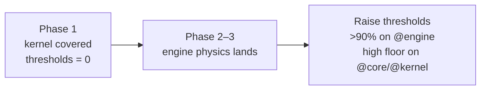

# 12 · Testing Strategy

The simulation is deterministic pure data, which makes it exceptionally testable: no mocks, no DOM, no time — just seed in, event stream out. Phase 1 proves the harness against the real kernel; the `>90%` engine target is enforced as the physics lands.

## Tooling

| Concern             | Choice                                                                           |
| ------------------- | -------------------------------------------------------------------------------- |
| Runner              | Vitest (shares the Vite config, so aliases/plugins are identical to the app)     |
| Coverage            | `@vitest/coverage-v8` (`text`, `html`, `lcov` reporters → `./coverage`)          |
| Default environment | `node` — the deterministic kernel needs no DOM                                   |
| DOM tests           | opt-in per file with `// @vitest-environment jsdom` (jsdom available)            |
| Layout              | unit tests co-located as `*.test.ts`; shared fixtures/integration under `tests/` |

Test include glob: `src/**/*.{test,spec}.{ts,tsx}` and `tests/**/*.{test,spec}.{ts,tsx}`. Coverage excludes barrels (`index.ts`), `*.d.ts`, `main.tsx`, and `App.tsx` (pure composition).

## What is tested in Phase 1

The foundation ships **8 test files / 41 tests passing**, all covering the real, deterministic kernel and primitives:

| #   | Test file                                         | Proves                                                                                                      |
| --- | ------------------------------------------------- | ----------------------------------------------------------------------------------------------------------- |
| 1   | `src/core/events/event-bus.test.ts`               | `createEventBus` typing + behavior: on/once/off/emit ordering, snapshot dispatch, `listenerCount`, `clear`. |
| 2   | `src/core/di/container.test.ts`                   | DI container: singleton caching, `registerValue`, `createScope` isolation, `ContainerResolutionError`.      |
| 3   | `src/kernel/rng/mulberry32.test.ts`               | RNG determinism: identical seed ⇒ identical stream; `nextInt`/`nextRange`/`chance`/`fork` behavior.         |
| 4   | `src/kernel/time/sim-clock.test.ts`               | `SimClock`: fixed-timestep advance, tick/time accounting, reset.                                            |
| 5   | `src/kernel/fsm/simulation-state-machine.test.ts` | FSM: legal transitions, illegal transitions throw `InvalidStateTransitionError`, `onChange`, reset.         |
| 6   | `src/kernel/simulation-kernel.test.ts`            | `createSimulationKernel`: tick loop, FSM→`SimStateChanged` bridging, register/boot/dispose.                 |
| 7   | `src/config/config-service.test.ts`               | `resolveProfile` mapping + defaulting; `createConfigService`.                                               |
| 8   | `src/utils/math.test.ts`                          | Pure math helpers (e.g. `clamp`).                                                                           |

These are the pieces the whole simulation's determinism depends on — if they hold, `seed + events` reproduces any run.

## Coverage policy

`vitest.config.ts` currently sets coverage **thresholds to 0** deliberately: Phase 1 proves the harness against the kernel, and failing CI on line coverage of unimplemented placeholders would be noise. As real physics lands, thresholds ramp:



Rationale: coverage gates should apply to code that has real behavior. Gating placeholder branches (`notImplemented()` throws) measures nothing. The `>90%` engine target becomes enforceable exactly when there is engine logic to cover.

## Test design principles

| Principle                           | Why                                                                                                                                                              |
| ----------------------------------- | ---------------------------------------------------------------------------------------------------------------------------------------------------------------- |
| **Deterministic by construction**   | Inject a fixed `seed` and a real `SimClock`; never `Math.random()` or wall-clock — matching the engine's own discipline ([08](./08-coding-standards.md)).        |
| **No mocks for the kernel**         | The kernel is pure; tests use real instances. Mocks appear only at true I/O seams (logger, serializer) via the DI container.                                     |
| **Test the contract, not the impl** | Tests target the exported interface (`TypedEventBus`, `SimulationStateMachine`), so refactors that preserve behavior don't break tests.                          |
| **Golden event streams** (later)    | Replay verification becomes a test category: record a run, replay it, assert byte-identical event streams. This is the ultimate integration test of determinism. |

## Layers of testing (as the project matures)

1. **Unit** (now) — kernel primitives, pure functions, FSM, DI, RNG, clock.
2. **System** (Phase 2+) — each engine subsystem in isolation against `SystemContext` fixtures.
3. **Integration** (Phase 3+) — full engine tick pipeline producing an expected event sequence for a scenario/seed.
4. **Replay/determinism** (Phase 10) — record → replay → verify identical streams; the backbone of the `@replay` module.
5. **Consumer** (as needed) — jsdom tests for projections (`bindStores` copies event fields correctly) and key UI behaviors.

## Running

```
pnpm test            # run once
pnpm test:watch      # watch mode
pnpm test:coverage   # with v8 coverage report
pnpm validate        # typecheck + typecheck:engine + lint + test (the CI gate)
```
