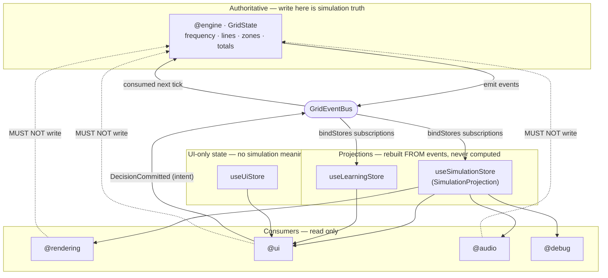

# 13 · State Ownership

Exactly one place in the system owns authoritative simulation state: the engine. Everything else either projects it (read-only) or owns its own private, non-simulation state. This is the mechanical answer to "the renderer must never invent state."

## The three kinds of state

| Kind                               | Owner                | Written by                         | Read by                                             | Example                                                                   |
| ---------------------------------- | -------------------- | ---------------------------------- | --------------------------------------------------- | ------------------------------------------------------------------------- |
| **Authoritative simulation state** | `@engine` (System A) | the engine only, during `step`     | the engine; emitted as events                       | `GridState` (`frequency`, `LineFlow[]`, `ZoneStatus[]`, totals)           |
| **Projections (read models)**      | `@state` (Zustand)   | `@state` binders, from events only | consumers (`@rendering`, `@ui`, `@audio`, `@debug`) | `SimulationProjection` (`tick`, `simTime`, `lifecycle`, `maxLineLoading`) |
| **UI state**                       | `@ui` (`useUiStore`) | UI components                      | UI components                                       | panel open/closed, selected district, camera preset                       |

## Ownership diagram

## Who may write what

| Actor                              | May write                                         | May NOT write                  |
| ---------------------------------- | ------------------------------------------------- | ------------------------------ |
| `@engine` subsystems               | `GridState` (their own authoritative state)       | projections, UI state          |
| `@state` binders                   | projection stores (copying event payloads)        | `GridState`, UI state          |
| `@ui` components                   | `useUiStore` (UI state); emit `DecisionCommitted` | `GridState`, projection stores |
| `@rendering` / `@audio` / `@debug` | _(nothing stateful about the simulation)_         | `GridState`, projection stores |
| `@learning`                        | its own model; emits `LearningUpdated`            | `GridState`                    |

## Why projections are copy-only

A projection store contains **no logic beyond copying event fields**. Look at the real `bindSimulationStore`: three subscriptions, each a single `setState` of payload fields (`tick`, `simTime`, `lifecycle`, `maxLineLoading`). There is nowhere to derive a simulation fact, because there is no code path that computes one — only assignment from an event the engine already emitted.

This is deliberate. If a projection _computed_ (e.g. re-derived line loading from raw flows), the renderer could show a value the engine never produced — a divergent "invented" state. By making projections mechanical, a consumer literally cannot read a fact the simulation did not emit.

## Rebuildable from events

Because projections are pure functions of the event stream, they are **rebuildable**:

- On `reset`, the stores are re-derived from the fresh event stream — no stale authoritative state leaks in.
- During `@replay`, replaying the recorded event stream reconstructs identical projections, which is why replay looks identical to the live run.
- `bindStores(bus)` returns a single `Unsubscribe` that detaches every projection at once (used on shutdown, see [15](./15-shutdown-sequence.md)).

## Interaction is intent, not mutation

The one apparent "upstream" write — a user making a decision — is not a state mutation. `@ui` emits `DecisionCommitted { decisionId, optionIndex, simTime }` onto the bus; the engine's `director` consumes it on the next tick and decides the effect. The UI never touches `GridState`; it expresses intent, and the engine remains the sole authority (see [05](./05-rendering-data-flow.md)).

## Enforcement recap

| Guarantee                         | Mechanism                                                                                                       |
| --------------------------------- | --------------------------------------------------------------------------------------------------------------- |
| Consumers can't reach `GridState` | ESLint forbids `@rendering`/`@ui`/`@audio` from importing `@engine`/`@kernel` ([03](./03-dependency-graph.md)). |
| Engine can't push to a store      | Pure layers may not import `zustand`; the data direction is one-way by construction.                            |
| Consumers can't hold live state   | Event payloads carry ids + scalars only — never a `GridState` reference ([06](./06-event-architecture.md)).     |
| Projections can't compute         | They are copy-only by design and covered by tests as physics lands ([12](./12-testing-strategy.md)).            |
