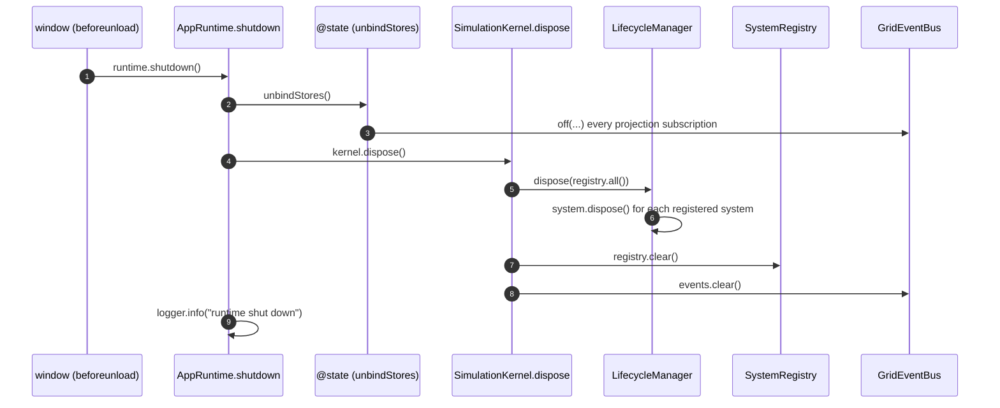

# 15 · Shutdown Sequence

Shutdown is the exact inverse of initialization: detach the projections that were bound at bootstrap, then dispose the kernel, which tears down systems, the registry, and the event bus in order. It is idempotent-friendly and leaves no dangling subscriptions.

## Trigger

`main.tsx` registers the teardown on tab close:

```ts
window.addEventListener('beforeunload', () => {
  runtime.shutdown();
});
```

`runtime` is the `AppRuntime` returned by `bootstrap`; `shutdown()` is the closure that captured `unbindStores` and the resolved `kernel`.

## Shutdown sequence



## Step-by-step

| Step | Call                                | Effect                                                                                                                                                                         |
| ---- | ----------------------------------- | ------------------------------------------------------------------------------------------------------------------------------------------------------------------------------ |
| 1    | `runtime.shutdown()`                | Entry; runs the captured teardown closure.                                                                                                                                     |
| 2    | `unbindStores()`                    | Calls the combined detach from `bindStores`, unsubscribing every projection binder (`bindSimulationStore`, `bindLearningStore`) from the bus. Consumers stop receiving events. |
| 3    | `kernel.dispose()`                  | Tears down the simulation in order:                                                                                                                                            |
| 3a   | `lifecycle.dispose(registry.all())` | Calls `dispose()` on every registered `SimulationSystem`, releasing per-system resources.                                                                                      |
| 3b   | `registry.clear()`                  | Empties the system registry.                                                                                                                                                   |
| 3c   | `events.clear()`                    | Removes every remaining subscription on the `GridEventBus`.                                                                                                                    |
| 4    | `logger.info(...)`                  | Records clean shutdown.                                                                                                                                                        |

## Ordering matters

The order is deliberate and mirrors initialization in reverse:

1. **Projections first.** Detach consumers _before_ disposing systems, so no event fired during teardown reaches a store whose consumer tree may already be unmounting.
2. **Systems before the bus.** `lifecycle.dispose` runs each system's `dispose()` while the bus still exists (a system may emit a final event or clean up a subscription). Only then does `events.clear()` wipe the bus.
3. **Registry before bus clear.** Clearing the registry drops references to systems; clearing the bus drops references to handlers. After both, the kernel holds nothing.

## Idempotency and safety

- `unbindStores` and each `Unsubscribe` are safe to call once; the binders return closures that simply `off(...)` their handlers.
- `events.clear()` is unconditional and safe even if some handlers already detached.
- Because Phase 1 never `boot()`s the placeholder engine, `lifecycle.dispose` currently iterates an **empty** registered-systems list (the engine was resolved to validate wiring but not registered as a kernel system) — so shutdown is trivially clean today. Phase 2, which registers and boots the engine, gets correct teardown for free through the same path.

## Relationship to `reset`

`shutdown` is terminal; `reset` is not. They share the "return to a clean state" idea but differ:

|           | `kernel.reset()`                    | `kernel.dispose()`            |
| --------- | ----------------------------------- | ----------------------------- |
| Systems   | `reset()` (keep, return to initial) | `dispose()` (release, drop)   |
| Registry  | retained                            | cleared                       |
| Clock     | `reset()` to zero                   | left (kernel is going away)   |
| FSM       | `reset()` to `Boot`                 | left                          |
| Event bus | retained                            | `clear()`ed                   |
| Used by   | FSM `Reset` state / new run         | app teardown (`beforeunload`) |

`reset` supports the FSM `Reset → Boot` edge (a new run without rebuilding the container); `dispose` ends the process's simulation entirely.
