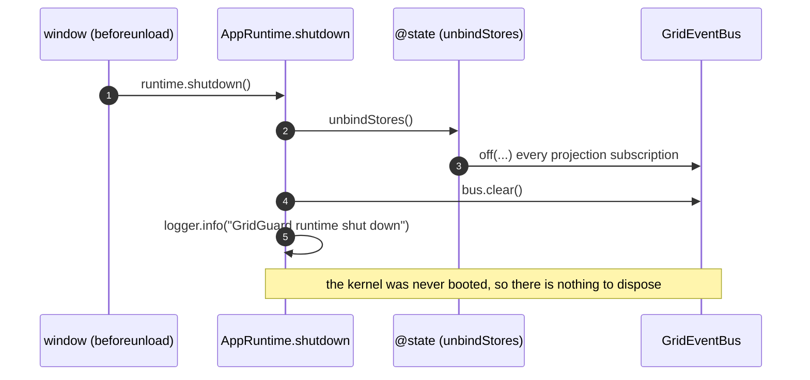

# 15 · Shutdown Sequence

Shutdown is the inverse of initialization: detach the projections that were bound at bootstrap, then clear the event bus. Because `bootstrap` never `boot()`s the kernel (see [14](./14-initialization-sequence.md)), there is **nothing to dispose** — so today's teardown is just _unbind stores + clear bus_. When the kernel is eventually booted, `kernel.dispose()` becomes the full teardown path (documented below). Shutdown is idempotent-friendly and leaves no dangling subscriptions.

## Trigger

`main.tsx` registers the teardown on tab close:

```ts
window.addEventListener('beforeunload', () => {
  runtime.shutdown();
});
```

`runtime` is the `AppRuntime` returned by `bootstrap`; `shutdown()` is the closure that captured `unbindStores` and the shared `bus`.

## Shutdown sequence (today)



## Step-by-step

| Step | Call                 | Effect                                                                                                                                                                         |
| ---- | -------------------- | ------------------------------------------------------------------------------------------------------------------------------------------------------------------------------ |
| 1    | `runtime.shutdown()` | Entry; runs the captured teardown closure.                                                                                                                                     |
| 2    | `unbindStores()`     | Calls the combined detach from `bindStores`, unsubscribing every projection binder (`bindSimulationStore`, `bindLearningStore`) from the bus. Consumers stop receiving events. |
| 3    | `bus.clear()`        | Removes every remaining subscription (and any `onAny` trace) on the `GridEventBus`.                                                                                            |
| 4    | `logger.info(...)`   | Records clean shutdown.                                                                                                                                                        |

## The full `kernel.dispose()` path (once booted)

When the kernel is booted and driving systems, terminal teardown goes through `kernel.dispose()`, which transitions the lifecycle to `Disposed` and then tears down in order:

| Order | Call                                | Effect                                                                                   |
| ----- | ----------------------------------- | ---------------------------------------------------------------------------------------- |
| a     | `lifecycle.transition(Disposed)`    | Marks the runtime terminal (see [docs/kernel/01](../kernel/01-simulation-lifecycle.md)). |
| b     | `lifecycleManager.dispose(systems)` | `dispose()` on every ordered `SimulationSystem`.                                         |
| c     | `scheduler.clear()`                 | Drops every scheduled task.                                                              |
| d     | `registry.clear()`                  | Empties the system registry.                                                             |
| e     | `events.clear()`                    | Removes every remaining subscription on the bus.                                         |

## Ordering matters

The order is deliberate and mirrors initialization in reverse:

1. **Projections first.** Detach consumers _before_ any system teardown, so no event fired during teardown reaches a store whose consumer tree may already be unmounting.
2. **Systems before the bus.** In `kernel.dispose()`, each system's `dispose()` runs while the bus still exists (a system may emit a final event or clean up a subscription). Only then does `events.clear()` wipe the bus.
3. **Registry before bus clear.** Clearing the registry drops references to systems; clearing the bus drops references to handlers. After both, the kernel holds nothing.

## Idempotency and safety

- `unbindStores` and each `Unsubscribe` are safe to call once; the binders return closures that simply `off(...)` their handlers.
- `bus.clear()` is unconditional and safe even if some handlers already detached.
- Because `bootstrap` never `boot()`s the placeholder engine, there are no registered systems and no booted kernel to dispose — so shutdown is trivially clean today (`unbindStores` + `bus.clear()`). Once the engine is registered and the kernel booted, terminal teardown routes through `kernel.dispose()` and gets correct system/scheduler/registry/bus teardown through the same path.

## Relationship to `reset`

`dispose` is terminal; `reset` is not. They share the "return to a clean state" idea but differ:

|                | `kernel.reset()`                                        | `kernel.dispose()`            |
| -------------- | ------------------------------------------------------- | ----------------------------- |
| Systems        | `reset()` (keep, return to initial)                     | `dispose()` (release, drop)   |
| Registry       | retained                                                | cleared                       |
| Clock          | `reset()` to zero                                       | left (kernel is going away)   |
| RNG            | restored to the **initial** seeded state                | left                          |
| Task scheduler | `clear()`ed                                             | `clear()`ed                   |
| Diagnostics    | `reset()`                                               | left                          |
| Lifecycle      | **unchanged** (`reset` keeps the current `KernelState`) | `→ Disposed` (terminal)       |
| Event bus      | retained                                                | `clear()`ed                   |
| Used by        | a fresh run without rebuilding the container            | app teardown (`beforeunload`) |

`reset` returns the clock, RNG, systems, task scheduler, and diagnostics to their initial state for a fresh deterministic run **without** touching the lifecycle state or rebuilding the container; `dispose` transitions to `Disposed` and ends the simulation entirely.
