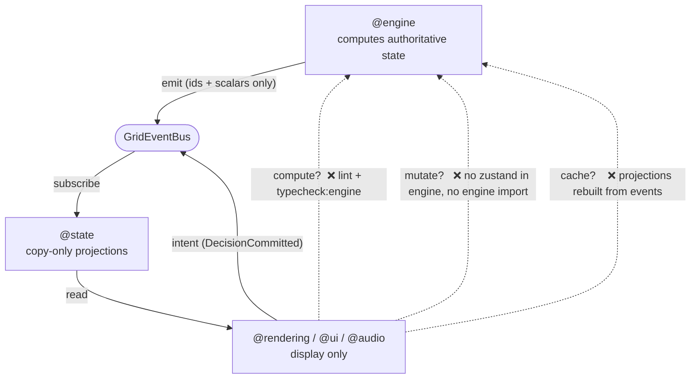

# Renderer Purity Doctrine

> **Simulation First. Rendering Second. UI Third.**

This is the single most important architectural rule in GridGuard. It is not a style preference — it is the load-bearing invariant the whole system is built to guarantee mechanically. Every other architecture document exists to serve it.

## The doctrine

**The simulation is the single source of truth. The renderer, UI, audio, replay, analytics, and any future AI system are consumers only. A consumer may never compute, infer, cache, or mutate authoritative simulation state. It may only _display_ state the simulation already produced. Every animation, every pixel, every sound must originate from a simulation event.**

Stated as a test you can apply to any line of consumer code:

> If a pixel moves, an event caused it. If you cannot name the `GRID_EVENT` (or the projected field derived from one) behind a visual, that visual is a bug.

## The four prohibitions

A consumer (`@rendering`, `@ui`, `@audio`, `@debug`, `@state`) must never:

| #   | Prohibition                    | What it means concretely                                                                                                             |
| --- | ------------------------------ | ------------------------------------------------------------------------------------------------------------------------------------ |
| 1   | **Compute** simulation state   | No power-flow math, no cascade logic, no "what would the loading be" in a component. The engine computes; the consumer reads.        |
| 2   | **Infer** simulation state     | No guessing a value the engine didn't emit (e.g. deriving a zone's status from indirect hints). If it wasn't emitted, it isn't true. |
| 3   | **Cache** authoritative state  | No consumer-side copy that could drift from the engine. Projections are rebuilt from events, not accumulated as a private truth.     |
| 4   | **Mutate** authoritative state | No writing back into `GridState`. User actions are emitted as _intent_ (`DecisionCommitted`); the engine decides the effect.         |

## Why this is non-negotiable

- **Determinism & replay.** If the renderer computed or cached state, two runs of the same seed could diverge visually, and replay verification (`seed + events` ⇒ identical stream) would be meaningless. Purity keeps the event stream the _whole_ truth.
- **Engineering credibility.** GridGuard simulates a real power grid. A decorative animation with no simulation cause is a lie about the physics. Realism beats decoration whenever they conflict.
- **Independence.** The simulation must compile and run with React/Three/UI deleted. That is only possible if nothing authoritative lives in a consumer.
- **Testability.** Pure data + pure functions, driven by a seeded RNG and a fixed clock, is trivially testable. State smeared into the view layer is not.

## How it is guaranteed mechanically

Purity is not left to discipline. Four mechanisms enforce it, and each fails loudly:

### 1. Projections are copy-only (`@state`)

Zustand stores are updated **exclusively** by event subscriptions, and each subscription does nothing but copy payload fields. The real `bindSimulationStore` is three `setState` calls of `payload.tick` (from `SimulationTick`), `payload.to` (from `KernelStateChanged`, a `KernelState`), and `payload.maxLoading` — no branching, no derivation. There is physically no code path in a projection that computes a simulation fact, so a consumer cannot read one the engine didn't emit. See [13 · State Ownership](./13-state-ownership.md).

### 2. Lint import boundaries (CI-enforced)

ESLint `no-restricted-imports` forbids `@rendering`, `@ui`, `@audio`, `@state`, `@debug` from importing `@engine` or `@kernel`, and forbids pure layers from importing `react`/`three`/`@react-three/*`/`gsap`/`howler`/`zustand`. A consumer _cannot call into the simulation_ because it cannot import it. A violation fails `pnpm lint` and CI. See [03 · Dependency Graph](./03-dependency-graph.md).

### 3. Engine-standalone typecheck (`typecheck:engine`)

`tsconfig.engine.json` compiles only the pure layers with `lib: ["ES2022"]` and `types: []` — no DOM, no React, no Three types in scope. If the simulation ever referenced a browser or framework API, this typecheck fails. This is the literal proof that the renderer could be deleted and the simulation would still compile. See [03](./03-dependency-graph.md).

### 4. Scalar-only event payloads

`GridEventMap` payloads carry only branded ids, scalars, and enums — never a `GridState` or model object. A consumer therefore cannot obtain a live reference to authoritative state to cache or mutate; it receives lightweight facts and reads richer detail from projections. See [06 · Event Architecture](./06-event-architecture.md).

## The one legitimate upstream channel

User input is **not** an exception to the doctrine. When a user acts, the UI emits `DecisionCommitted { decisionId, optionIndex, simTime }` onto the bus. The engine's `director` consumes it and decides the consequence, then emits the resulting state changes. The UI expresses _intent_; it never writes state. This preserves the invariant: the engine remains the sole author of every authoritative fact. See [05 · Rendering Data Flow](./05-rendering-data-flow.md).

## Applying the doctrine in review

When reviewing consumer code, ask:

1. Does this component read anything other than a projection or an event payload? → If yes, reject.
2. Is there arithmetic here that reproduces engine physics? → If yes, it belongs in the engine; reject.
3. Does this hold a mutable copy of simulation state across frames? → If yes, replace with a projection read; reject.
4. Can I name the event behind this animation? → If no, the animation has no simulation cause; reject.

If all four pass, the code is a faithful _display_ of the simulation — which is the only thing a consumer is ever allowed to be.
