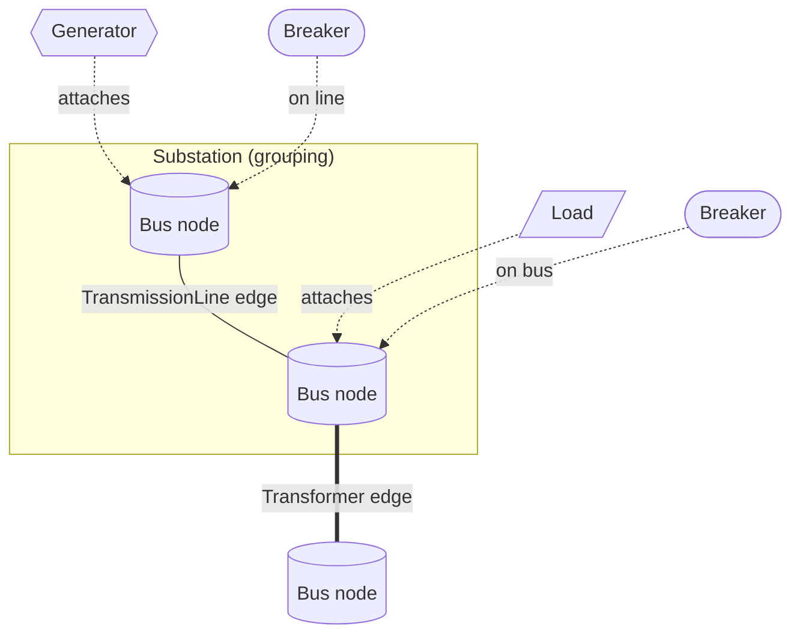
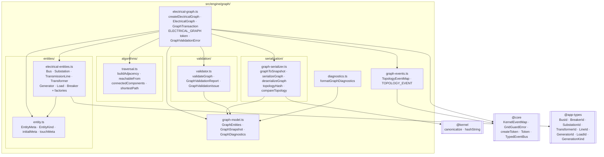
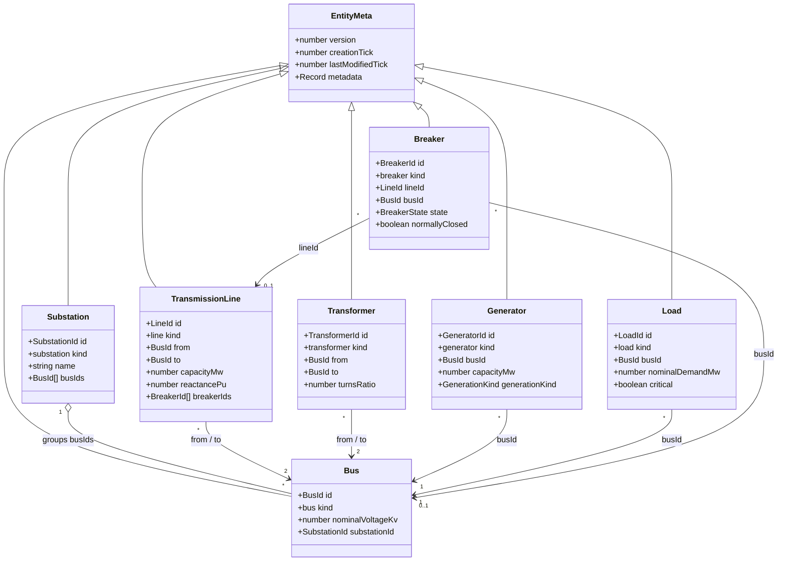

# 01 · Graph Architecture

## Responsibilities

The electrical graph engine is the **single authoritative topology model** for
GridGuard. Its responsibilities are deliberately narrow:

| It owns                                                              | It never does                              |
| -------------------------------------------------------------------- | ------------------------------------------ |
| Identity and provenance of every electrical entity                   | Power flow / voltage / current calculation |
| The wiring: which buses connect to which via lines/transformers      | Protection or tripping decisions           |
| Attachment relationships (generators, loads, breakers → buses/lines) | Thermal or physical simulation             |
| Grouping (substations → buses)                                       | Cascade propagation                        |
| Structural validation of the topology                                | Rendering, UI, or gameplay                 |
| Deterministic queries (adjacency, islands, paths, sources)           | Silent repair of invalid topology          |
| A structural hash + canonical serialization                          | Interpreting numeric fields physically     |

Numeric fields (`capacityMw`, `reactancePu`, `turnsRatio`, `nominalVoltageKv`,
`nominalDemandMw`) are **data only**. The engine stores and validates their sign,
but attaches no physics — that is the domain of future subsystems that read the
graph.

## The node / edge / attachment model

| Concept        | Entity                            | Role in the graph                                                        |
| -------------- | --------------------------------- | ------------------------------------------------------------------------ |
| **Node**       | `Bus`                             | The vertices of the graph                                                |
| **Edge**       | `TransmissionLine`, `Transformer` | Connect two buses (`from` → `to`)                                        |
| **Attachment** | `Generator`, `Load`               | Attach to a single bus (`busId`)                                         |
| **Attachment** | `Breaker`                         | Attach to a line **or** a bus (`lineId` / `busId`, exactly one non-null) |
| **Grouping**   | `Substation`                      | Owns a set of buses (`busIds[]`)                                         |

`GraphEdge = TransmissionLine | Transformer`. Adjacency is **undirected**: an edge
`from → to` links both directions and self-loops (`from === to`) connect nothing.

## Cached adjacency and islands

The live graph keeps two derived structures that are **recomputed once per
committed transaction** (never per query):

```mermaid
flowchart LR
  commit[Commit swaps live maps] --> recompute[recompute&#40;&#41;]
  recompute --> hash[topology hash]
  recompute --> adj[cachedAdjacency<br/>Map&lt;BusId, BusId&#91;&#93;&gt;]
  recompute --> isl[cachedIslands<br/>BusId&#91;&#93;&#91;&#93;]
  adj --> q1[neighbors / reachable / shortestPath]
  isl --> q2[islands / islandOf / islandCount]
```

- `cachedAdjacency` — an undirected adjacency map with sorted neighbor lists,
  built by `buildAdjacency`.
- `cachedIslands` — the connected components (electrical islands), built by
  `connectedComponents`; each component is sorted and components are ordered by
  smallest id.

Because both are cached, reads are **O(1) / O(read)**: `neighbors` is a map
lookup, `islandCount` is an array length, and `reachable` / `shortestPath` run
over the pre-built adjacency. Only a commit pays the recompute cost.

## Module layout

Key layering rules:

- The **validator** and **serializer** operate on `GraphEntities` (a flat,
  id-sorted bag), _not_ on the live graph object. This keeps them pure and
  independently testable.
- The **algorithms** are generic over `TNode extends string` and know nothing of
  electrical semantics.
- Only `graph-serializer.ts` reaches into `@kernel` (for `canonicalize` /
  `hashString`); only `graph-events.ts` extends `@core`'s `KernelEventMap`. The
  kernel never references topology types.

## Data model

See [02-entity-model.md](./02-entity-model.md) for field-level detail.

## Performance

The engine is designed for **thousands of buses without architectural change**:

- Mutations are **copy-on-commit** — one map clone per transaction, not per op.
- Adjacency and islands are **cached after each commit**; queries do not rebuild
  them.
- Lookups are `O(1)` map reads; collection accessors sort on read for
  determinism.

The stress suite includes a 1000-bus chain, a deterministic-hash check, and a
serialization round-trip.
