# 02 · Entity Model

Every electrical entity is an **immutable record** that extends a common
`EntityMeta` provenance envelope. Entities are created **only** through factory
functions, are **tick-stamped** at creation, and never mutate themselves — a
"change" produces a _new_ record with a bumped version. All mutation goes through
the [transaction pipeline](./04-mutation-rules.md).

## `EntityMeta` — the provenance envelope

Defined in `entities/entity.ts`. Every entity `extends EntityMeta`.

| Field              | Type                                | Meaning                                                       |
| ------------------ | ----------------------------------- | ------------------------------------------------------------- |
| `version`          | `number`                            | Per-entity version; starts at `1`, bumps on each modification |
| `creationTick`     | `number`                            | Kernel tick at which the entity was created                   |
| `lastModifiedTick` | `number`                            | Kernel tick of the most recent modification                   |
| `metadata`         | `Readonly<Record<string, unknown>>` | Free-form, non-structural annotations                         |

Two pure helpers manage the envelope:

| Helper                             | Behavior                                                                                                                 |
| ---------------------------------- | ------------------------------------------------------------------------------------------------------------------------ |
| `initialMeta(tick, metadata = {})` | Metadata for a fresh entity: `version: 1`, `creationTick = lastModifiedTick = tick`, `metadata`                          |
| `touchMeta(meta, tick, metadata?)` | On modify: `version + 1`, `creationTick` preserved, `lastModifiedTick = tick`, `metadata` replaced if provided else kept |

`EntityKind` enumerates the seven tracked kinds (each entity carries its `kind`
as a literal):

| `EntityKind` member | Value           |
| ------------------- | --------------- |
| `Bus`               | `'bus'`         |
| `Substation`        | `'substation'`  |
| `Line`              | `'line'`        |
| `Transformer`       | `'transformer'` |
| `Generator`         | `'generator'`   |
| `Load`              | `'load'`        |
| `Breaker`           | `'breaker'`     |

## Immutability & factories

```mermaid
flowchart LR
  spec[Spec object<br/>e.g. BusSpec] --> factory[createBus&#40;spec, tick&#41;]
  tick[kernel tick] --> factory
  factory --> meta[+ initialMeta&#40;tick, spec.metadata&#41;]
  factory --> record[(Immutable Bus record<br/>readonly fields)]
```

- All entity fields are `readonly`. Records are frozen-by-convention immutable.
- Each entity kind has a `*Spec` input type and a `create*` factory. The factory
  applies defaults, spreads `initialMeta(tick, spec.metadata)`, and stamps the
  literal `kind`.
- `updateMetadata` (on the transaction) is the only in-place-style change, and it
  produces a **new** record via `touchMeta` — the old record is never mutated.

| Entity             | Factory                              | Spec                   |
| ------------------ | ------------------------------------ | ---------------------- |
| `Bus`              | `createBus(spec, tick)`              | `BusSpec`              |
| `Substation`       | `createSubstation(spec, tick)`       | `SubstationSpec`       |
| `TransmissionLine` | `createTransmissionLine(spec, tick)` | `TransmissionLineSpec` |
| `Transformer`      | `createTransformer(spec, tick)`      | `TransformerSpec`      |
| `Generator`        | `createGenerator(spec, tick)`        | `GeneratorSpec`        |
| `Load`             | `createLoad(spec, tick)`             | `LoadSpec`             |
| `Breaker`          | `createBreaker(spec, tick)`          | `BreakerSpec`          |

## The entities

### `Bus` — graph node

| Field              | Type                   | Notes                                              |
| ------------------ | ---------------------- | -------------------------------------------------- |
| `id`               | `BusId`                | Branded id                                         |
| `kind`             | `'bus'`                | Literal                                            |
| `nominalVoltageKv` | `number`               | Data only — no voltage math                        |
| `substationId`     | `SubstationId \| null` | Owning substation, or `null` (spec default `null`) |

### `Substation` — bus grouping

| Field    | Type               | Notes                                              |
| -------- | ------------------ | -------------------------------------------------- |
| `id`     | `SubstationId`     |                                                    |
| `kind`   | `'substation'`     |                                                    |
| `name`   | `string`           |                                                    |
| `busIds` | `readonly BusId[]` | Buses owned by this substation (spec default `[]`) |

### `TransmissionLine` — graph edge

| Field         | Type                   | Notes                                              |
| ------------- | ---------------------- | -------------------------------------------------- |
| `id`          | `LineId`               |                                                    |
| `kind`        | `'line'`               |                                                    |
| `from`        | `BusId`                | Edge endpoint                                      |
| `to`          | `BusId`                | Edge endpoint                                      |
| `capacityMw`  | `number`               | Data only; validator rejects negative              |
| `reactancePu` | `number`               | Data only; negative is an error, zero is a warning |
| `breakerIds`  | `readonly BreakerId[]` | Breakers on this line (spec default `[]`)          |

### `Transformer` — placeholder edge

| Field        | Type            | Notes                                |
| ------------ | --------------- | ------------------------------------ |
| `id`         | `TransformerId` |                                      |
| `kind`       | `'transformer'` |                                      |
| `from`       | `BusId`         | Edge endpoint                        |
| `to`         | `BusId`         | Edge endpoint                        |
| `turnsRatio` | `number`        | Placeholder — no impedance model yet |

### `Generator` — bus attachment

| Field            | Type             | Notes                                                                |
| ---------------- | ---------------- | -------------------------------------------------------------------- |
| `id`             | `GeneratorId`    |                                                                      |
| `kind`           | `'generator'`    |                                                                      |
| `busId`          | `BusId`          | Host bus                                                             |
| `capacityMw`     | `number`         | Data only; validator rejects negative                                |
| `generationKind` | `GenerationKind` | `Baseload` \| `Peaker` \| `Solar` \| `Wind` \| `Storage` \| `Import` |

Buses that host at least one generator are the graph's **sources** (see
[06-query-engine.md](./06-query-engine.md)).

### `Load` — bus attachment

| Field             | Type      | Notes                                        |
| ----------------- | --------- | -------------------------------------------- |
| `id`              | `LoadId`  |                                              |
| `kind`            | `'load'`  |                                              |
| `busId`           | `BusId`   | Host bus                                     |
| `nominalDemandMw` | `number`  | Data only; validator rejects negative demand |
| `critical`        | `boolean` | Spec default `false`                         |

### `Breaker` — line / bus attachment

| Field            | Type             | Notes                                            |
| ---------------- | ---------------- | ------------------------------------------------ |
| `id`             | `BreakerId`      |                                                  |
| `kind`           | `'breaker'`      |                                                  |
| `lineId`         | `LineId \| null` | Attached line (spec default `null`)              |
| `busId`          | `BusId \| null`  | Attached bus (spec default `null`)               |
| `state`          | `BreakerState`   | `'open'` \| `'closed'` (spec default `'closed'`) |
| `normallyClosed` | `boolean`        | Spec default `true`                              |

`BreakerState` is `{ Open: 'open', Closed: 'closed' }`. A breaker is **data
only** — Phase 3 has **no protection or tripping logic**. The validator requires
that a breaker reference _at least one_ of `lineId` / `busId` (`INVALID_BREAKER`
otherwise).

## Branded ids

Ids are branded strings so the compiler rejects passing (say) a `ZoneId` where a
`LineId` is expected. Phase 3 introduced four new branded ids in `@app-types`
(`src/types/ids.ts`):

| New id (Phase 3) | Definition                       | Constructor              |
| ---------------- | -------------------------------- | ------------------------ |
| `BusId`          | `Brand<string, 'BusId'>`         | `asBusId(value)`         |
| `BreakerId`      | `Brand<string, 'BreakerId'>`     | `asBreakerId(value)`     |
| `SubstationId`   | `Brand<string, 'SubstationId'>`  | `asSubstationId(value)`  |
| `TransformerId`  | `Brand<string, 'TransformerId'>` | `asTransformerId(value)` |

Pre-existing ids reused by the graph include `LineId`, `GeneratorId`, and
`LoadId`.

## Composite types

| Type               | Definition                                                                             |
| ------------------ | -------------------------------------------------------------------------------------- |
| `ElectricalEntity` | `Bus \| Substation \| TransmissionLine \| Transformer \| Generator \| Load \| Breaker` |
| `GraphEdge`        | `TransmissionLine \| Transformer`                                                      |
