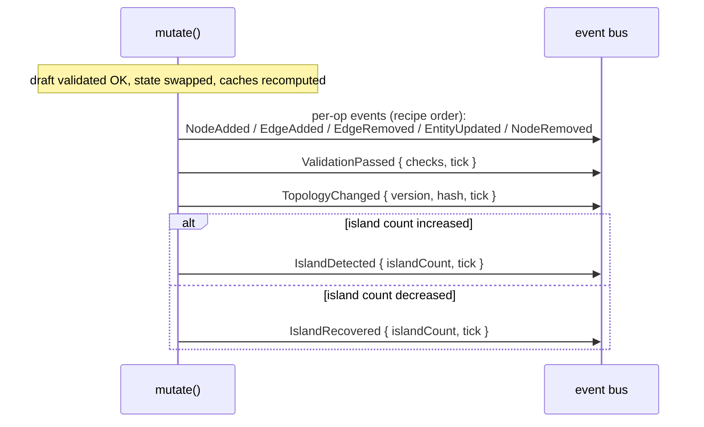

# 04 · Mutation Rules — The Transaction Pipeline

All topology change flows through one method: `mutate(recipe)`. It is
**transactional** (all-or-nothing), **deterministic**, **fail-fast**, and
**never silently repairs**. There is no other way to change the live graph.

## The pipeline

```mermaid
flowchart TD
  start([graph.mutate&#40;recipe&#41;]) --> clone[Clone live maps into a DRAFT<br/>one clone per transaction]
  clone --> run["Run recipe&#40;tx&#41;<br/>stage ops on the draft,<br/>record per-op events, tick = now&#40;&#41;"]
  run --> validate[validateGraph&#40;draft entities&#41;]
  validate --> valid{report.valid?}

  valid -->|"NO (errorCount &gt; 0)"| fail[emit ValidationFailed &#123;issueCount, tick&#125;]
  fail --> throw[[throw GraphValidationError&#40;report&#41;]]
  throw --> rollback([Nothing applied · live state unchanged])

  valid -->|YES| swap[Swap live maps = draft<br/>version += 1<br/>recompute hash + adjacency + islands]
  swap --> emitops[Emit recorded per-op events in order]
  emitops --> emitpass[emit ValidationPassed &#123;checks, tick&#125;]
  emitpass --> emitchg[emit TopologyChanged &#123;version, hash, tick&#125;]
  emitchg --> islandcheck{island count changed?}
  islandcheck -->|increased| detected[emit IslandDetected &#123;islandCount, tick&#125;]
  islandcheck -->|decreased| recovered[emit IslandRecovered &#123;islandCount, tick&#125;]
  islandcheck -->|unchanged| done
  detected --> done([return MutationResult])
  recovered --> done
```

### Step by step

1. **Draft.** `cloneMaps(maps)` produces a shallow-cloned copy of all seven
   entity maps. This is the **only** clone — copy-on-commit, not copy-per-op.
2. **Run recipe.** The recipe receives a `GraphTransaction` and stages
   add/remove/replace/update operations onto the draft. Each staged op pushes a
   `RecordedTopologyEvent` into an in-memory list (events are **not** emitted
   yet). `tick` is sampled once, at the start, from `now()`.
3. **Validate.** `validateGraph(entitiesOf(draft))` runs all 11 structural checks
   on the _draft_ (see [05](./05-validation-pipeline.md)).
4. **Invalid → rollback.** If `report.valid` is false, the engine emits
   `ValidationFailed { issueCount: report.errorCount, tick }` and throws
   `GraphValidationError` carrying the full report. The draft is discarded; live
   state is **completely unchanged** (version, hash, caches all untouched).
5. **Valid → commit.** Record `beforeIslands = cachedIslands.length`, then swap
   `maps = draft`, `version += 1`, and `recompute()` (rebuilds hash, adjacency,
   islands). Record `afterIslands = cachedIslands.length`.
6. **Emit.** Emit the recorded per-op events in recipe order, then
   `ValidationPassed`, then `TopologyChanged`, then — only if the island count
   changed — `IslandDetected` (increase) or `IslandRecovered` (decrease).
7. **Return** `MutationResult { version, hash, events, report }`.

## Ordering of emitted events (on a successful commit)

| Guarantee                   | How it is achieved                                                                                                                                  |
| --------------------------- | --------------------------------------------------------------------------------------------------------------------------------------------------- |
| **Atomic (all-or-nothing)** | All ops target a draft; live state is swapped in one assignment only after validation passes                                                        |
| **No partial state**        | On failure the draft is dropped — nothing is applied                                                                                                |
| **Events after commit**     | Per-op events are _recorded_ during the recipe and only _emitted_ after the successful swap; a failed transaction emits **only** `ValidationFailed` |
| **Fail fast**               | The first invalid draft throws `GraphValidationError`; callers must handle it                                                                       |
| **Never silently repairs**  | The validator reports; the pipeline rejects. It never edits the draft to make it valid                                                              |
| **Deterministic**           | Same starting state + same recipe ⇒ same version, hash, event sequence, and island result (algorithms sort nodes/neighbors)                         |

## Per-op → event mapping

The event a staged op records depends on the op (some removes record **no**
event):

| Transaction op                                                          | Recorded event(s)                                                          |
| ----------------------------------------------------------------------- | -------------------------------------------------------------------------- |
| `addBus`                                                                | `NodeAdded { busId, tick }`                                                |
| `removeBus`                                                             | `NodeRemoved { busId, tick }`                                              |
| `addLine`                                                               | `EdgeAdded { edgeId, from, to, tick }`                                     |
| `removeLine`                                                            | `EdgeRemoved { edgeId, tick }`                                             |
| `replaceLine`                                                           | `EdgeRemoved { edgeId, tick }` then `EdgeAdded { edgeId, from, to, tick }` |
| `addTransformer`                                                        | `EdgeAdded { edgeId, from, to, tick }`                                     |
| `removeTransformer`                                                     | `EdgeRemoved { edgeId, tick }`                                             |
| `addSubstation`                                                         | `EntityUpdated { entityId, kind, version, tick }`                          |
| `addGenerator`                                                          | `EntityUpdated { entityId, kind, version, tick }`                          |
| `addLoad`                                                               | `EntityUpdated { entityId, kind, version, tick }`                          |
| `addBreaker`                                                            | `EntityUpdated { entityId, kind, version, tick }`                          |
| `updateMetadata`                                                        | `EntityUpdated { entityId, kind, version, tick }`                          |
| `removeSubstation` / `removeGenerator` / `removeLoad` / `removeBreaker` | _(none)_                                                                   |

Plus, once per **successful** commit: `ValidationPassed`, `TopologyChanged`, and
optionally `IslandDetected` / `IslandRecovered`. On a **failed** commit: only
`ValidationFailed`.

## Error handling

| Failure                           | Signal                                                                     | Live state                  |
| --------------------------------- | -------------------------------------------------------------------------- | --------------------------- |
| Draft fails validation            | throws `GraphValidationError` (extends `GridGuardError`), carries `report` | unchanged                   |
| `updateMetadata` on an unknown id | throws `GridGuardError` from inside the recipe                             | unchanged (draft discarded) |

Because `GraphValidationError` carries the `GraphValidationReport`, callers can
inspect `error.report.issues` to see exactly which checks failed and on which
entities.
