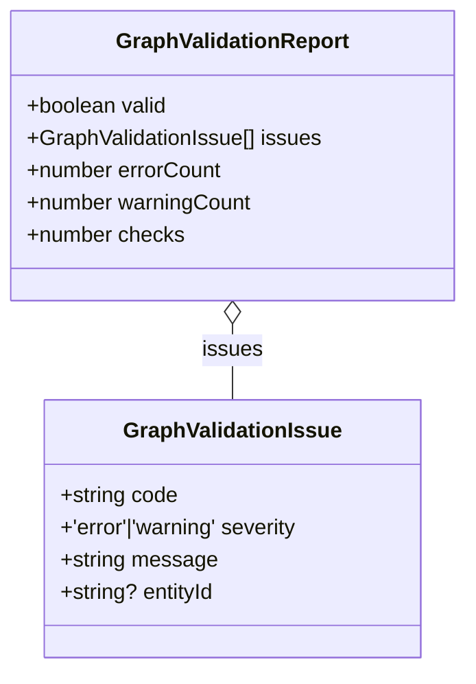

# 05 · Validation Pipeline

`validateGraph(entities: GraphEntities) → GraphValidationReport` is the
structural integrity gate. It is a **pure function** over a flat entity bag — it
takes no live graph, holds no state, and is independently testable. Crucially, it
**only reports; it never repairs**. A transaction whose draft fails validation is
rejected wholesale ([04-mutation-rules.md](./04-mutation-rules.md)); nothing is
silently fixed.

## The report

| Field          | Type                              | Meaning                                                       |
| -------------- | --------------------------------- | ------------------------------------------------------------- |
| `valid`        | `boolean`                         | `true` **iff `errorCount === 0`** — warnings never invalidate |
| `issues`       | `readonly GraphValidationIssue[]` | Every issue found, errors and warnings                        |
| `errorCount`   | `number`                          | Count of `severity === 'error'` issues                        |
| `warningCount` | `number`                          | Count of `severity === 'warning'` issues                      |
| `checks`       | `number`                          | Number of distinct rules applied — a constant **`11`**        |

`GraphValidationIssue`: `code` (stable string), `severity` (`'error'` |
`'warning'`), human-readable `message`, and optional `entityId` (present when the
issue is attributable to a specific entity).

> **`valid` iff zero errors.** Warnings (`ZERO_REACTANCE`, `DISCONNECTED_BUS`,
> `EMPTY_SUBSTATION`, `PARALLEL_EDGES`) are advisory: a graph with warnings but no
> errors is valid and will commit.

## The 11 checks

The validator applies eleven numbered rule groups over the entity bag:

| #   | Check                                                       | Emits (severity)                                                              |
| --- | ----------------------------------------------------------- | ----------------------------------------------------------------------------- |
| 1   | Duplicate ids across the **whole** graph (all kinds pooled) | `DUPLICATE_ID` (error)                                                        |
| 2   | Edge self-loops (`from === to`)                             | `SELF_LOOP` (error)                                                           |
| 3   | Edge endpoints reference existing buses                     | `MISSING_REFERENCE` (error)                                                   |
| 4   | Line electrical placeholders (capacity/reactance sign)      | `NEGATIVE_CAPACITY`, `NEGATIVE_REACTANCE` (error); `ZERO_REACTANCE` (warning) |
| 5   | Generators reference an existing bus, non-negative capacity | `MISSING_REFERENCE`, `NEGATIVE_CAPACITY` (error)                              |
| 6   | Loads reference an existing bus, non-negative demand        | `MISSING_REFERENCE`, `NEGATIVE_CAPACITY` (error)                              |
| 7   | Breaker references (attaches to something; line/bus exist)  | `INVALID_BREAKER`, `MISSING_REFERENCE` (error)                                |
| 8   | Substation ownership (non-empty; owned buses exist)         | `EMPTY_SUBSTATION` (warning); `MISSING_REFERENCE` (error)                     |
| 9   | Bus → substation back-reference exists                      | `MISSING_REFERENCE` (error)                                                   |
| 10  | Disconnected buses (no incident edges)                      | `DISCONNECTED_BUS` (warning)                                                  |
| 11  | Parallel edges between the same bus pair                    | `PARALLEL_EDGES` (warning)                                                    |

Edges for incidence and parallel-edge checks are **lines + transformers**
combined. The parallel-edge key is the sorted `from`/`to` pair, so direction does
not matter.

## Issue codes reference

### Errors (any one makes the graph invalid)

| Code                 | Severity | Meaning                                                                                                                                     | Raised by checks |
| -------------------- | -------- | ------------------------------------------------------------------------------------------------------------------------------------------- | ---------------- |
| `DUPLICATE_ID`       | error    | The same id appears on more than one entity (across all kinds)                                                                              | 1                |
| `SELF_LOOP`          | error    | An edge connects a bus to itself                                                                                                            | 2                |
| `MISSING_REFERENCE`  | error    | A reference points at a non-existent entity: edge endpoints, generator/load bus, breaker line/bus, substation-owned buses, bus's substation | 3, 5, 6, 7, 8, 9 |
| `NEGATIVE_CAPACITY`  | error    | A line's `capacityMw`, a generator's `capacityMw`, **or a load's `nominalDemandMw`** is negative                                            | 4, 5, 6          |
| `NEGATIVE_REACTANCE` | error    | A line's `reactancePu` is negative                                                                                                          | 4                |
| `INVALID_BREAKER`    | error    | A breaker references **neither** a line nor a bus                                                                                           | 7                |

> Note: negative **load demand** is reported under the `NEGATIVE_CAPACITY` code
> (message: _"Line/Generator/Load … has negative capacity/demand"_).

### Warnings (advisory — do not invalidate)

| Code               | Severity | Meaning                                                   | Raised by check |
| ------------------ | -------- | --------------------------------------------------------- | --------------- |
| `ZERO_REACTANCE`   | warning  | A line's `reactancePu` is exactly `0` (placeholder value) | 4               |
| `EMPTY_SUBSTATION` | warning  | A substation owns no buses                                | 8               |
| `DISCONNECTED_BUS` | warning  | A bus has no incident edges (legal but suspect)           | 10              |
| `PARALLEL_EDGES`   | warning  | More than one edge connects the same bus pair             | 11              |

## Where validation runs

```mermaid
flowchart LR
  A[graph.validate&#40;&#41;] --> V[validateGraph&#40;current entities&#41;]
  B[graph.diagnostics&#40;&#41;] --> V
  C["mutate&#40;&#41; pipeline"] --> Vd[validateGraph&#40;DRAFT entities&#41;]
  Vd --> gate{valid?}
  gate -->|no| rej[reject + ValidationFailed + throw]
  gate -->|yes| commit[commit + ValidationPassed]
```

- `graph.validate()` — validates current live state on demand.
- `graph.diagnostics()` — runs the validator and surfaces `validationPassed`.
- `mutate()` — validates the **draft** before committing; a failed report emits
  `ValidationFailed { issueCount: errorCount, tick }` and throws
  `GraphValidationError`, while a passing report emits `ValidationPassed { checks,
tick }`. See [04-mutation-rules.md](./04-mutation-rules.md).

## Never silently repair — the contract

1. The validator produces a report; it **does not** mutate the entities it is
   given.
2. The mutation pipeline treats an invalid draft as a hard failure (throw),
   discarding it — it does **not** attempt to auto-correct.
3. Callers own remediation: inspect `error.report.issues`, fix the recipe, and
   re-`mutate`.

This makes invalid topology impossible to commit and keeps the authoritative
graph trustworthy for every downstream consumer.
