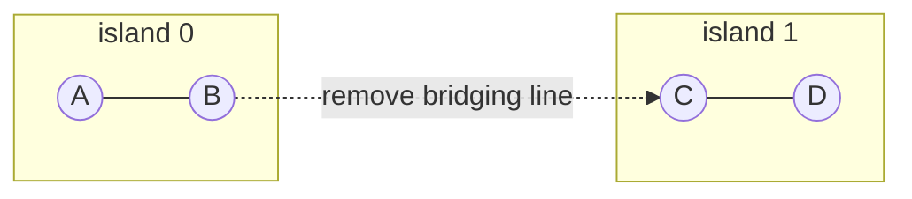
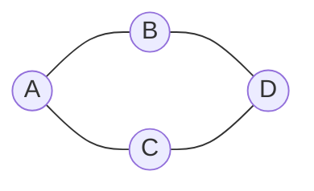

# 06 · Query Engine

Queries are the **read** half of the topology API. They answer questions about
connectivity, reachability, paths, islands, and sources. Every query is
**pure and deterministic**: the underlying algorithms sort nodes and neighbor
lists, so results never depend on insertion order. Two of the derived structures
(adjacency, islands) are cached after each commit, so most queries are `O(1)` or
`O(read)`.

## The algorithms

All algorithms live in `algorithms/traversal.ts` and are generic over
`TNode extends string`. They know **nothing** about electrical semantics — only
graph structure. They perform **no** electrical calculation.

```mermaid
flowchart TB
  nodes[nodes: TNode&#91;&#93;] --> BA
  edges["edges: GraphEdgeRef&#91;&#93;<br/>&#123; id, from, to &#125;"] --> BA
  BA[buildAdjacency<br/>undirected · sorted neighbors · skips self-loops] --> ADJ[(adjacency<br/>Map&lt;TNode, TNode&#91;&#93;&gt;)]
  ADJ --> RF[reachableFrom · BFS]
  ADJ --> SP[shortestPath · BFS]
  nodes --> CC[connectedComponents]
  edges --> CC
  CC --> ISL[(islands<br/>TNode&#91;&#93;&#91;&#93;)]
```

| Function                            | Signature               | Determinism                                                                                                          |
| ----------------------------------- | ----------------------- | -------------------------------------------------------------------------------------------------------------------- |
| `buildAdjacency(nodes, edges)`      | `→ Map<TNode, TNode[]>` | Undirected; **skips self-loops** (`from === to`); ignores edges referencing unknown nodes; **neighbor lists sorted** |
| `reachableFrom(start, adjacency)`   | `→ Set<TNode>`          | BFS from `start`; visits over the sorted adjacency                                                                   |
| `connectedComponents(nodes, edges)` | `→ TNode[][]`           | Islands: **each component sorted**, components **ordered by smallest node id**                                       |
| `shortestPath(from, to, adjacency)` | `→ TNode[] \| null`     | BFS; **stable** because neighbor order is sorted; `[from]` when `from === to`; `null` if unreachable                 |

Edges passed to the algorithms are the abstract `GraphEdgeRef<TNode>` shape
(`{ id, from, to }`). The live graph derives these from **lines + transformers**.

### Determinism guarantees

- **Undirected adjacency** — every edge links both directions.
- **Sorted neighbors** — `buildAdjacency` stores each neighbor set as a sorted
  array, so BFS visitation order (and therefore the chosen shortest path among
  equal-length candidates) is stable.
- **Sorted, ordered components** — each island is sorted internally, and the list
  of islands is ordered by each island's smallest id.
- **Self-loops connect nothing** — skipped during adjacency construction.
- **Unknown endpoints ignored** — the algorithms silently ignore edges whose
  endpoints are not in the node set; the _validator_ reports those as
  `MISSING_REFERENCE` separately.

## Graph-level queries

`ElectricalGraph` exposes electrical-aware wrappers over the cached structures
and the algorithms:

| Query                    | Backed by                                 | Complexity      | Notes                                           |
| ------------------------ | ----------------------------------------- | --------------- | ----------------------------------------------- |
| `neighbors(bus)`         | `cachedAdjacency`                         | `O(1)` map read | Sorted `BusId[]`; `[]` for unknown bus          |
| `reachable(from)`        | `reachableFrom(from, cachedAdjacency)`    | `O(V + E)`      | `ReadonlySet<BusId>`                            |
| `shortestPath(from, to)` | `shortestPath(from, to, cachedAdjacency)` | `O(V + E)`      | `readonly BusId[] \| null`                      |
| `islands()`              | `cachedIslands`                           | `O(1)`          | Precomputed at last commit                      |
| `islandOf(bus)`          | scan of `cachedIslands`                   | `O(islands)`    | First island containing `bus`, else `null`      |
| `islandCount()`          | `cachedIslands.length`                    | `O(1)`          |                                                 |
| `sources()`              | generator map                             | `O(generators)` | Sorted, de-duplicated buses hosting a generator |
| `generatorsAt(bus)`      | generator map filter                      | `O(generators)` | id-sorted                                       |
| `loadsAt(bus)`           | load map filter                           | `O(loads)`      | id-sorted                                       |
| `breakersOf(line)`       | breaker map filter                        | `O(breakers)`   | id-sorted; matches `lineId`                     |

### Islands (electrical islands)

An **island** is a connected component of the bus graph — a maximal set of buses
mutually reachable through lines/transformers. Islands are recomputed once per
commit and cached. The mutation pipeline compares island count before/after a
commit to emit `IslandDetected` (count increased — a split) or `IslandRecovered`
(count decreased — a merge). See [04-mutation-rules.md](./04-mutation-rules.md).

Removing the only edge bridging two groups increases `islandCount()` from 1 to 2
and triggers `IslandDetected`.

### Sources

`sources()` returns the set of buses that host at least one generator — the
grid's energization points. It is derived as the sorted, de-duplicated set of
`generator.busId` values. Phase 3 attaches **no** energization _semantics_ to
this (no power flow); it is a topology fact that future subsystems consume.

### Shortest path — worked example

With buses `A, B, C, D` and edges `A–B, A–C, B–D, C–D`, both `A→B→D` and
`A→C→D` are length-2 paths. Because neighbor lists are sorted, `A`'s neighbors
are `[B, C]`, so BFS reaches `D` via `B` first: `shortestPath(A, D)` deterministically
returns `[A, B, D]`.

## Purity & testability

Because the algorithms are pure and generic, they are unit-tested in isolation
from the graph object. The Phase 3 suite includes 9 algorithm tests plus stress
coverage (a 1000-bus chain, deterministic hashing, and a serialization
round-trip) confirming stable results at scale.
