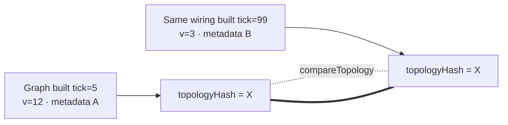
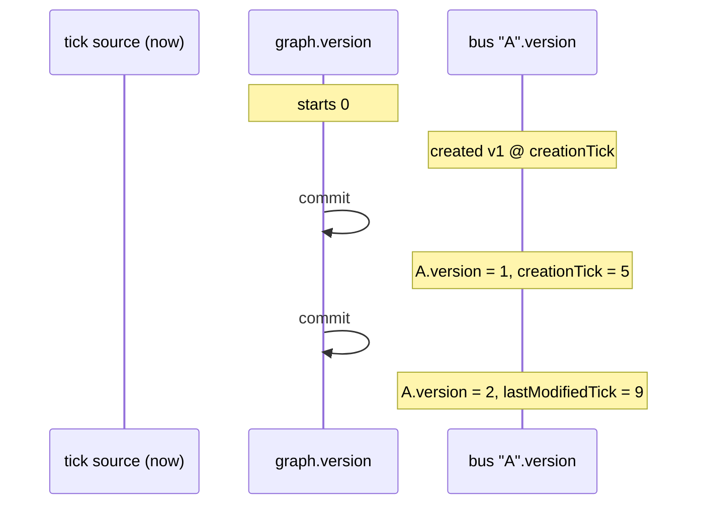

# 07 · Serialization & Versioning

Serialization lives in `serialization/graph-serializer.ts` and operates on the
pure `GraphEntities` bag (and `GraphSnapshot`). It reuses the **kernel's**
`canonicalize` and `hashString` (`@kernel`), so the graph engine adds no new
hashing primitive. There are two distinct projections of the graph — a **full
snapshot** (with provenance) and a **structural projection** (provenance-stripped,
used for hashing/comparison).

## Full snapshot vs structural projection

```mermaid
flowchart TB
  E[(GraphEntities<br/>live records with EntityMeta)] --> FS[graphToSnapshot&#40;entities, version&#41;]
  E --> ST[structural&#40;entities&#41;<br/>internal]

  FS --> SNAP[GraphSnapshot<br/>id-sorted entities + version<br/>+ per-entity version/ticks/metadata]
  SNAP --> SER[serializeGraph → canonical JSON string]
  SER --> DES[deserializeGraph → GraphSnapshot]

  ST --> TH[topologyHash → hashString&#40;canonicalize&#40;…&#41;&#41;]
  TH --> CMP[compareTopology]

  classDef prov fill:#eef;
  class SNAP,SER prov;
```

| Projection                                  | Includes provenance?                                            | Used for                                     |
| ------------------------------------------- | --------------------------------------------------------------- | -------------------------------------------- |
| **Full snapshot** (`GraphSnapshot`)         | Yes — `version`, `creationTick`, `lastModifiedTick`, `metadata` | Persistence, transport, exact reconstruction |
| **Structural** (internal `structural(...)`) | **No** — provenance stripped                                    | `topologyHash`, `compareTopology`            |

## Serialization API

| Function                             | Signature         | Behavior                                                                                  |
| ------------------------------------ | ----------------- | ----------------------------------------------------------------------------------------- |
| `graphToSnapshot(entities, version)` | `→ GraphSnapshot` | Produces a canonical, **id-sorted** snapshot of every entity collection plus `version`    |
| `serializeGraph(snapshot)`           | `→ string`        | Deterministic serialization via the kernel's `canonicalize` (stable key + array ordering) |
| `deserializeGraph(text)`             | `→ GraphSnapshot` | Inverse of `serializeGraph` (`JSON.parse`)                                                |
| `topologyHash(entities)`             | `→ string`        | Deterministic **structural** hash: `hashString(canonicalize(structural(entities)))`       |
| `compareTopology(a, b)`              | `→ boolean`       | `true` iff `topologyHash(a) === topologyHash(b)`                                          |

`GraphSnapshot` extends `GraphEntities` (all seven collections) and adds
`version: number`. `graph.toSnapshot()` returns
`graphToSnapshot(entities, version)`.

## The structural projection in detail

`topologyHash` hashes a reduced view that keeps only wiring-relevant fields and
**excludes** `version`, `creationTick`, `lastModifiedTick`, and `metadata`. Each
collection is id-sorted and its id lists (e.g. `busIds`, `breakerIds`) are sorted,
so ordering can never perturb the hash. The projected fields:

| Entity      | Structural fields retained                                                                                   |
| ----------- | ------------------------------------------------------------------------------------------------------------ |
| Bus         | `id`, `voltage` (`nominalVoltageKv`), `substation` (`substationId`)                                          |
| Substation  | `id`, `name`, `buses` (sorted `busIds`)                                                                      |
| Line        | `id`, `from`, `to`, `capacity` (`capacityMw`), `reactance` (`reactancePu`), `breakers` (sorted `breakerIds`) |
| Transformer | `id`, `from`, `to`, `ratio` (`turnsRatio`)                                                                   |
| Generator   | `id`, `bus` (`busId`), `capacity` (`capacityMw`), `kind` (`generationKind`)                                  |
| Load        | `id`, `bus` (`busId`), `demand` (`nominalDemandMw`), `critical`                                              |
| Breaker     | `id`, `line` (`lineId`), `bus` (`busId`), `state`, `normallyClosed`                                          |

**Consequence:** two graphs with **identical wiring hash identically**, even if
they were built at different ticks, in a different order, through a different
number of intermediate versions, or carry different `metadata`. This is what
makes the hash a reliable topology fingerprint (and drives the deterministic-hash
stress test).

## Two kinds of version

The engine tracks provenance at **two levels**. Do not conflate them.

|                  | Graph version                      | Entity version                                                         |
| ---------------- | ---------------------------------- | ---------------------------------------------------------------------- |
| Where            | `graph.version`                    | `entity.version` (from `EntityMeta`)                                   |
| Starts at        | `0`                                | `1`                                                                    |
| Increments       | Once per **committed** transaction | Once per **modification of that entity** (via `touchMeta`)             |
| Scope            | Whole graph                        | A single entity                                                        |
| Provenance ticks | —                                  | `creationTick`, `lastModifiedTick` (from injected `now` = kernel tick) |

- **`graph.version`** counts committed transactions. It is part of the full
  snapshot but **not** part of the structural hash.
- **`entity.version` / ticks** describe an individual entity's lifecycle and are
  stamped from the injected `now()` (the kernel tick in production wiring). They
  are also **provenance**, so they too are excluded from `topologyHash`.

Because both version counters and ticks are provenance, `topologyHash` is
**provenance-independent**: the hash reflects _what_ the grid is wired like, never
_how or when_ it got there.

## Round-tripping

```mermaid
flowchart LR
  live[Live graph] --> snap[toSnapshot&#40;&#41;] --> txt[serializeGraph → string]
  txt --> back[deserializeGraph → GraphSnapshot]
  back -. same structural fields .-> live
```

A serialize → deserialize round-trip preserves the full snapshot (entities +
version). Structural equality of any two graphs is checked with
`compareTopology`, independent of serialization. Both are covered by the Phase 3
serializer and stress tests (6 serializer tests; a round-trip in the stress
suite).
