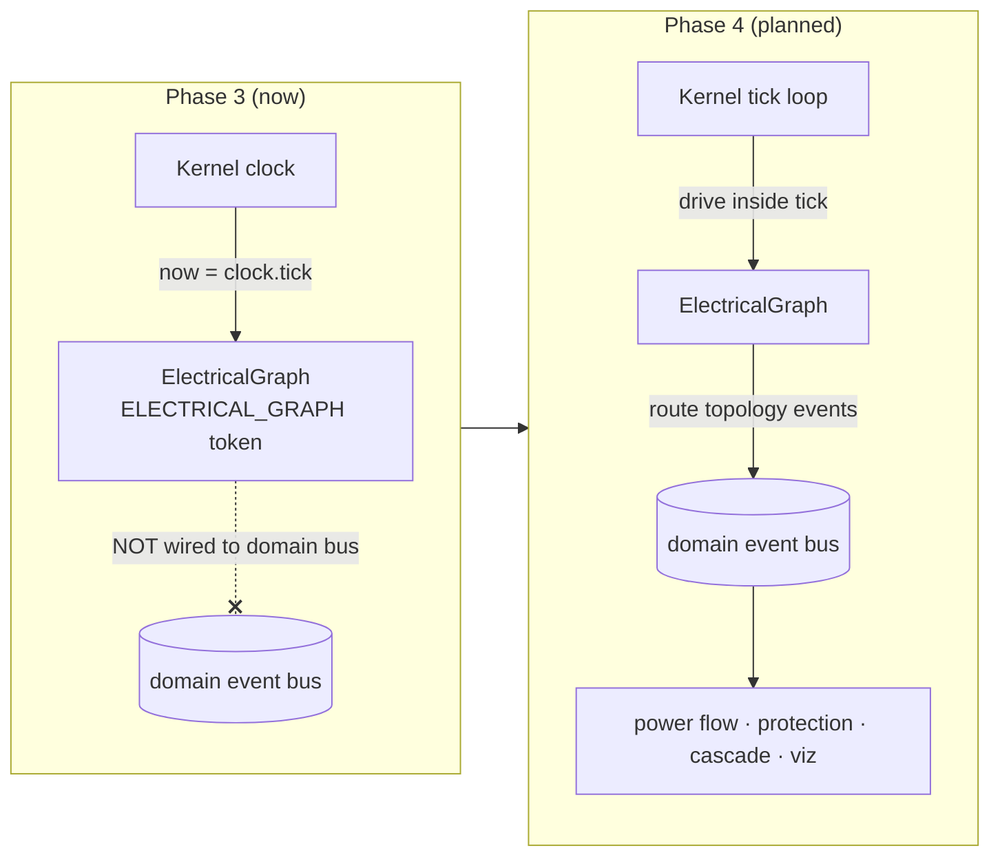

# 08 · Extension Guide

The graph engine is the **single authoritative topology model** and it performs
**no electrical math**. That constraint is a feature: every future subsystem —
power flow, protection, cascade, visualization — can be built _on top of_ the
graph **without modifying it**. This guide describes the three-way contract a
consumer uses.

## The contract: read · drive · subscribe

```mermaid
flowchart TB
  subgraph consumers["Future subsystems (Phase 4+)"]
    PF[Power-flow solver]
    PROT[Protection model]
    CASC[Cascade engine]
    VIS[Visualization / UI]
  end

  GRAPH[[ElectricalGraph<br/>authoritative topology · no math]]

  GRAPH -->|1 · READ via queries| consumers
  consumers -->|2 · DRIVE via mutate&#40;tx&#41;| GRAPH
  GRAPH -->|3 · SUBSCRIBE to topology events| consumers

  BUS[(domain event bus)]
  GRAPH -.->|Phase 4 will route events onto| BUS
  BUS -.-> consumers
  classDef muted stroke-dasharray:4 4;
  class BUS muted;
```



| Interaction       | Mechanism                                                                                   | Rule                                                         |
| ----------------- | ------------------------------------------------------------------------------------------- | ------------------------------------------------------------ |
| **1 · Read**      | Lookups, collections, and queries ([03](./03-topology-api.md), [06](./06-query-engine.md))  | Consumers read topology; they never reach into internal maps |
| **2 · Drive**     | `graph.mutate(recipe)` transactions ([04](./04-mutation-rules.md))                          | The only write path; every change is validated               |
| **3 · Subscribe** | `TopologyEventMap` events on a `TypedEventBus` ([graph-events](./01-graph-architecture.md)) | React to change without polling                              |

The graph never depends on its consumers. Dependencies point **inward** toward
the topology core, never outward.

## 1 · Read the topology

Consume connectivity through the query surface — never by reconstructing
adjacency yourself:

| Consumer               | Reads it needs                                                                                                                                                                                                                |
| ---------------------- | ----------------------------------------------------------------------------------------------------------------------------------------------------------------------------------------------------------------------------- |
| **Power-flow solver**  | `buses()`, `edges()`, `neighbors(bus)`, `islands()` (solve per island), `sources()` (generator buses), `generatorsAt` / `loadsAt`, line `capacityMw` / `reactancePu`, transformer `turnsRatio` (as _inputs_ to its own model) |
| **Protection model**   | `breakers()`, `breakersOf(line)`, `neighbors`, `shortestPath` for fault-path reasoning; breaker `state` / `normallyClosed` as data                                                                                            |
| **Cascade engine**     | `islands()` / `islandOf` / `islandCount()`, `reachable(from)`, `edges()` to reason about post-trip splits                                                                                                                     |
| **Visualization / UI** | `toSnapshot()`, `buses()` / `edges()`, `islands()`, `diagnostics()` for a render model                                                                                                                                        |

The graph exposes `capacityMw`, `reactancePu`, `turnsRatio`, `nominalVoltageKv`,
and `nominalDemandMw` as **data**. A solver reads them as inputs and computes
physics **in its own module** — it must not push results back as topology.

## 2 · Drive change through transactions

Any topology change a subsystem needs (opening a breaker's line, removing a
tripped edge, re-wiring) goes through `mutate`:

```ts
// A protection model deciding to isolate a faulted line:
const result = graph.mutate((tx) => {
  tx.removeLine(faultedLineId);
});
// result.report is the passing validation report;
// result.events lists what changed; islands recomputed automatically.
```

- The transaction is **atomic and validated** — a subsystem cannot leave the
  graph in an invalid state.
- It is **deterministic** — the same decision on the same topology yields the same
  result and event sequence.
- Physics stays in the subsystem; only the **topological consequence** is written
  back through `mutate`.

> Do **not** add electrical calculation, protection logic, or physics fields to
> the graph entities to "make it convenient." Keep those in your own subsystem and
> reference graph entities by their branded ids.

## 3 · Subscribe to topology events

Pass a `TypedEventBus<TopologyEventMap>` as `events` when constructing the graph
(or resolve the DI-registered instance) and subscribe. `TopologyEventMap`
**extends** `KernelEventMap`, so topology events flow on any kernel-compatible
bus.

| Event                                   | Fires when                                                  | Typical consumer reaction                     |
| --------------------------------------- | ----------------------------------------------------------- | --------------------------------------------- |
| `GraphCreated`                          | Graph constructed                                           | Initialize a render/model cache               |
| `NodeAdded` / `NodeRemoved`             | Bus added/removed                                           | Invalidate per-bus caches                     |
| `EdgeAdded` / `EdgeRemoved`             | Line/transformer added/removed                              | Recompute local flows                         |
| `EntityUpdated`                         | Substation/generator/load/breaker added or metadata updated | Refresh entity view                           |
| `ValidationPassed` / `ValidationFailed` | Commit validated / rejected                                 | Surface diagnostics                           |
| `TopologyChanged`                       | Once per successful commit                                  | Trigger a full re-solve                       |
| `IslandDetected` / `IslandRecovered`    | Island count increased / decreased                          | Cascade or blackout logic; UI island coloring |

See [04-mutation-rules.md](./04-mutation-rules.md) for exact per-commit ordering,
and [graph-events](./01-graph-architecture.md) for payload shapes.

## Phase 3 wiring status → Phase 4



- **Today:** `ELECTRICAL_GRAPH` is registered in the composition root, **tick-aware**
  (`now: () => kernel.clock.tick`), but **unwired from the domain bus**. It emits
  events only to a bus explicitly passed at construction.
- **Phase 4** will drive the graph inside the tick loop and route its topology
  events onto the shared domain bus, at which point subscribers wire up without
  any change to the graph engine itself.

## Extension checklist

1. **Resolve** the graph via the `ELECTRICAL_GRAPH` token (do not construct your
   own authoritative instance).
2. **Read** topology through queries; treat numeric fields as inputs.
3. **Compute** physics/logic in your own subsystem/module.
4. **Write back** only topological consequences via `graph.mutate(...)`.
5. **Subscribe** to `TopologyEventMap` events to stay in sync.
6. **Never** modify graph entities, the validator, or the algorithms to embed
   subsystem concerns.

Following this keeps the topology core small, deterministic, and authoritative
while an arbitrary number of physics and gameplay systems compose around it.
