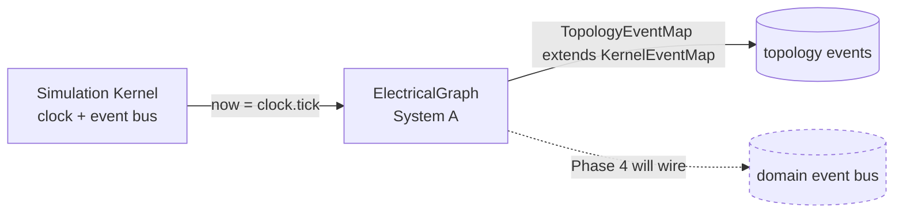

# GridGuard Phase 3 — Electrical Graph Engine

The electrical graph engine is the **single authoritative representation of the
network topology**. It lives in `src/engine/graph/` (System A of the composition
root) and answers exactly one question: _how is the grid wired?_ Buses are nodes;
transmission lines and transformers are edges; generators, loads, and breakers
attach to those; substations group buses. Every read is a topology query and
every write is a validated, transactional mutation — there is one clone per
transaction, adjacency and islands are cached after each commit, and identical
wiring always produces an identical structural hash.

**The graph performs no math.** It computes _no_ power flow, no voltages, no
currents, no protection decisions, no thermal state, no cascades. Numeric fields
such as `capacityMw`, `reactancePu`, and `turnsRatio` are carried as _data_ for
future subsystems to consume — the engine never interprets them physically. This
strict separation is what lets a power-flow solver, protection model, or
visualization layer be added later without touching the topology core: they
**read** through queries, **drive** change through transactions, and **subscribe**
to topology events. See [08-extension-guide.md](./08-extension-guide.md).

The engine emits topology events on a `TopologyEventMap` that **extends** the
kernel's `KernelEventMap`, reuses the kernel's `canonicalize` / `hashString`, and
compiles standalone (`pnpm typecheck:engine`). The Simulation Kernel and the
overall architecture were **not modified** in Phase 3.

## Documentation index

| #   | Document                                                                   | Covers                                                                                  |
| --- | -------------------------------------------------------------------------- | --------------------------------------------------------------------------------------- |
| —   | [README.md](./README.md)                                                   | This index + the "graph performs no math" principle                                     |
| 01  | [01-graph-architecture.md](./01-graph-architecture.md)                     | Responsibilities, node/edge/attachment model, cached adjacency & islands, module layout |
| 02  | [02-entity-model.md](./02-entity-model.md)                                 | Every entity, its fields, `EntityMeta`, immutability, factory functions                 |
| 03  | [03-topology-api.md](./03-topology-api.md)                                 | The `ElectricalGraph` read + `mutate` surface (method reference)                        |
| 04  | [04-mutation-rules.md](./04-mutation-rules.md)                             | The transaction pipeline, determinism, fail-fast, per-commit events                     |
| 05  | [05-validation-pipeline.md](./05-validation-pipeline.md)                   | The 11 structural checks, the structured report, "never silently repair"                |
| 06  | [06-query-engine.md](./06-query-engine.md)                                 | Queries + the pure graph algorithms (islands, shortestPath, reachability, sources)      |
| 07  | [07-serialization-and-versioning.md](./07-serialization-and-versioning.md) | Serialize/deserialize, structural hash vs full snapshot, versioning, `compareTopology`  |
| 08  | [08-extension-guide.md](./08-extension-guide.md)                           | How future subsystems consume the graph without modifying it                            |

## Scope at a glance

| Implemented (Phase 3)                         | Deferred (not implemented)  |
| --------------------------------------------- | --------------------------- |
| Topology entities + immutable records         | Power flow / DC solver      |
| Pure graph algorithms (BFS, components, path) | Protection logic (tripping) |
| Transactional mutation with validation        | Thermal physics             |
| 11-check structural validator                 | Cascade engine              |
| Structural hashing + canonical serialization  | Rendering / UI / gameplay   |
| Topology event emission                       | —                           |

## Where it plugs in

The `ELECTRICAL_GRAPH` DI token is registered in the composition root
(`src/infrastructure/di/composition-root.ts`) and is **tick-aware** via
`now: () => kernel.clock.tick`, but it is **unwired from the domain bus in
Phase 3**. Phase 4 will drive the graph inside the tick and route its events onto
the shared bus.

