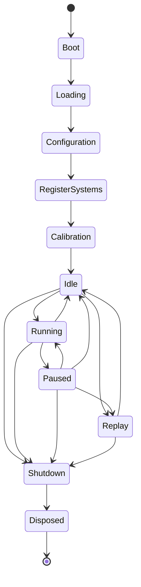
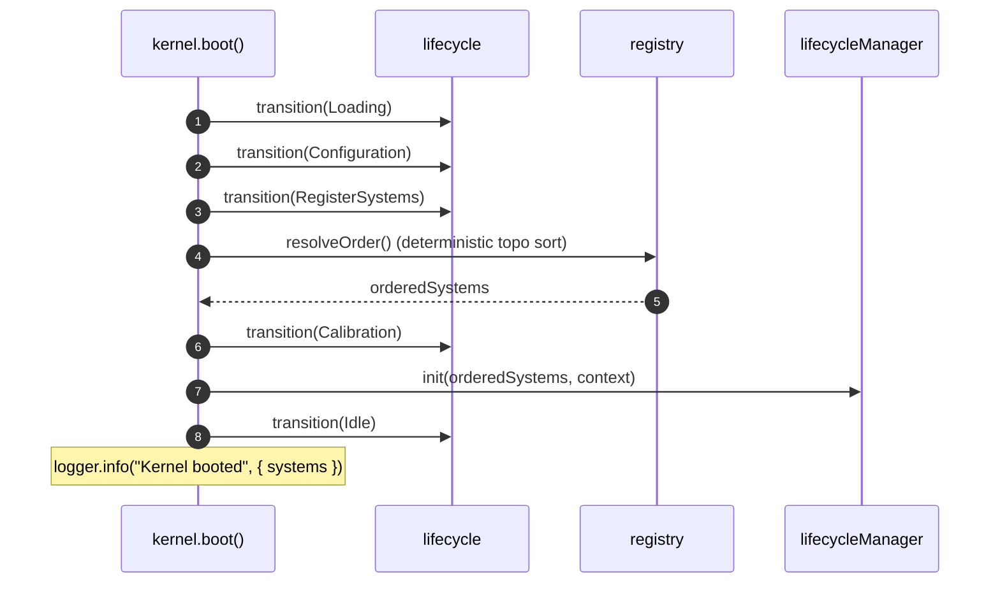

# 01 · Simulation Lifecycle

The kernel owns a **runtime lifecycle** state machine, `KernelState`. It describes _how the runtime is executing_ — booting, running, paused, replaying, disposed — and nothing about gameplay. The old game-arc FSM (`PreCrisis/Crisis/Cascade/Recovery/AfterAction`) was removed from the kernel in Phase 2; a domain arc is a separate, later concern owned by the engine/director.

The vocabulary lives in the `@app-types` leaf (`src/types/kernel-state.ts`) so both `@core` event payloads and the `@kernel` FSM can reference it without a dependency cycle. The transition **rules** live with the implementation in `@kernel`.

## States

`KernelState` is a `const` object with eleven states:

| State             | Meaning                                                          |
| ----------------- | ---------------------------------------------------------------- |
| `Boot`            | Initial state. Systems may still be registered.                  |
| `Loading`         | Boot walk step — loading resources.                              |
| `Configuration`   | Boot walk step — applying configuration.                         |
| `RegisterSystems` | Boot walk step — the registry resolves its execution order here. |
| `Calibration`     | Boot walk step — systems are initialized (`init`).               |
| `Idle`            | Booted and ready; not ticking. The hub state.                    |
| `Running`         | Ticking. `tick()` is only legal here (or in `Replay`).           |
| `Paused`          | Ticking suspended; resumable.                                    |
| `Replay`          | Ticking a recorded run; `tick()` is legal here.                  |
| `Shutdown`        | Terminal-approaching; the only exit is `Disposed`.               |
| `Disposed`        | Terminal. No transitions out.                                    |

## Legal transitions

The transition graph is `KERNEL_TRANSITIONS` (`src/kernel/fsm/kernel-transitions.ts`) — a frozen `Record<KernelState, readonly KernelState[]>`. **There are no hidden or implicit transitions**; any edge not listed is rejected.

| From              | To (legal)                              |
| ----------------- | --------------------------------------- |
| `Boot`            | `Loading`                               |
| `Loading`         | `Configuration`                         |
| `Configuration`   | `RegisterSystems`                       |
| `RegisterSystems` | `Calibration`                           |
| `Calibration`     | `Idle`                                  |
| `Idle`            | `Running`, `Replay`, `Shutdown`         |
| `Running`         | `Paused`, `Idle`, `Shutdown`            |
| `Paused`          | `Running`, `Idle`, `Replay`, `Shutdown` |
| `Replay`          | `Idle`, `Shutdown`                      |
| `Shutdown`        | `Disposed`                              |
| `Disposed`        | _(none — terminal)_                     |



## The lifecycle object

`createKernelLifecycle(initial = KernelState.Boot)` returns a `KernelLifecycle`:

| Member               | Behavior                                                                 |
| -------------------- | ------------------------------------------------------------------------ |
| `state`              | The current `KernelState`.                                               |
| `can(target)`        | `true` iff `target` is in `KERNEL_TRANSITIONS[state]`.                   |
| `transition(target)` | Validates, updates state, notifies listeners. Throws on an illegal edge. |
| `onChange(listener)` | Observe `{ from, to }` changes; returns an `Unsubscribe`.                |

Illegal transitions throw `InvalidStateTransitionError` carrying the exact `from → to` pair. The state machine is pure and domain-agnostic — it validates and notifies, nothing more.

The kernel **bridges** every validated change onto the event bus:

```ts
lifecycle.onChange(({ from, to }) => {
  events.emit(KERNEL_EVENT.KernelStateChanged, { from, to, tick: clock.tick });
});
```

## The boot walk

`kernel.boot()` walks the five setup edges in order and resolves + initializes systems along the way:



## Method → transition map

| Kernel method   | Transition(s)                                                           | Guard                                   |
| --------------- | ----------------------------------------------------------------------- | --------------------------------------- |
| `boot()`        | `Boot → Loading → Configuration → RegisterSystems → Calibration → Idle` | —                                       |
| `start()`       | `→ Running`                                                             | from `Idle`                             |
| `pause()`       | `→ Paused`                                                              | from `Running`                          |
| `resume()`      | `→ Running`                                                             | from `Paused`                           |
| `stop()`        | `→ Idle`                                                                | from `Running`/`Paused`/`Replay`        |
| `enterReplay()` | `→ Replay`                                                              | from `Idle`/`Paused`                    |
| `exitReplay()`  | `→ Idle`                                                                | from `Replay`                           |
| `shutdown()`    | `→ Shutdown`                                                            | from `Idle`/`Running`/`Paused`/`Replay` |
| `dispose()`     | `→ Disposed` + tears down systems/scheduler/registry/bus                | from `Shutdown`                         |
| `transition(t)` | low-level validated transition to `t`                                   | any legal edge                          |

`register(system)` is only legal while in `Boot` — it throws `GridGuardError` otherwise. `tick()`/`run(n)` require `Running` **or** `Replay` (see [02 · Tick Pipeline](./02-tick-pipeline.md)).
