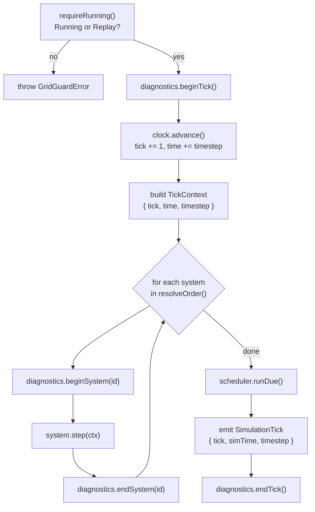

# 02 · Tick Pipeline

A **tick** is one fixed timestep of simulation. The kernel drives ticks; systems only advance when the kernel steps them. `tick()` is legal only while the kernel is in `Running` or `Replay` — any other state throws `GridGuardError` via the `requireRunning` guard. `run(count)` simply calls the tick pipeline `count` times.

## The ordered pipeline

Every tick executes exactly these steps, in this order:

1. **`requireRunning()`** — assert state is `Running` or `Replay`, else throw.
2. **`diagnostics.beginTick()`** — mark the tick start (injected wall-clock).
3. **`clock.advance()`** — the _only_ place simulation time moves; `tick += 1`, `time += timestep`.
4. **Build `TickContext`** — `{ tick, time, timestep }` read from the clock.
5. **For each system in `registry.resolveOrder()`** (resolved once at boot):
   - `diagnostics.beginSystem(id)`
   - `system.step(ctx)` (via the stateless `systemRunner`)
   - `diagnostics.endSystem(id)`
6. **`scheduler.runDue()`** — fire all task-scheduler callbacks due at the new tick.
7. **`emit(SimulationTick, { tick, simTime, timestep })`** — publish the tick to consumers.
8. **`diagnostics.endTick()`** — record tick duration.

## Why this order

| Ordering choice                    | Reason                                                                                      |
| ---------------------------------- | ------------------------------------------------------------------------------------------- |
| `clock.advance()` first            | The `TickContext`, systems, tasks, and the emitted tick all agree on the _new_ tick number. |
| Systems in `resolveOrder()`        | Each system runs after its declared dependencies — a deterministic topological order.       |
| `scheduler.runDue()` after systems | Timed tasks observe the fully-stepped world for the current tick.                           |
| `SimulationTick` emitted last      | Consumers (`@state`, `@replay`, `@debug`) see a settled tick, not a half-stepped one.       |
| Diagnostics wrap each phase        | Per-system and per-tick timing without polluting the pure simulation logic.                 |

## Contexts

Two distinct read-only contexts flow through the pipeline:

| Context         | Built at | Fields                             | Given to                        |
| --------------- | -------- | ---------------------------------- | ------------------------------- |
| `SystemContext` | boot     | `events`, `rng`, `clock`, `logger` | `system.init(ctx)` (once)       |
| `TickContext`   | per tick | `tick`, `time`, `timestep`         | `system.step(ctx)` (every tick) |

A system captures long-lived services from `SystemContext` at `init`, then receives fresh per-tick facts through `TickContext` on every `step`.

## Determinism properties

- **Fixed timestep, virtual time.** `clock.advance()` moves time by a constant `timestep`; simulation time is fully decoupled from wall-clock. The kernel never touches `requestAnimationFrame`.
- **Stable system order.** `resolveOrder()` is computed once at boot and reused every tick — no per-tick re-sorting, no ordering drift.
- **Deterministic scheduling.** `scheduler.runDue()` fires due tasks in a defined order (see [04 · Task Scheduler](./04-scheduler.md)).
- **Ordered emission.** The bus dispatches in `(priority desc, subscription order)` (see [03 · Event Pipeline](./03-event-pipeline.md)).

Given the same seed, systems, and tick/transition sequence, the emitted event stream, snapshots, and hashes are identical run-to-run.
