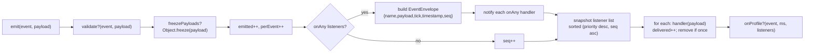

# 03 · Event Pipeline

The event bus is the only channel between the simulation and its consumers (rendering, audio, UI, state, replay, analytics). Consumers never poll simulation internals — they subscribe. `createEventBus<TMap>(options?)` lives in `@core` (`src/core/events/event-bus.ts`) and returns a `TypedEventBus<TMap>`: an in-memory, synchronous, ordered publish/subscribe bus, generic over an event map (name → payload type).

## Kernel event map vs. domain event map

The kernel is generic over `TEvents extends KernelEventMap` and owns only two events:

```ts
export interface KernelEventMap {
  SimulationTick: SimulationTickPayload; // { tick, simTime, timestep }
  KernelStateChanged: KernelStateChangedPayload; // { from, to, tick } — from/to are KernelState
}
```

A domain event map **extends** this one, so kernel events flow on the same bus while the kernel never references a domain event name:

```ts
export interface GridEventMap extends KernelEventMap {
  WeatherChanged: WeatherChangedPayload;
  PowerFlowSolved: PowerFlowSolvedPayload;
  /* … all electrical/gameplay events … */
}
```

The kernel creates its bus as `TypedEventBus<TEvents>`; in the app, the `EVENT_BUS` token resolves to `kernel.events` so every event is tick-tagged by the kernel's own tick provider.

## API surface

| Method                                     | Purpose                                                                  |
| ------------------------------------------ | ------------------------------------------------------------------------ |
| `on(event, handler, { priority?, once? })` | Subscribe; returns an `Unsubscribe`. Higher `priority` runs first.       |
| `once(event, handler)`                     | Subscribe for a single dispatch, then auto-remove.                       |
| `off(event, handler)`                      | Remove a specific handler.                                               |
| `emit(event, payload)`                     | Synchronously dispatch to all handlers (payload type-checked).           |
| `onAny(handler)`                           | Subscribe to **every** event as a traced `EventEnvelope` (debug/replay). |
| `clear()`                                  | Remove every subscription and every `onAny` listener.                    |
| `listenerCount(event)`                     | Handlers registered for one event.                                       |
| `totalListenerCount()`                     | Handlers across all events.                                              |
| `stats()`                                  | `{ emitted, delivered, perEvent }`.                                      |
| `resetStats()`                             | Zero the counters (and the emit sequence).                               |

## The `onAny` trace and `EventEnvelope`

`onAny` is the **seam replay records through**. Every `emit` — when at least one `onAny` listener is attached — wraps the event in an envelope before dispatch to normal handlers:

```ts
interface EventEnvelope<TName, TPayload> {
  readonly name: TName;
  readonly payload: TPayload;
  readonly tick: number; // from tickProvider
  readonly timestamp: number; // from timeProvider (ms)
  readonly seq: number; // monotonic emit sequence — deterministic ordering key
}
```

The recorder subscribes `onAny` and pushes `{ tick, seq, name, payload }` into the recording (see [08 · Replay Pipeline](./08-replay-pipeline.md)). The `seq` counter advances on every emit whether or not anyone is tracing, so sequence numbers are stable.

## Dispatch order

Within a single event, handlers run in **priority descending, then subscription order**. On subscribe, the listener list is re-sorted by `(priority desc, seq asc)`. On emit, the bus iterates a **snapshot** (`[...listeners]`) so a handler may safely subscribe or unsubscribe mid-dispatch without corrupting the current fan-out. `once` handlers are removed after their invocation.



## Bus options

`createEventBus<TMap>(options)` accepts:

| Option           | Effect                                                                             |
| ---------------- | ---------------------------------------------------------------------------------- |
| `tickProvider`   | Supplies the current tick for envelope tagging (kernel passes `() => clock.tick`). |
| `timeProvider`   | Supplies a monotonic time (ms) for `timestamp` and profiling.                      |
| `freezePayloads` | `Object.freeze` each object payload before dispatch — enforces immutability.       |
| `leakThreshold`  | Warn (via `onLeak`) when an event's listener count exceeds this.                   |
| `onLeak`         | `(event, count) => void`; the kernel logs a listener-leak warning.                 |
| `validate`       | `(event, payload) => void`; throw to reject a payload before dispatch.             |
| `onProfile`      | `(event, durationMs, listeners) => void`; invoked after each emit.                 |

The kernel wires the bus with `tickProvider: () => clock.tick`, the injected `timeProvider`, `freezePayloads` and `leakThreshold` from options, and an `onLeak` that logs through the kernel logger.

## Statistics

`stats()` returns `{ emitted, delivered, perEvent }`: total emits, total handler invocations, and a per-event emit count. `resetStats()` zeroes the counters and the emit sequence. These are pure introspection — useful for the debug overlay and leak diagnosis, and they never affect dispatch.
