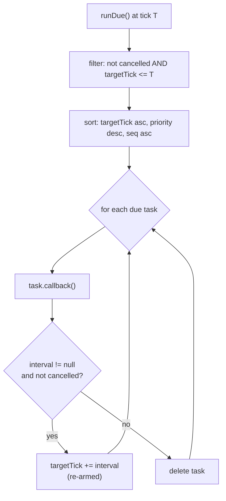

# 04 · Task Scheduler

The **task scheduler** runs one-shot and repeating callbacks as a function of the simulation clock. It **never** uses `setTimeout`, `setInterval`, or any browser timer — every task fires deterministically off the tick count, so scheduling is fully reproducible. The kernel calls `scheduler.runDue()` once per tick, after advancing the clock (see [02 · Tick Pipeline](./02-tick-pipeline.md)).

> Do not confuse this with the internal `systemRunner` (`createScheduler`), which merely steps registered systems in order each tick. The **task scheduler** (`createTaskScheduler`) schedules arbitrary callbacks at future ticks/times.

## Construction

`createTaskScheduler(clock)` binds the scheduler to a `Clock`. All relative scheduling (`afterTicks`, `atNextTick`, `everyTicks`, `atSimTime`) is computed against `clock.tick` / `clock.timestep` at the moment of scheduling.

## Scheduling API

| Method                                | Fires when…                                                                        |
| ------------------------------------- | ---------------------------------------------------------------------------------- |
| `atTick(tick, cb, priority?)`         | the clock reaches absolute `tick`.                                                 |
| `afterTicks(n, cb, priority?)`        | `n` ticks from now (`clock.tick + n`). Rejects `n < 0`.                            |
| `atNextTick(cb, priority?)`           | the next tick (`clock.tick + 1`).                                                  |
| `everyTicks(interval, cb, priority?)` | every `interval` ticks, first at `clock.tick + interval`. Rejects `interval <= 0`. |
| `atSimTime(seconds, cb, priority?)`   | the first tick whose sim time reaches `seconds` (`ceil(seconds / timestep)`).      |

Each returns a `ScheduledTask` `{ id, cancel() }`. `cancel()` marks the task cancelled and removes it before it fires.

| Member         | Meaning                                                    |
| -------------- | ---------------------------------------------------------- |
| `runDue()`     | Execute all tasks due at the current tick (kernel-called). |
| `pendingCount` | Number of tasks still scheduled.                           |
| `clear()`      | Drop every scheduled task.                                 |

## Deterministic ordering

`runDue()` collects every non-cancelled task whose `targetTick <= clock.tick`, then sorts by:

```
targetTick ascending  →  priority descending  →  scheduling order (seq ascending)
```

so same-tick tasks always execute in a defined, reproducible order regardless of insertion timing.



Repeating tasks (`everyTicks`) re-arm by advancing `targetTick += interval` after firing; one-shot tasks are deleted. A task cancelled _during_ its own dispatch is not re-armed.

## Why no browser timers

`setTimeout`/`setInterval` fire off wall-clock, which is non-deterministic and coupled to the host's event loop. Anchoring every callback to the simulation clock means:

- A run replays identically — tasks fire at the exact same ticks.
- Snapshots are complete — scheduled work is a pure function of tick state, not hidden timer handles.
- Tests need no fake timers — advance the clock and call `runDue()`.

## Example

```ts
const scheduler = createTaskScheduler(clock);

scheduler.atSimTime(2.0, () => bus.emit(GRID_EVENT.WeatherChanged, heatwave)); // at sim time 2s
const pulse = scheduler.everyTicks(10, () => diagnostics.report(), 5); // every 10 ticks, priority 5
// …later…
pulse.cancel();
```
