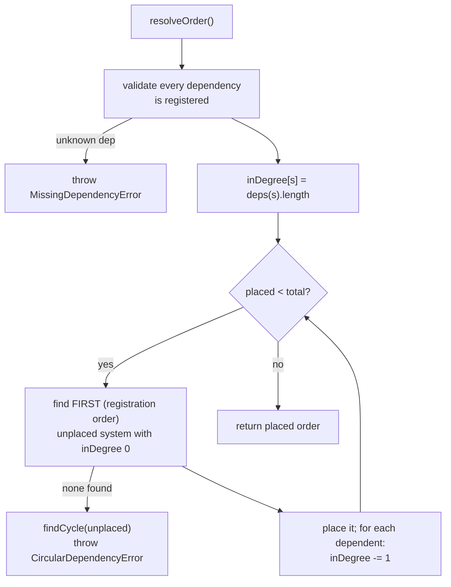

# 05 · Dependency Resolution

Systems declare an optional `dependencies?: SystemId[]` — the ids of systems that must run **before** them each tick. The registry turns those edges into a single deterministic execution order via `resolveOrder()`, computed once at boot and reused every tick. This is how, for example, a protection system can be guaranteed to run after the power-flow solver without the kernel knowing what either does.

## The algorithm: deterministic topological sort

`resolveOrder()` (`src/kernel/registry/system-registry.ts`) is a Kahn-style topological sort with a **registration-order tie-break**:

1. **Validate dependencies.** For every system, every declared dependency must be a registered id — otherwise throw `MissingDependencyError(system, dependency)`.
2. **Compute in-degrees.** Each system's in-degree is its number of declared dependencies.
3. **Place in waves.** Repeatedly pick the _first system in registration order_ whose in-degree is `0` and is not yet placed; append it, then decrement the in-degree of every system that depends on it.
4. **Detect cycles.** If no in-degree-0 system remains but systems are still unplaced, throw `CircularDependencyError` with the cycle path.

Because step 3 always scans in **registration order** and picks the first eligible system, the output is fully deterministic: the same set of systems with the same dependencies always yields the same order.

## Tie-breaks

When several systems are simultaneously eligible (all dependencies satisfied), the one **registered earliest** goes first. This makes ordering stable and predictable:

| Registration order | Dependencies         | Resolved order |
| ------------------ | -------------------- | -------------- |
| `A`, `B`, `C`      | _(none)_             | `A, B, C`      |
| `A`, `B`, `C`      | `C → [A]`            | `A, B, C`      |
| `A`, `B`, `C`      | `A → [B]`            | `B, A, C`      |
| `A`, `B`, `C`      | `A → [C]`, `B → [C]` | `C, A, B`      |

## Errors

| Error                     | Thrown when                                          | Carries                          |
| ------------------------- | ---------------------------------------------------- | -------------------------------- |
| `MissingDependencyError`  | a system depends on an id that was never registered. | the system id and the missing id |
| `CircularDependencyError` | the dependency graph contains a cycle.               | the **cycle path** of system ids |

`findCycle` performs a depth-first walk over the unplaced systems to report the actual cycle (e.g. `A → B → C → A`), not just "a cycle exists," so the offending edge is easy to locate.

## Why this matters

- **New systems integrate without touching the kernel.** A future system declares what it needs and the registry orders it correctly. The kernel's tick loop is unchanged (see [10 · Extension Guide](./10-extension-guide.md)).
- **Determinism is preserved.** Ordering is a pure function of the registered set and their declared edges — no wall-clock, no hashing of object identity, no `Map` iteration surprises (the registry preserves insertion order).
- **Mistakes fail loudly at boot.** A missing or circular dependency throws during `boot()` (`RegisterSystems` step), never silently mis-orders a tick.
