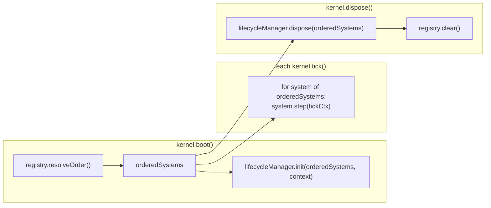

# 06 · System Registry

The **system registry** is the kernel's catalogue of `SimulationSystem`s. It is insertion-ordered and dependency-aware: it preserves registration order for `all()`, and produces a deterministic dependency-respecting order for `resolveOrder()`. Crucially, it knows nothing about what a system _does_ — only the `SimulationSystem` contract — so new systems (power flow, cascade, weather, audio, …) are added without modifying the kernel.

The registry is generic over `TEvents extends KernelEventMap`, defaulting to the domain-agnostic `KernelEventMap`.

## API

`createSystemRegistry<TEvents>()` returns a `SystemRegistry<TEvents>`:

| Method             | Behavior                                                                             |
| ------------------ | ------------------------------------------------------------------------------------ |
| `register(system)` | Add a system by `id`. Throws `GridGuardError` on a duplicate id.                     |
| `get(id)`          | The system with `id`, or `undefined`.                                                |
| `has(id)`          | Whether `id` is registered.                                                          |
| `all()`            | All systems, **in registration order**.                                              |
| `resolveOrder()`   | Systems in deterministic dependency order (see [05](./05-dependency-resolution.md)). |
| `clear()`          | Remove every system.                                                                 |

Internally the registry is a `Map<SystemId, SimulationSystem>`, which preserves insertion order — the foundation for the registration-order tie-break in `resolveOrder()`.

## The `SimulationSystem` contract

A system is the only thing the scheduler advances each tick. It owns its own authoritative state and communicates exclusively through events.

```ts
interface SimulationSystem<TEvents extends KernelEventMap = KernelEventMap> extends Disposable {
  readonly id: SystemId;
  readonly dependencies?: readonly SystemId[]; // must run before this system
  init(context: SystemContext<TEvents>): void; // one-time setup
  step(context: TickContext): void; // advance one fixed timestep
  reset(): void; // return to initial state
  dispose(): void; // release resources (from Disposable)
}
```

Optionally, a state-owning system implements `SnapshotableSystem` (`captureState`/`restoreState`) to opt into deterministic snapshot/restore — see [07 · Snapshot Architecture](./07-snapshot-architecture.md).

## How the kernel uses the registry



- **Registration happens before boot.** `kernel.register(system)` delegates to `registry.register` and is only legal in the `Boot` state.
- **Order is resolved once** at boot (`RegisterSystems` step) and captured as `orderedSystems`, reused for every tick and for dispose.
- **The lifecycle manager** drives `init` / `reset` / `dispose` across the ordered systems; the per-tick `systemRunner` drives `step`.

## Extension without kernel edits

Adding a system is purely additive:

1. Implement `SimulationSystem` (and optionally `SnapshotableSystem`).
2. Declare `dependencies` on the ids it must run after.
3. `kernel.register(it)` before `boot()`.

The registry orders it, the kernel steps it, and its events flow to consumers already subscribed — no change to `simulation-kernel.ts`. The full worked example is in [10 · Extension Guide](./10-extension-guide.md).
