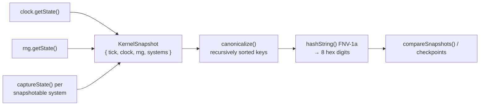

# 07 · Snapshot Architecture

A **snapshot** is an authoritative capture of simulation state at a tick. It contains _only_ simulation state — never renderer or UI state — and is deterministic: two runs at the same tick produce byte-identical snapshots and therefore identical hashes. Snapshots power `kernel.snapshot()`/`restore()`/`hash()`, replay checkpoints, and fast replay seeking. The implementation is `src/kernel/snapshot/snapshot.ts`.

## `KernelSnapshot`

```ts
interface KernelSnapshot {
  readonly tick: number;
  readonly clock: ClockState; // { tick, elapsed }
  readonly rng: RngState; // { s0, s1 } — 64-bit words as decimal strings
  readonly systems: Readonly<Record<string, unknown>>; // per-system captured state, keyed by system id
}
```

The clock and RNG states are the full internal state of the deterministic core; `systems` holds whatever each snapshotable system chose to capture.

## Capture and restore

| Function                                               | Behavior                                                                                                   |
| ------------------------------------------------------ | ---------------------------------------------------------------------------------------------------------- |
| `captureKernelSnapshot(clock, rng, systems)`           | Reads `clock.getState()`, `rng.getState()`, and `captureState()` for each snapshotable system.             |
| `restoreKernelSnapshot(snapshot, clock, rng, systems)` | `clock.setState()`, `rng.setState()`, then `restoreState()` for each snapshotable system with saved state. |

The kernel exposes these as `kernel.snapshot()` and `kernel.restore(s)`, passing the ordered systems.

### Opting in: `SnapshotableSystem`

Only systems that hold authoritative state participate. A system opts in by implementing:

```ts
interface SnapshotableSystem {
  captureState(): unknown;
  restoreState(state: unknown): void;
}
```

`isSnapshotable(system)` is the runtime type guard (checks for a `captureState` function). During capture/restore the kernel skips any system that is not snapshotable, so a stateless system needs no extra code. `captureState`/`restoreState` **must round-trip exactly** — the captured value is serialized and hashed.

## Canonicalization

`canonicalize(value)` produces a deterministic string: JSON with **recursively sorted object keys**, so the output depends only on values, not on insertion order.

- `undefined` → `"null"`; `null`/primitives → `JSON.stringify`.
- Arrays → element order preserved (order is meaningful).
- Objects → keys sorted, then serialized.

This is what makes snapshot hashes stable across runs and machines — two structurally-equal states serialize identically regardless of how their keys were inserted.

## Hashing: FNV-1a 32-bit

`hashString(text)` is a **FNV-1a 32-bit** hash rendered as 8 hex digits — deterministic and fast, with no crypto dependency:

```
hash = 0x811c9dc5
for each char: hash ^= charCode; hash = (hash * 0x01000193) >>> 0
return hash.toString(16).padStart(8, '0')
```

| Function                      | Returns                                                                 |
| ----------------------------- | ----------------------------------------------------------------------- |
| `serializeSnapshot(snapshot)` | `canonicalize(snapshot)` — the canonical string form.                   |
| `hashSnapshot(snapshot)`      | `hashString(serializeSnapshot(snapshot))` — the 8-hex determinism hash. |
| `hashString(text)`            | FNV-1a 32-bit of an arbitrary string.                                   |
| `compareSnapshots(a, b)`      | `{ equal, hashA, hashB }` — hash-based equality of two snapshots.       |

`kernel.hash()` is `hashSnapshot(captureKernelSnapshot(...))` — a one-call fingerprint of the current authoritative state.



## Where snapshots are used

- **`kernel.snapshot()/restore()/hash()`** — capture, rewind, or fingerprint the live simulation.
- **Replay checkpoints** — the recorder stores `hashSnapshot` values at chosen ticks; the verifier compares them (see [08 · Replay Pipeline](./08-replay-pipeline.md)).
- **`SnapshotStore`** in `@replay` — keeps tick-ordered snapshots and finds the `nearest(tick)` one, so seeking during replay is an O(1) restore plus a short fast-forward rather than replaying from tick zero.
