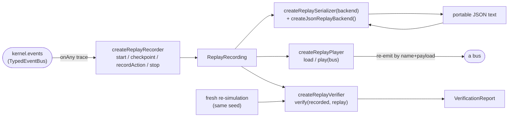

# 08 · Replay Pipeline

`@replay` is now a **real** first-class module (not the Phase-1 placeholder). Because the kernel is deterministic — seeded `xoroshiro128+` RNG + fixed-timestep clock — a run is fully reproducible from its `seed` plus its recorded event stream, and snapshots merely make seeking fast. The module records a run via the bus's `onAny` trace, plays it back by re-emitting events, serializes/deserializes recordings, verifies that a replay reproduces the original stream, and stores snapshots for fast seeking. It imports `@core` and `@kernel`, never a consumer layer.

## The recording model

```ts
interface RecordedEvent {
  tick: number;
  seq: number;
  name: string;
  payload: unknown;
}
interface ReplayCheckpoint {
  tick: number;
  hash: string;
} // a snapshot hash at a tick
interface PlayerAction {
  tick: number;
  kind: string;
  data: unknown;
} // operator action
interface ReplayMetadata {
  version: string;
  configHash: string;
  seed: number;
  tickCount: number;
}

interface ReplayRecording {
  recordingId: string; // deterministic — no wall-clock
  metadata: ReplayMetadata;
  events: readonly RecordedEvent[];
  actions: readonly PlayerAction[];
  checkpoints: readonly ReplayCheckpoint[];
}
```

## The pipeline



### 1 · Recorder — `createReplayRecorder()`

`start({ seed, version, configHash, bus })` subscribes to `bus.onAny` and pushes every envelope as a `RecordedEvent { tick, seq, name, payload }`.

| Member                   | Behavior                                                                      |
| ------------------------ | ----------------------------------------------------------------------------- |
| `start(options)`         | Reset buffers, capture provenance, subscribe `onAny`, set `recording = true`. |
| `checkpoint(tick, hash)` | Record a determinism checkpoint (a snapshot hash at a tick).                  |
| `recordAction(action)`   | Record a `PlayerAction` for faithful re-simulation.                           |
| `stop(tickCount)`        | Unsubscribe, set `recording = false`, return the finished `ReplayRecording`.  |
| `recording`              | Whether a recording is in progress.                                           |

The `recordingId` is **deterministic** — `` `replay-seed${seed}-ticks${tickCount}` `` — with no wall-clock, so the same run always yields the same id.

### 2 · Serializer — `createReplaySerializer(backend)`

Persists a recording to/from portable text via an injected `Serializer`. `createJsonReplayBackend()` is a **pure JSON** backend (returns `Result<string, Error>` / `Result<T, Error>`; uses only the `JSON` global — no DOM or Node APIs), kept in `@replay` so the pure layer can serialize without importing a consumer.

### 3 · Player — `createReplayPlayer()`

`load(recording)` then `play(bus)` re-emits the recorded events onto a bus **by name + payload**, in recorded order. Every consumer (rendering, audio, UI) reacts to a replay exactly as it did live — no special-casing, because the recorded stream is the source of truth.

### 4 · Verifier — `createReplayVerifier()`

`verify(recorded, replay)` proves a reproduction is faithful. It diffs the two runs and reports the **first** divergence:

```ts
interface VerificationReport {
  deterministic: boolean;
  divergedAtTick: number | null;
  checkedEvents: number;
  expected: RecordedEvent | null;
  actual: RecordedEvent | null;
  checkpointMismatchTick: number | null;
}
```

Order of checks:

1. **Event streams.** Compare events pairwise; two events match when `name`, `tick`, and `canonicalize(payload)` all agree. A mismatch reports `divergedAtTick`, `expected`, `actual`.
2. **Stream length.** A length difference is a divergence at the first unmatched event's tick.
3. **Checkpoint hashes.** Compare checkpoint hashes pairwise; the first mismatch reports `checkpointMismatchTick`.

If all pass, `deterministic: true`. Payload comparison uses the kernel's `canonicalize`, so key-order differences never register as false divergences.

### 5 · Snapshot store — `createSnapshotStore()`

Keeps `KernelSnapshot`s ordered by tick. `put`, `at(tick)`, and `nearest(tick)` (the newest snapshot at or before `tick`) let a seek do an O(1) restore plus a short fast-forward instead of replaying from tick zero.

> **Timeline** (`createTimeline` / `PlaceholderTimeline`) remains a Phase-8 placeholder: it will scan the recorded event stream for severity-tagged markers (first overload, cascade start, blackout, recovery). The record/serialize/play/verify/snapshot path above is real today.

## Determinism proof

| Scenario                       | Verifier result                                                                                         |
| ------------------------------ | ------------------------------------------------------------------------------------------------------- |
| Same seed, config, and actions | Identical event stream **and** checkpoint hashes → `deterministic: true`.                               |
| Different seed                 | Streams/hashes diverge → the verifier reports the first `divergedAtTick` (or `checkpointMismatchTick`). |

This is the strongest guarantee in the runtime: record a run, re-simulate from the same seed, and the verifier confirms the reproduction is bit-for-bit faithful — or pinpoints exactly where it wasn't.
