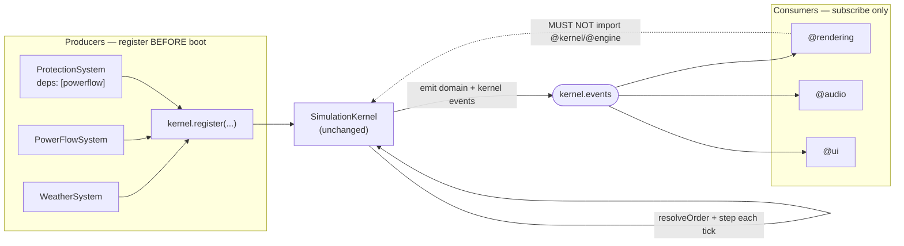

# 10 · Extension Guide

The kernel is domain-agnostic and closed for modification: a new system, renderer, or audio consumer integrates **without editing `simulation-kernel.ts`**. This document shows how. The rule of thumb: _producers_ implement `SimulationSystem` and register before boot; _consumers_ subscribe to events. Neither touches the kernel.

## Two kinds of extension

| You are adding…                          | You implement…                              | You touch the kernel? |
| ---------------------------------------- | ------------------------------------------- | --------------------- |
| A simulation producer (physics, weather) | `SimulationSystem` + `register` before boot | **No**                |
| A consumer (renderer, audio, UI, HUD)    | An event subscription (`bus.on(...)`)       | **No**                |

## Adding a simulation system

### 1 · Implement `SimulationSystem`

```ts
import type { SimulationSystem, SystemContext, TickContext } from '@core';
import type { SystemId } from '@app-types';

class WeatherSystem implements SimulationSystem<GridEventMap> {
  readonly id = 'weather' as SystemId;
  readonly dependencies = [] as const; // declare ids that must run BEFORE this one

  private ctx!: SystemContext<GridEventMap>;

  init(ctx: SystemContext<GridEventMap>): void {
    this.ctx = ctx; // capture events, rng, clock, logger
  }

  step(_tick: TickContext): void {
    // advance one fixed timestep, then emit domain facts (ids + scalars only)
    this.ctx.events.emit(GRID_EVENT.WeatherChanged, { kind, temperature });
  }

  reset(): void {
    /* return to initial state */
  }
  dispose(): void {
    /* release resources */
  }
}
```

Key contract points:

- Draw all randomness from `ctx.rng` — never `Math.random()` (banned; see [11 · Determinism Guarantees](./11-determinism-guarantees.md)).
- Read time from `ctx.clock` / the per-tick `TickContext`; never `Date.now()` or `performance.now()`.
- Emit only **ids, scalars, and enums** in payloads — never a model object. Consumers read richer detail from `@state` projections.

### 2 · Declare dependencies

Set `dependencies` to the ids that must execute before this system each tick. The registry topologically orders systems by these edges and rejects cycles/unknown ids at boot (see [05 · Dependency Resolution](./05-dependency-resolution.md)).

```ts
class ProtectionSystem implements SimulationSystem<GridEventMap> {
  readonly id = 'protection' as SystemId;
  readonly dependencies = ['powerflow' as SystemId]; // runs AFTER powerflow every tick
  /* … */
}
```

### 3 · Register before boot

```ts
const kernel = createSimulationKernel<GridEventMap>({ seed: 7, frequencyHz: 10, events: bus });

kernel.register(new WeatherSystem());
kernel.register(new PowerFlowSystem());
kernel.register(new ProtectionSystem()); // depends on powerflow

kernel.boot(); // resolveOrder() runs here; systems init in dependency order
kernel.start();
```

`register` is only legal in the `Boot` state; the kernel resolves execution order once during `boot()` and reuses it every tick.

### 4 · (Optional) Opt into snapshots

If the system holds authoritative state, implement `SnapshotableSystem` so it participates in `kernel.snapshot()/restore()/hash()`:

```ts
class PowerFlowSystem implements SimulationSystem<GridEventMap>, SnapshotableSystem {
  captureState(): unknown {
    return {/* serializable, round-trippable state */};
  }
  restoreState(state: unknown): void {
    /* restore exactly */
  }
}
```

`captureState`/`restoreState` must round-trip exactly — the value is canonicalized and hashed (see [07 · Snapshot Architecture](./07-snapshot-architecture.md)). Stateless systems implement nothing extra.

## Adding a consumer (renderer / audio / UI)

Consumers never register with the kernel and never import `@kernel`/`@engine`. They subscribe to the bus and _display_ state:

```ts
bus.on(GRID_EVENT.WeatherChanged, ({ kind, temperature }) => updateSkybox(kind, temperature));
bus.on(KERNEL_EVENT.KernelStateChanged, ({ to }) => hud.showRuntimeState(to)); // to is a KernelState
```

Consumers may set a higher `priority` to run first within an event, use `once` for one-shot reactions, and rely on the bus's snapshot-per-emit dispatch to (un)subscribe mid-dispatch safely (see [03 · Event Pipeline](./03-event-pipeline.md)). During `@replay`, the player re-emits the same events, so a consumer reacts to replay exactly as it did live — no special-casing.

## The extension seam, visually



## What you must never do

- **Never edit `simulation-kernel.ts`** to add a domain concept — extend via a system or a subscriber instead.
- **Never reference a domain event name inside the kernel** — the kernel knows only `KernelEventMap`.
- **Never compute/cache/mutate authoritative state in a consumer** — see the Renderer Purity Doctrine (`docs/architecture/renderer-purity.md`).
