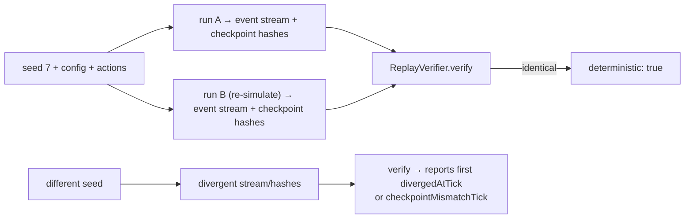

# 11 · Determinism Guarantees

Determinism is the load-bearing property of the whole runtime. It is what makes replay verification, snapshot hashing, and reproducible competition runs meaningful.

> **The guarantee.** Identical **version + config + seed + actions** ⇒ identical **ticks, events, replay, snapshots, and hashes**.

## How each guarantee is enforced

| Guarantee                   | Mechanism                                                                                                                      |
| --------------------------- | ------------------------------------------------------------------------------------------------------------------------------ |
| Reproducible randomness     | `xoroshiro128+` seeded via SplitMix64, with exact 64-bit BigInt internals. `Math.random()` is **banned**.                      |
| Reproducible time           | Fixed-timestep `SimClock` — `advance()` is the only way time moves. No `requestAnimationFrame`, no wall-clock in the sim.      |
| Reproducible system order   | `resolveOrder()` is a deterministic topological sort with a registration-order tie-break, computed once at boot.               |
| Reproducible task firing    | `TaskScheduler` fires off tick count with a defined tie-break order; **no** `setTimeout`/`setInterval`/browser timers.         |
| Reproducible event delivery | Bus dispatch is `(priority desc, subscription order)`, with a per-emit snapshot and a monotonic `seq`.                         |
| Reproducible fingerprints   | Snapshots are canonicalized (recursively sorted keys) then FNV-1a hashed — stable across runs and machines.                    |
| Pure simulation layers      | Wall-clock time is **injected** (`timeProvider`) into diagnostics and the bus; the sim never reads `performance.now()` itself. |
| No framework leakage        | `pnpm typecheck:engine` compiles the kernel with `lib: ["ES2022"]`, `types: []` — no DOM/React/Three in scope.                 |

## The seeded RNG: `xoroshiro128+`

`createXoroshiro128Plus(seed)` is GridGuard's canonical randomness source (`src/kernel/rng/xoroshiro128plus.ts`). The single numeric seed is expanded through **SplitMix64** into two 64-bit words `(s0, s1)`; the generator runs the xoroshiro128+ (Blackman & Vigna v1.0) recurrence on BigInt-backed 64-bit state, so the stream is bit-exact and platform-independent. The all-zero state is avoided (it is a fixed point).

It implements the `Rng` contract:

| Member                         | Behavior                                                                                |
| ------------------------------ | --------------------------------------------------------------------------------------- |
| `next()`                       | Uniform `[0, 1)` float (53-bit mantissa).                                               |
| `randomFloat(min?, max?)`      | Uniform float in `[min, max)` (defaults `0`, `1`).                                      |
| `randomInt(min, maxExclusive)` | Uniform integer in `[min, maxExclusive)`.                                               |
| `randomBoolean(p?)`            | `true` with probability `p` (clamped to `[0,1]`, default `0.5`).                        |
| `randomNormal(mean?, stddev?)` | Gaussian via Box–Muller, keeping **no** hidden spare so state stays fully in `(s0,s1)`. |
| `shuffle(array)`               | Fisher–Yates using `randomInt`.                                                         |
| `pick(array)`                  | Uniform element (throws on empty).                                                      |
| `weightedPick(items, weights)` | Weighted element (validates lengths + positive total).                                  |
| `fork()`                       | A child RNG seeded from a fresh 53-bit draw — independent, reproducible stream.         |
| `clone()`                      | An exact copy with the same current `(s0, s1)`.                                         |
| `getState()` / `setState()`    | Serialize/restore `RngState = { s0, s1 }` (two 64-bit words as **decimal strings**).    |

Because the entire generator state is `(s0, s1)` and is fully serializable, a snapshot restores the exact stream — no hidden buffered value can desynchronize a replay.

## The fixed-timestep clock

`createSimClock(timestep)` (or `createClockFromFrequency(hz)`) is a virtual `Clock`: `tick`, `time`, `timestep`, `frequencyHz`, `advance()`, `reset()`, `getState()/setState()` (`ClockState = { tick, elapsed }`). Supported frequencies are 5/10/20/30/60 Hz. Simulation time is completely independent of wall-clock; the kernel calls `advance()` exactly once per tick, so the same number of ticks always represents the same simulated duration.

## Injection keeps the sim pure

The two impure resources a simulation might reach for — wall-clock time and the render loop — are kept out by construction:

- **Wall-clock** is injected as `timeProvider: () => number`. Diagnostics and event timestamps use it; the simulation logic never calls `performance.now()`/`Date.now()`. In the app, infrastructure passes `() => performance.now()`; in tests it defaults to `() => 0`.
- **The render loop** never drives ticks. The kernel advances on `tick()`/`run(n)`, not on `requestAnimationFrame`.

## Proof and verification

- **Replay verification** re-simulates from the same seed and confirms byte-identical event streams and checkpoint hashes; a different seed makes the verifier report the first divergence (see [08 · Replay Pipeline](./08-replay-pipeline.md)).
- **Snapshot hashing** gives a one-call fingerprint (`kernel.hash()`) that must match across identical runs (see [07 · Snapshot Architecture](./07-snapshot-architecture.md)).
- **`pnpm typecheck:engine`** proves the kernel compiles with no DOM/React/Three — the literal proof the renderer could be deleted and the simulation would still build.

The **competition** profile turns every determinism affordance to maximum: fixed `seed 7`, frozen payloads, diagnostics on (see [12 · Configuration & Profiles](./12-configuration-profiles.md)).
