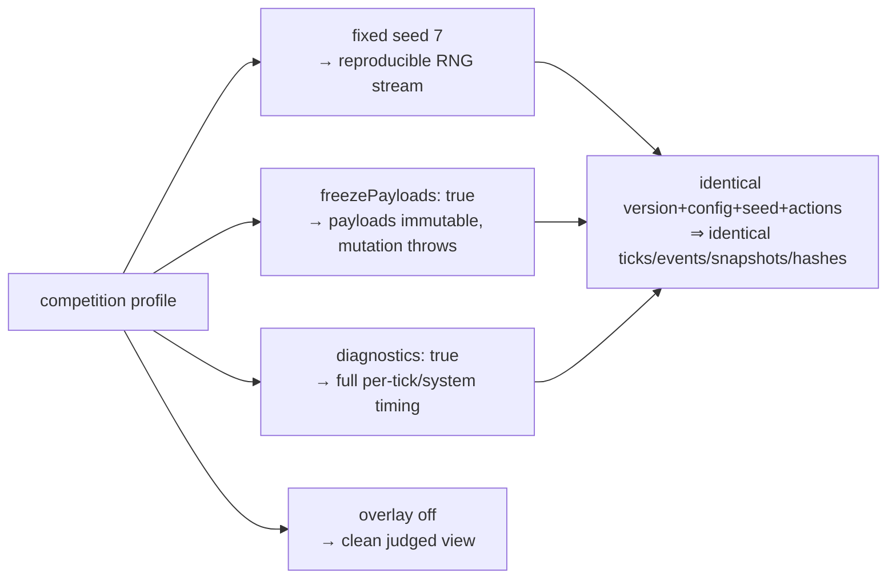

# 12 · Configuration & Profiles

All configurable values live in one fully-resolved `AppConfig`; there are no hardcoded tunables scattered elsewhere. A **profile** selects a concrete `AppConfig`, assembled in `src/config/profiles.ts` from the schema in `src/config/schema.ts`. Phase 2 adds a `kernel` config section that feeds directly into `createSimulationKernel`.

## `AppConfig` shape

```ts
interface AppConfig {
  profile: AppProfile; // 'development' | 'demo' | 'production' | 'competition'
  simulation: SimulationConfig; // { seed, timestep, tickRateHz }
  render: RenderConfig; // { maxPixelRatio, postProcessing, shadows }
  debug: DebugConfig; // { overlay, logLevel }
  kernel: KernelConfig; // { freezePayloads, leakThreshold, diagnostics }
}
```

### `KernelConfig`

| Field            | Type      | Meaning                                                               |
| ---------------- | --------- | --------------------------------------------------------------------- |
| `freezePayloads` | `boolean` | Freeze event payloads for immutability (catches accidental mutation). |
| `leakThreshold`  | `number`  | Listener-count threshold before the bus warns about a leak.           |
| `diagnostics`    | `boolean` | Whether runtime diagnostics are collected.                            |

These map onto the kernel's `freezePayloads` and `leakThreshold` options and the diagnostics wiring (see [09 · Kernel API](./09-kernel-api.md)).

## The four profiles

| Profile         | Seed | `freezePayloads` | `leakThreshold`       | `diagnostics` | Debug overlay | Log level | Intent                                                  |
| --------------- | ---- | ---------------- | --------------------- | ------------- | ------------- | --------- | ------------------------------------------------------- |
| **development** | `1`  | `false`          | `MAX_EVENT_LISTENERS` | `true`        | `true`        | `debug`   | Everything on, verbose, overlay + diagnostics.          |
| **demo**        | `42` | `false`          | `MAX_EVENT_LISTENERS` | `true`        | `false`       | `info`    | Full visuals, fixed seed for a repeatable showcase.     |
| **production**  | `42` | `false`          | `MAX_EVENT_LISTENERS` | `false`       | `false`       | `warn`    | Full visuals, quiet, overlay + diagnostics off.         |
| **competition** | `7`  | **`true`**       | `MAX_EVENT_LISTENERS` | `true`        | `false`       | `info`    | **Maximum determinism** for a judged, reproducible run. |

All profiles share `baseSimulation` (`timestep = DEFAULT_TIMESTEP`, `tickRateHz = DEFAULT_TICK_RATE_HZ = 10`) and `baseRender` (`maxPixelRatio = MAX_DEVICE_PIXEL_RATIO`, `postProcessing: true`, `shadows: true`). `MAX_EVENT_LISTENERS` is `100`.

## Competition = maximum determinism

The competition profile hardens every determinism affordance for a judged run:



- **Fixed `seed 7`** — the entire run reproduces from a known seed.
- **`freezePayloads: true`** — the bus `Object.freeze`s each object payload before dispatch, so any consumer that tries to mutate a payload fails loudly instead of silently diverging.
- **`diagnostics: true`** — full timing evidence for the judged run.

See [11 · Determinism Guarantees](./11-determinism-guarantees.md) for how these combine into the end-to-end reproducibility guarantee.

## Selecting a profile

`resolveProfile(import.meta.env['VITE_PROFILE'])` maps the env string to an `AppProfile` (defaulting to `development` when unset/unknown), then `PROFILES[profile]` yields the concrete `AppConfig`. The config's `kernel` and `simulation` fields flow into `createSimulationKernel({ seed, freezePayloads, leakThreshold, … })` at the composition root.
