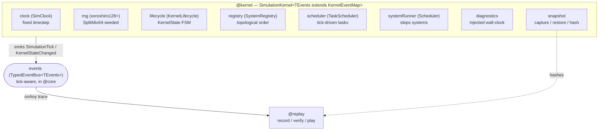

# GridGuard Phase 2 — Simulation Kernel

The **Simulation Kernel** is GridGuard's deterministic engine core. Phase 2 makes it **domain-agnostic**: it owns time, randomness, the runtime lifecycle, the system registry, the tick and task schedulers, diagnostics, and the event bus — and it knows nothing about power flow, cascades, or gameplay. It only drives registered systems and emits kernel events.

```ts
export interface SimulationKernel<TEvents extends KernelEventMap = KernelEventMap> { … }
```

The kernel is generic over `TEvents extends KernelEventMap` and references only `KernelEventMap` (`SimulationTick`, `KernelStateChanged`). A domain event map such as `GridEventMap extends KernelEventMap` flows on the same bus, but the kernel never imports a single gameplay or electrical event name.

> **Determinism guarantee.** Identical version + config + seed + actions ⇒ identical ticks, events, replay, snapshots, and hashes.

## What changed from Phase 1

Phase 1 froze the architecture; Phase 2 delivered the real kernel and, in doing so, corrected several Phase-1 assumptions honestly:

| Phase 1 (frozen)                                                                 | Phase 2 (real)                                                                  |
| -------------------------------------------------------------------------------- | ------------------------------------------------------------------------------- |
| Game-arc FSM `SimulationState` (`PreCrisis/Crisis/Cascade/Recovery/AfterAction`) | **Removed** from the kernel. The kernel owns a runtime lifecycle `KernelState`. |
| Event `SimStateChanged`                                                          | `KernelStateChanged` (payload `from`/`to` are `KernelState`).                   |
| RNG `mulberry32`                                                                 | `xoroshiro128+` (seeded via SplitMix64, BigInt 64-bit internals).               |
| Kernel typed against `GridEventMap`                                              | Kernel generic over `KernelEventMap`; the domain map merely extends it.         |
| `@replay` placeholder stubs                                                      | **Real** record / serialize / play / verify / snapshot-store.                   |

The gameplay arc (calm → cascade → recovery) becomes a future **domain** concern owned by the engine/director — not the kernel.

## Document map

| #                                    | Topic                    | Covers                                                              |
| ------------------------------------ | ------------------------ | ------------------------------------------------------------------- |
| [01](./01-simulation-lifecycle.md)   | Simulation lifecycle     | `KernelState` FSM, legal transitions, `InvalidStateTransitionError` |
| [02](./02-tick-pipeline.md)          | Tick pipeline            | The ordered per-tick sequence, `requireRunning`, `TickContext`      |
| [03](./03-event-pipeline.md)         | Event pipeline           | Bus features, `onAny` trace, `EventEnvelope`, ordering, stats       |
| [04](./04-scheduler.md)              | Task scheduler           | Tick-driven scheduling, determinism, no browser timers              |
| [05](./05-dependency-resolution.md)  | Dependency resolution    | Deterministic topological sort, cycles, tie-breaks                  |
| [06](./06-system-registry.md)        | System registry          | register / resolveOrder / extension without kernel edits            |
| [07](./07-snapshot-architecture.md)  | Snapshot architecture    | `KernelSnapshot`, `canonicalize`, FNV-1a hashing, capture/restore   |
| [08](./08-replay-pipeline.md)        | Replay pipeline          | recorder → serializer → player → verifier, checkpoints, divergence  |
| [09](./09-kernel-api.md)             | Kernel API               | `createSimulationKernel` options + method reference                 |
| [10](./10-extension-guide.md)        | Extension guide          | Add a system/renderer/audio **without modifying the kernel**        |
| [11](./11-determinism-guarantees.md) | Determinism guarantees   | The guarantees and how each is mechanically enforced                |
| [12](./12-configuration-profiles.md) | Configuration & profiles | development / demo / production / competition + kernel config       |

## Module map



## Proof of purity

`pnpm typecheck:engine` compiles the kernel with `lib: ["ES2022"]` and `types: []` — no DOM, no React, no Three in scope. If the kernel ever referenced a browser or framework API, this typecheck fails. Wall-clock time (`performance.now()`) is **injected** into the pure layers, never read directly.

**Tests:** 100 passing across 15 files (see [12 · Testing Strategy](../architecture/12-testing-strategy.md)).
