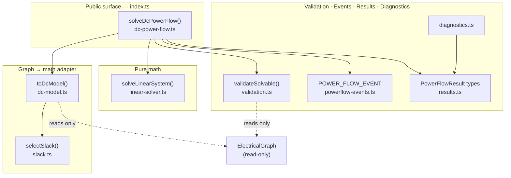
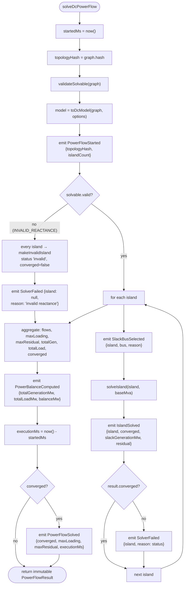
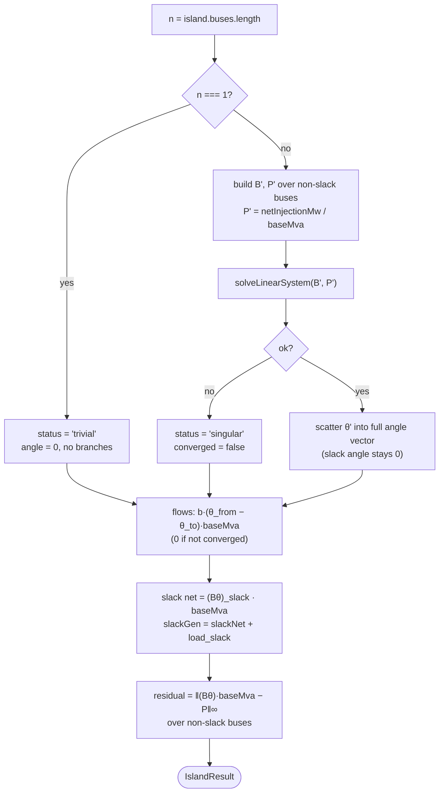
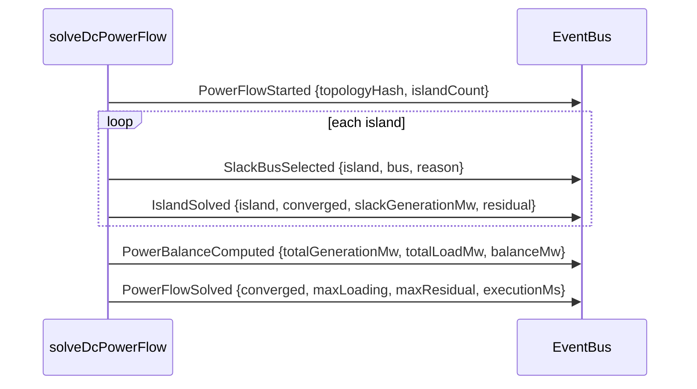

# 03 — Solver Architecture

## Module map

The solver is a small, layered set of pure modules under
`src/engine/powerflow/`. Dependencies point downward only; nothing below the
adapter knows the graph exists.



| Module                | Exports                                                                                                         | Role                                                         |
| --------------------- | --------------------------------------------------------------------------------------------------------------- | ------------------------------------------------------------ |
| `dc-power-flow.ts`    | `solveDcPowerFlow`, `DcPowerFlowOptions`                                                                        | Orchestrator; owns the pipeline and per-island `solveIsland` |
| `dc-model.ts`         | `toDcModel`, `DcModel`, `DcIsland`, `DcBranch`, `DcModelOptions`                                                | Pure graph → math adapter                                    |
| `slack.ts`            | `selectSlack`, `SlackSelection`                                                                                 | Deterministic slack selection                                |
| `linear-solver.ts`    | `solveLinearSystem`, `LinearSolveResult`                                                                        | Dense Gaussian elimination w/ partial pivoting               |
| `validation.ts`       | `validateSolvable`, `validatePowerFlowResult`                                                                   | Pre/post checks                                              |
| `results.ts`          | `PowerFlowResult`, `IslandResult`, `LineFlowResult`, `BusAngleResult`, `PowerFlowMetadata`, `ConvergenceStatus` | Immutable result types                                       |
| `powerflow-events.ts` | `POWER_FLOW_EVENT`, `PowerFlowEventMap`, payload types                                                          | Event contract                                               |
| `diagnostics.ts`      | `powerFlowDiagnostics`, `formatPowerFlowDiagnostics`, `lineFlowTable`, `formatBMatrix`                          | Debug/console only                                           |

## Entry point

```ts
solveDcPowerFlow(graph: ElectricalGraph, options?: DcPowerFlowOptions): PowerFlowResult
```

`DcPowerFlowOptions` extends `DcModelOptions` and adds two orchestration hooks:

| Option          | Type                               | Purpose                                                     |
| --------------- | ---------------------------------- | ----------------------------------------------------------- |
| `baseMva?`      | `number`                           | System base (default 100)                                   |
| `slackBusId?`   | `BusId`                            | Configured slack candidate                                  |
| `generationMw?` | `(bus) => number`                  | Dispatch override (Phase-5 real dispatch)                   |
| `events?`       | `TypedEventBus<PowerFlowEventMap>` | Optional bus to emit on                                     |
| `timeProvider?` | `() => number`                     | Injected clock for `executionMs`; **defaults to `() => 0`** |

## The solve pipeline



Key ordering facts, verbatim from `dc-power-flow.ts`:

- `topologyHash`, `validateSolvable`, and `toDcModel` all run **before**
  `PowerFlowStarted` is emitted.
- If `validateSolvable` fails, **no** island is solved: every island becomes an
  `invalid` result via `makeInvalidIsland` and a single
  `SolverFailed {island: null}` is emitted.
- On the valid path, each island emits `SlackBusSelected` → `solveIsland` →
  `IslandSolved`, and additionally `SolverFailed {island: N}` if that island did
  not converge.
- `PowerBalanceComputed` is always emitted. `PowerFlowSolved` is emitted **only
  when the whole result converged**.

## Per-island solve (`solveIsland`)



The four `ConvergenceStatus` values an island can report:

| `status`    | `converged` | Meaning                                                              |
| ----------- | ----------- | -------------------------------------------------------------------- |
| `converged` | `true`      | Reduced system solved; residual ≈ 0                                  |
| `trivial`   | `true`      | Single-bus island; angle 0, no branches                              |
| `singular`  | `false`     | `solveLinearSystem` detected a singular reduced matrix               |
| `invalid`   | `false`     | Pre-solve validation failed (invalid reactance); island never solved |

## Immutable results

`solveDcPowerFlow` returns a `PowerFlowResult` whose every field is `readonly`,
including nested `islands`, `flows`, `angles`, and `metadata`. Nothing in the
result aliases mutable solver state, and the graph itself is never written to.
Result shape:

```text
PowerFlowResult
├─ converged: boolean
├─ islands: IslandResult[]
│   ├─ index, buses[], slackBus, converged, status
│   ├─ slackGenerationMw, totalGenerationMw, totalLoadMw, powerBalanceMw, residual
│   ├─ angles: BusAngleResult[]  { bus, angleRad, netInjectionMw }
│   └─ flows: LineFlowResult[]   { line, from, to, flowMw, loading }
├─ flows: LineFlowResult[]        (all islands, flattened)
├─ maxLoading, maxResidual
└─ metadata: { baseMva, islandCount, busCount, branchCount, executionMs, topologyHash }
```

## Event sequence

`PowerFlowEventMap` **extends** `KernelEventMap`, so these events ride any
kernel-compatible `TypedEventBus` while the kernel never references them. The
sequence for a **successful** multi-island solve:



Failure variants: an unsolvable model emits `PowerFlowStarted` then a single
`SolverFailed {island: null, reason: 'invalid reactance'}` (and **no**
`PowerFlowSolved`); a per-island failure emits `SolverFailed {island: N,
reason: status}` right after that island's `IslandSolved`. See
[06-validation.md](./06-validation.md) for the full event/validation matrix.

Events are best-effort: if no `events` bus is supplied, `emit` is a no-op and
the returned result is byte-for-byte identical.

## Determinism

Identical inputs ⇒ identical outputs. The determinism guarantees come from:

- **sorted graph queries** — `graph.lines()`, `graph.generators()`,
  `graph.loads()` return id-sorted arrays;
- **deterministic slack selection** — see [05-slack-selection.md](./05-slack-selection.md);
- **partial-pivot Gaussian elimination** — a fixed pivoting rule, no randomness;
- **injected `timeProvider`** — defaults to `() => 0`, so `executionMs = 0` in
  tests and the result carries no wall-clock dependence.

No `Math.random`, no `Date`.
