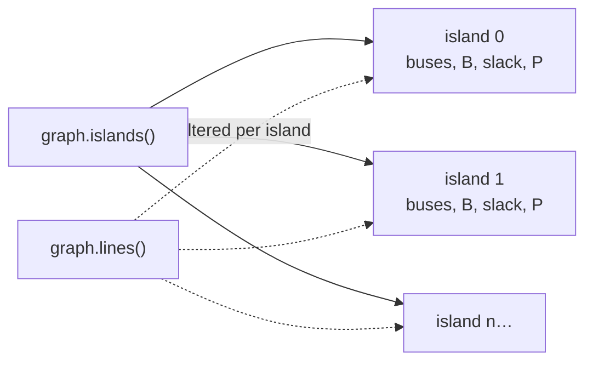
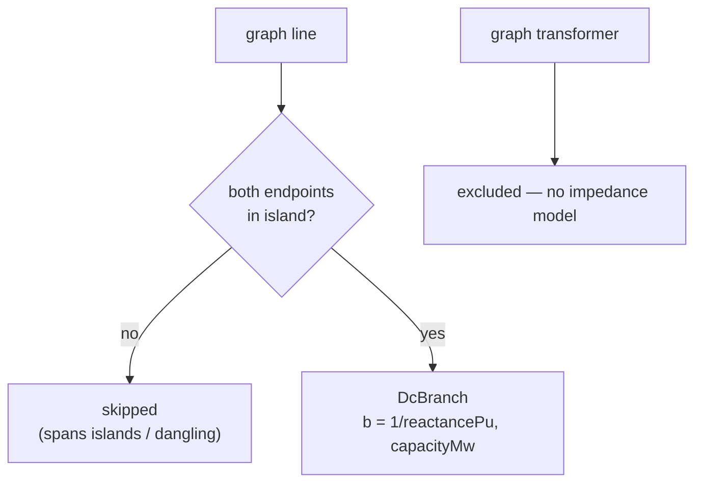

# 04 — Matrix Construction (`toDcModel`)

`toDcModel(graph, options)` is the **pure adapter** that turns the math-free
electrical graph into the `DcModel` the solver consumes. It only **reads** the
graph — no parallel topology is kept, and nothing is written back. This is the
one place where graph structure becomes numbers.

```ts
toDcModel(graph: ElectricalGraph, options?: DcModelOptions): DcModel
```

## Options

```ts
interface DcModelOptions {
  readonly baseMva?: number; // default 100 (DEFAULT_BASE_MVA)
  readonly slackBusId?: BusId; // configured slack candidate
  readonly generationMw?: (bus: BusId) => number; // dispatch override
}
```

- **`baseMva`** — the per-unit power base; defaults to `DEFAULT_BASE_MVA = 100`.
- **`slackBusId`** — a preferred slack, honored per island if present there
  (see [05-slack-selection.md](./05-slack-selection.md)).
- **`generationMw`** — overrides the default dispatch. When omitted, generation
  defaults to **summed generator nameplate capacity** at the bus. Phase 5
  supplies real dispatch through this hook without any other change.

## Inputs gathered from the graph

The adapter reads exactly four graph surfaces, all read-only:

| Graph query          | Used for                                             |
| -------------------- | ---------------------------------------------------- |
| `graph.generators()` | Sum `capacityMw` per `busId` → `genCapacityByBus`    |
| `graph.loads()`      | Sum `nominalDemandMw` per `busId` → `loadByBus`      |
| `graph.lines()`      | Candidate DC branches (filtered per island)          |
| `graph.islands()`    | Independent connected components to model separately |
| `graph.buses()`      | `busCount` for metadata                              |

Two per-bus lookup tables are built once and reused across all islands:

```text
genCapacityByBus[bus]  = Σ generator.capacityMw     for generators at bus
loadByBus[bus]         = Σ load.nominalDemandMw      for loads at bus

generationOf(bus) = options.generationMw
                    ? options.generationMw(bus)
                    : genCapacityByBus[bus] ?? 0
```

## Per-island partitioning

Islands come straight from `graph.islands()` (connected components of the
topology). Each island is modeled **independently** — its own bus index map,
branch list, slack, injections, and `B` matrix. This keeps every linear system
as small as possible and is what lets a disconnected system solve island by
island.



For each island the adapter assigns a **local index** to every bus
(`busIndex: Map<BusId, number>`, `0…n-1`) in island order — this local index is
the row/column position in `B` and `P`.

## Branch selection (and transformer exclusion)

A graph line becomes a `DcBranch` **only if both endpoints are in the island**:

```text
branches = graph.lines()
    .filter(line => busSet.has(line.from) && busSet.has(line.to))
    .map(line => ({
        line: line.id,
        from: line.from,
        to:   line.to,
        susceptance: 1 / line.reactancePu,   // b = 1/x
        capacityMw:  line.capacityMw,
    }))
```

**Transformers are excluded from the DC branch set.** They exist in the graph as
Phase-3 placeholders but carry **no impedance model yet**, so there is no
susceptance to contribute. They are simply not iterated when building branches
or `B`. (Note: transformers still participate in graph **connectivity** —
`graph.islands()` may group buses that a transformer connects — but they add no
term to the matrix.) When an impedance model is added, transformers join the
branch set here with no change to callers.



## B-matrix assembly

`B` starts as an `n × n` zero matrix. Each branch stamps four cells (the
weighted-Laplacian pattern):

```text
B = zeros(n, n)
for each branch (i, j) with susceptance b:
    B[i][i] += b     // diagonal: sum of incident susceptances
    B[j][j] += b
    B[i][j] -= b     // off-diagonal: negative shared susceptance
    B[j][i] -= b
```

This yields a symmetric matrix whose rows sum to zero. Parallel lines between
the same pair of buses accumulate naturally (each adds its own `b`). Full
mathematical properties are in
[02-mathematical-formulation.md](./02-mathematical-formulation.md).

## Injection vectors

For each bus (in local index order) the adapter records three parallel arrays:

```text
generationMw[i]   = generationOf(bus_i)
loadMw[i]         = loadByBus[bus_i] ?? 0
netInjectionMw[i] = generationOf(bus_i) - (loadByBus[bus_i] ?? 0)
```

`netInjectionMw` is the raw MW vector; the solver divides it by `baseMva` to
form the per-unit right-hand side `P′` for the reduced system.

## Slack selection

Each island calls `selectSlack(islandBuses, genCapacityByBus, options.slackBusId)`,
storing both the `SlackSelection` (`{ bus, reason }`) and its **local index**
`slackIndex = busIndex.get(slack.bus)`. Full rules in
[05-slack-selection.md](./05-slack-selection.md).

## Output — `DcModel`

```text
DcModel
├─ baseMva: number
├─ islands: DcIsland[]
│   ├─ index: number
│   ├─ buses: BusId[]                 // island order
│   ├─ busIndex: Map<BusId, number>   // bus → local row/col
│   ├─ branches: DcBranch[]           // { line, from, to, susceptance, capacityMw }
│   ├─ slack: SlackSelection          // { bus, reason }
│   ├─ slackIndex: number
│   ├─ generationMw[], loadMw[], netInjectionMw[]
│   └─ bMatrix: number[][]            // n×n bus susceptance matrix B
├─ busCount: number                   // graph.buses().length
└─ branchCount: number                // Σ island.branches.length
```

`busCount` counts **all** graph buses; `branchCount` counts only the DC branches
actually modeled (so transformers and cross-island lines are not counted). The
adapter performs no solve — it only shapes data. The numerical work happens in
`solveDcPowerFlow` / `solveLinearSystem`.
