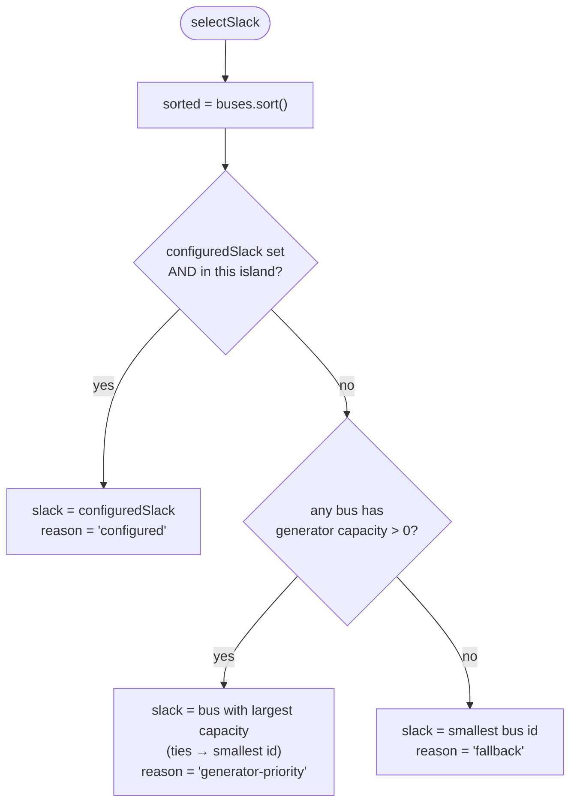

# 05 — Slack-Bus Selection

Every island needs exactly **one slack (reference) bus** whose angle is pinned
at 0. The slack anchors the otherwise-singular `B` matrix and absorbs the
network's residual injection (its generation is a solved output, not an input).
Selection is fully **deterministic** so that identical topologies always pick
the same slack.

```ts
selectSlack(
  buses: readonly BusId[],
  generatorCapacityByBus: ReadonlyMap<BusId, number>,
  configuredSlack?: BusId,
): SlackSelection   // { bus, reason }
```

The buses are sorted (`[...buses].sort()`) before any decision, so **ties always
resolve by smallest id**.

## The three-tier rule



| Tier | Condition                                                   | Chosen bus                                                        | `reason`               |
| ---- | ----------------------------------------------------------- | ----------------------------------------------------------------- | ---------------------- |
| 1    | `configuredSlack` is defined **and** belongs to this island | the configured bus                                                | `'configured'`         |
| 2    | otherwise, some bus has generator capacity                  | bus with **largest total generator capacity**, ties → smallest id | `'generator-priority'` |
| 3    | otherwise (no generation anywhere in the island)            | **smallest bus id**                                               | `'fallback'`           |

Notes on the exact semantics:

- **Tier 1 is island-scoped.** A configured slack that is _not_ in the current
  island is ignored for that island, which then falls through to tier 2/3. This
  is why a single `slackBusId` option is safe across a multi-island system: only
  the island that actually contains it uses it.
- **Tier 2 uses a strict `>` comparison** starting from `bestCapacity = 0`
  while scanning the **sorted** bus list. So a bus is only replaced by a _strictly_
  larger capacity; equal capacities keep the earlier (smaller-id) bus. A bus
  with 0 capacity never wins tier 2.
- **Tier 3 (`fallback`)** fires only when no bus in the island has any generator
  capacity (e.g. a load-only or generator-less island). It picks
  `sorted[0]` — the smallest id.

## One slack per island — guaranteed

`selectSlack` requires a non-empty `buses` list and always returns exactly one
`SlackSelection`, so **each island has precisely one slack**. `toDcModel` calls
`selectSlack` once per island and records both the selection and its local
`slackIndex`. Distinct islands select independently, so a system with _k_
islands has _k_ slacks — one reference per connected component, which is exactly
what the reduced-system solve needs.

```ts
interface SlackSelection {
  readonly bus: BusId;
  readonly reason: 'configured' | 'generator-priority' | 'fallback';
}
```

## How the slack is used downstream

- Its angle is fixed at 0; its row and column are removed to form the reduced
  system `B′θ′ = P′` (see
  [02-mathematical-formulation.md](./02-mathematical-formulation.md)).
- Its generation is **computed**, not given:
  `slackGenerationMw = (Bθ)_slack · baseMva + load_slack`. The slack therefore
  balances the island.
- The `reason` is surfaced for observability: the solver emits
  `SlackBusSelected {island, bus, reason}` for every island (before it solves),
  and diagnostics report the slack bus per island.

## Diagnostics

Slack information appears in the debug surfaces of `diagnostics.ts`:

- `powerFlowDiagnostics(result).islands[i].slackBus` — the chosen slack per island;
- `formatPowerFlowDiagnostics(result)` — one-line converged/failed summary
  (island/bus/branch counts, max loading, max residual).

The `reason` itself travels on the `SlackBusSelected` event rather than in the
final result, making slack provenance auditable per solve.

## Worked cases

| Island buses | Generation         | `slackBusId`         | Result                                         |
| ------------ | ------------------ | -------------------- | ---------------------------------------------- |
| `b1, b2`     | `b1`: 100 MW       | —                    | `b1` (`generator-priority`)                    |
| `b1, b2, b3` | `b2`: 50, `b3`: 50 | —                    | `b2` (tie → smallest id, `generator-priority`) |
| `b1, b2`     | none               | `b2` (in island)     | `b2` (`configured`)                            |
| `b1, b2`     | none               | `b9` (not in island) | `b1` (`fallback`)                              |
| `b1, b2`     | none               | —                    | `b1` (`fallback`)                              |
