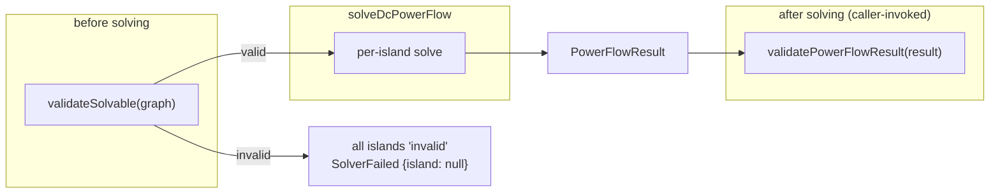

# 06 — Validation

The solver **never silently ignores a failure**. Problems that make the model
unbuildable are caught _before_ solving; problems that show up in the solution
are caught _after_. Both checks return the same structured report shape so
callers can treat them uniformly.

```ts
interface PowerFlowValidationReport {
  readonly valid: boolean; // true iff no 'error'-severity issues
  readonly issues: readonly PowerFlowIssue[];
}
interface PowerFlowIssue {
  readonly code: string;
  readonly severity: 'error' | 'warning';
  readonly message: string;
  readonly island?: number;
}
```

`valid` is computed as "no issue has `severity === 'error'`", so **warnings do
not invalidate** a report.

## Pre-solve: `validateSolvable(graph)`

Runs before the model is built. It checks that every line has a **positive
reactance**, because `b = 1/reactancePu` must be finite and well-defined.

| Code                | Severity | Trigger                                | Meaning                                                                                  |
| ------------------- | -------- | -------------------------------------- | ---------------------------------------------------------------------------------------- |
| `INVALID_REACTANCE` | `error`  | `!(line.reactancePu > 0)` for any line | Zero, negative, or `NaN` reactance → infinite/invalid susceptance; model cannot be built |

The condition is written `!(line.reactancePu > 0)`, which deliberately catches
**all** non-positive and non-numeric cases in one test:

| `reactancePu` | `> 0`                                      | flagged? |
| ------------- | ------------------------------------------ | -------- |
| `0.1`         | true                                       | no       |
| `0`           | false                                      | **yes**  |
| `-0.1`        | false                                      | **yes**  |
| `NaN`         | false (any comparison with `NaN` is false) | **yes**  |

When `validateSolvable` reports an error, `solveDcPowerFlow` **refuses to
solve**: every island is turned into an `invalid` `IslandResult`
(`converged = false`, `status = 'invalid'`, angles 0, no flows) and a single
`SolverFailed {island: null, reason: 'invalid reactance'}` is emitted. This is
the "refuse rather than produce garbage" behavior — the `invalid-reactance
rejection` test asserts it.

## Post-solve: `validatePowerFlowResult(result, toleranceMw = 1e-6)`

Runs on a completed `PowerFlowResult`. For **each island** it applies three
checks. The tolerance defaults to `1e-6` MW and is caller-overridable.

| Code                    | Severity  | Trigger                                   | Meaning                                                                                      |
| ----------------------- | --------- | ----------------------------------------- | -------------------------------------------------------------------------------------------- |
| `NOT_CONVERGED`         | `error`   | `!island.converged`                       | Island's reduced system was singular or invalid — no usable solution                         |
| `POWER_IMBALANCE`       | `error`   | `\|island.powerBalanceMw\| > toleranceMw` | Generation ≠ load beyond tolerance; a lossless DC solve must balance                         |
| `NUMERICAL_INSTABILITY` | `warning` | `island.residual > toleranceMw`           | Solved angles do not reproduce the requested injections closely enough; conditioning concern |

Only `NOT_CONVERGED` and `POWER_IMBALANCE` are errors, so a large residual alone
produces a **valid** report with a warning attached — it flags conditioning
without discarding the solution.

## Residual vs. power balance — two different self-checks

These measure different things and can fail independently:

|            | **Residual**                                                                  | **Power balance**             |
| ---------- | ----------------------------------------------------------------------------- | ----------------------------- |
| Field      | `island.residual`                                                             | `island.powerBalanceMw`       |
| Definition | $\lVert (B\theta)\cdot\texttt{baseMva} - P\rVert_\infty$ over non-slack buses | $\sum G - \sum \text{load}$   |
| Asks       | "Do the solved angles reproduce the inputs?"                                  | "Does generation match load?" |
| Expected   | ≈ 0 (near machine precision)                                                  | ≈ 0 (lossless DC)             |
| On failure | `NUMERICAL_INSTABILITY` (warning)                                             | `POWER_IMBALANCE` (error)     |
| Character  | numerical/conditioning                                                        | conservation/model            |

The residual is a purely numerical guard (the 30-bus radial robustness test
asserts `< 1e-9`); the balance is a physical conservation guard that follows
from the slack absorbing all mismatch in a lossless network.

## Where validation sits in the pipeline



`validateSolvable` is called **inside** `solveDcPowerFlow`;
`validatePowerFlowResult` is a separate post-hoc check the caller runs on the
returned result (e.g. in tests or before consuming flows).

## Event correspondence

| Situation                              | Events emitted                                                                                                 |
| -------------------------------------- | -------------------------------------------------------------------------------------------------------------- |
| Unsolvable model (`INVALID_REACTANCE`) | `PowerFlowStarted` → `SolverFailed {island: null, reason: 'invalid reactance'}` (no `PowerFlowSolved`)         |
| Island did not converge (`singular`)   | `SlackBusSelected` → `IslandSolved {converged: false}` → `SolverFailed {island: N, reason: status}`            |
| Fully converged                        | `PowerFlowStarted` → per island `SlackBusSelected`/`IslandSolved` → `PowerBalanceComputed` → `PowerFlowSolved` |

In all cases the failure is **explicit** — either an `error`-severity issue in a
report or a `SolverFailed` event. Nothing is swallowed.
