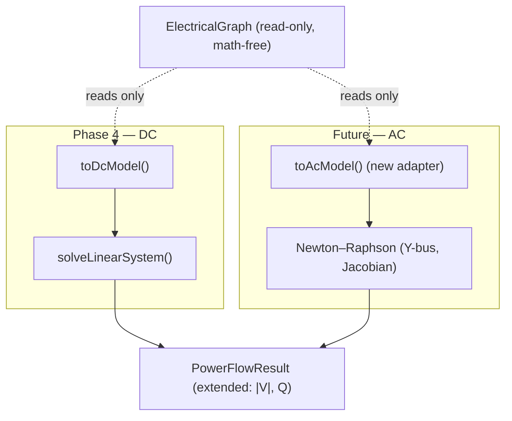

# 07 — Limitations and the AC Extension Path

Phase 4 is deliberately a **minimal, correct DC core**. This document is honest
about what it does not model, and shows how a future AC solver extends the same
architecture **without touching the graph**.

## Known limitations

### Modeling limitations (inherent to DC)

| Limitation                    | Detail                                       | Consequence                                                            |
| ----------------------------- | -------------------------------------------- | ---------------------------------------------------------------------- |
| **No voltage magnitudes**     | \|V\| fixed at 1.0 pu                        | Cannot study voltage profiles or voltage stability                     |
| **No reactive power**         | Q / MVAr not represented                     | No VAr planning, no PV/PQ behavior                                     |
| **Lossless**                  | Resistance ignored; branch is reactance-only | `Σ generation = Σ load` exactly; no I²R losses reported                |
| **Small-angle linearization** | `sin θ ≈ θ`                                  | Accuracy degrades on heavily loaded corridors with large angle spreads |

### Scope limitations (deferred to later phases)

| Limitation                                | Detail                                                                                                                                                                                 |
| ----------------------------------------- | -------------------------------------------------------------------------------------------------------------------------------------------------------------------------------------- |
| **Transformers not modeled electrically** | Present in the graph, but excluded from the DC branch set — no impedance model yet, so they add no term to `B`. They still count for connectivity.                                     |
| **Breakers / protection not modeled**     | No switching state, protection logic, or trip behavior in the solve. Deferred.                                                                                                         |
| **No thermal (time-domain) model**        | Loading is instantaneous `\|flow\|/capacity`; there is no heating/cooling dynamics or cascade analysis.                                                                                |
| **Capacity-as-dispatch default**          | With no `generationMw` override, generation defaults to summed nameplate `capacityMw` — an upper bound, not an economic dispatch. Phase 5 supplies real dispatch through the override. |

### Numerical / performance limitations

| Limitation                  | Detail                                                                                                                                                               |
| --------------------------- | -------------------------------------------------------------------------------------------------------------------------------------------------------------------- |
| **Dense O(n³) solve**       | `solveLinearSystem` is dense Gaussian elimination with partial pivoting. Correct and stable for the per-island systems here, but not optimal for very large islands. |
| **Full rebuild each solve** | `toDcModel` rebuilds `B` and injections from scratch every call; there is no incremental/warm-start update.                                                          |

These last two are explicitly flagged in-code as the Phase-5+ optimization
target: a **sparse factorization** for very large islands, plus incremental
solving. The per-island decomposition already bounds each dense solve to one
connected component (islands are independent and smaller), which keeps the dense
approach viable at current scale.

## Why the DC solve is still the right Phase-4 core

- **Always converges** for a connected island with positive reactances — no
  iteration, no divergence, no initial-guess sensitivity.
- **Deterministic and fast** — a single linear solve per island.
- **Exactly the quantities a grid game needs first**: real-power flows and
  thermal loading, which drive overload and (later) cascade mechanics.
- **A clean seam** for the AC upgrade, because all math lives behind the
  read-only `toDcModel` adapter.

## The AC extension path

A future AC power-flow solver restores what DC drops, using the standard
**Newton–Raphson** formulation. Crucially, it slots in behind the _same_
read-only graph surface — the graph stays math-free and is never mutated.

### What AC adds

| DC (Phase 4)                    | AC (future)                              |
| ------------------------------- | ---------------------------------------- |
| \|V\| = 1.0 pu (fixed)          | \|V\| solved per bus                     |
| Reactive power ignored          | Q solved; P **and** Q balance            |
| Lossless (X only)               | Full series **R + jX**, shunts, losses   |
| One bus type (implicit) + slack | **Slack / PV / PQ** bus typing           |
| Linear `Bθ = P`, one solve      | Nonlinear, iterated to convergence       |
| `B` matrix (susceptance)        | Complex `Y` bus admittance matrix        |
| Angles from a single solve      | Jacobian-based Newton–Raphson iterations |

### Newton–Raphson in one line

AC solves the nonlinear mismatch equations $\mathbf{f}(\mathbf{x}) = \mathbf{0}$
(real and reactive power mismatch at each bus) by iterating

$$
\mathbf{x}^{(k+1)} = \mathbf{x}^{(k)} - J(\mathbf{x}^{(k)})^{-1}\,\mathbf{f}(\mathbf{x}^{(k)}),
$$

where $\mathbf{x}$ collects unknown voltage **angles and magnitudes** and $J$ is
the power-flow Jacobian. The DC solution is a natural **flat-start / warm-start**
seed for this iteration.

### Bus typing

| Bus type           | Known    | Unknown  |
| ------------------ | -------- | -------- |
| **Slack**          | \|V\|, θ | P, Q     |
| **PV** (generator) | P, \|V\| | Q, θ     |
| **PQ** (load)      | P, Q     | \|V\|, θ |

DC's slack selection (see [05-slack-selection.md](./05-slack-selection.md))
already provides the reference bus AC needs; PV/PQ typing would be derived from
the same generator/load data the adapter already reads.

### How it plugs in without changing the graph

The extension is **additive**:

1. A new adapter (e.g. `toAcModel`) reads the same graph surfaces
   (`lines()`, `generators()`, `loads()`, `islands()`), now also consuming
   resistance, shunt, and transformer-impedance data as those fields are added
   to the graph's nameplate model.
2. A new numerical core (Y-bus + Newton–Raphson) replaces the single linear
   solve.
3. Result types grow (voltage magnitudes, reactive flows, losses) as **new
   readonly fields**; existing DC consumers keep working.
4. The **graph is untouched** — still topology and nameplate only, still never
   mutated by the solver. The same principle that isolates Phase 4 (see the
   [README](./README.md)) is what makes the AC upgrade a drop-in behind the
   adapter seam.

Deferred protection, breakers, thermal dynamics, and cascade modeling layer on
**above** the solver (consuming its flows and loadings); they do not require the
DC → AC change and are independent workstreams.
