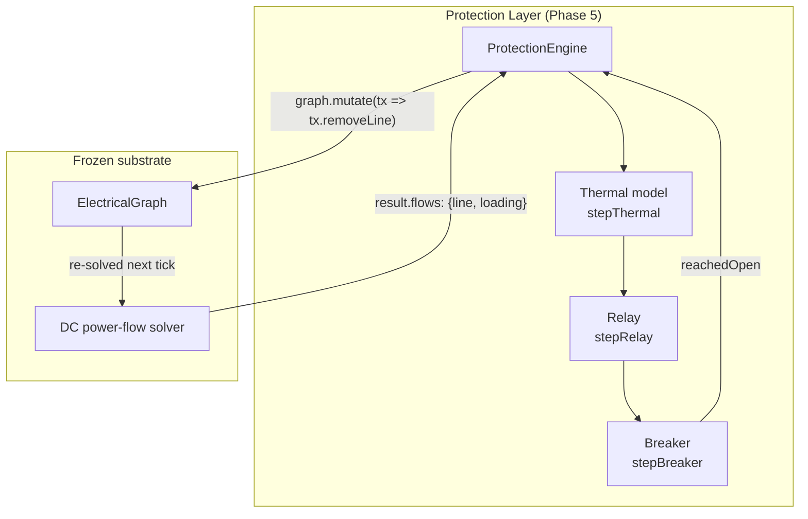
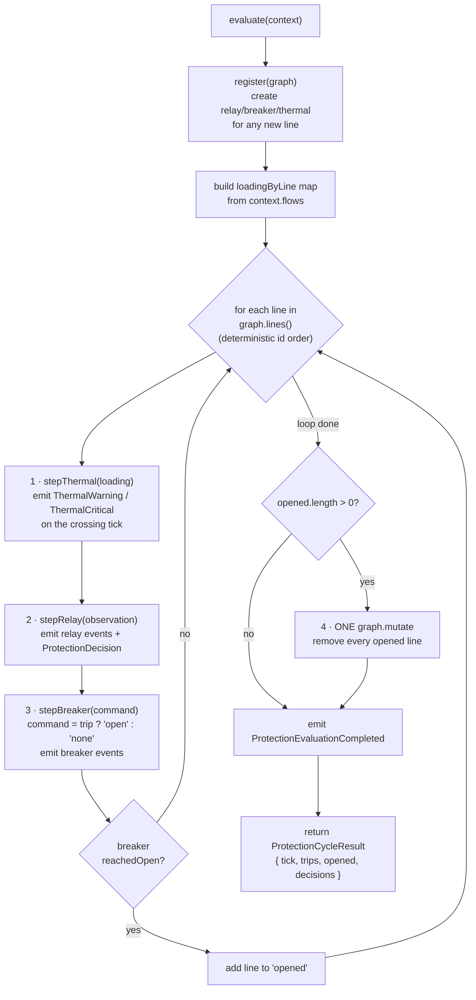
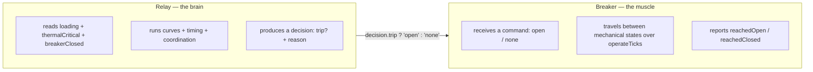

# 01 · Protection Architecture

## Layered design

The protection layer is a thin, deterministic layer that sits **over** two frozen substrates and never reaches into them except through their public, controlled APIs.

Two rules make the boundary unambiguous:

1. **Data flows in as loadings.** The engine reads `context.flows` (a minimal `{ line, loading }[]`; a full power-flow result is a superset). It never solves power flow.
2. **Change flows out as one transaction.** After evaluating all lines, the engine issues **at most one** `graph.mutate(...)` that removes every line whose breaker reached Open this tick. No entity mutates itself; the graph's staged transaction API is the only write path.

Everything is **immutable state + pure step functions**. `stepThermal`, `stepRelay`, and `stepBreaker` each take a state + observation and return a *new* state — the same inputs always yield the same outputs, which is what makes the whole simulation deterministic and replayable.

## The per-tick pipeline in detail

`ProtectionEngine.evaluate(context)` runs this exact sequence:

Key structural facts:

- **Order is thermal → relay → breaker, per line.** The relay's observation for a line includes `thermalCritical`, which is computed from *that same tick's* thermal step. So a line that just went thermally critical trips on the same tick.
- **Iteration order is `graph.lines()` id order** — deterministic, which guarantees reproducible evaluation.
- **The transaction is deferred to after the loop.** No line is removed mid-loop; the engine collects `opened` line ids and removes them all in one `graph.mutate`, guarding each removal with `graph.getLine(lineId) !== undefined`.
- **`ProtectionEvaluationCompleted` always fires last**, with `{ tick, relaysEvaluated, trips, opened }` counts.

### `evaluate` inputs and outputs

| Type | Shape | Role |
| --- | --- | --- |
| `ProtectionContext` | `{ graph, flows, tick, timestepS }` | input: what to evaluate and against which loadings |
| `LineLoading` | `{ line, loading }` | one element of `flows` |
| `ProtectionCycleResult` | `{ tick, trips, opened, decisions }` | output: which lines tripped, which opened, per-line decisions |

`trips` are lines whose relay issued a trip this tick; `opened` are lines whose breaker *fully opened* this tick (and were therefore removed from the graph). A trip does not become an `opened` in the same tick unless the breaker's `operateTicks` allows it.

## The relay-decides / breaker-switches split

The single most important design separation in the layer:

| Concern | Relay (`relay.ts`) | Breaker (`breaker.ts`) |
| --- | --- | --- |
| Electrical judgement | **Yes** — evaluates loadings, thresholds, curves, thermal | **Never** — computes no electrical conditions |
| Timing / coordination | **Yes** — curve delay + backup coordination delay | Only mechanical `operateTicks` travel time |
| Output | a `RelayDecision { trip, reason }` | a mechanical transition + `reachedOpen`/`reachedClosed` |
| Triggers topology change | No (only *decides*) | Indirectly — `reachedOpen` tells the engine to remove the line |

The breaker only **executes commands**; it never decides on its own. This mirrors real substation design, where protective relays make the tripping decision and the breaker is a dumb, fast switch.

## What this layer deliberately does not do

- It does not compute power flow — it consumes the solver's `result.flows`.
- It does not mutate the graph directly — only via one `graph.mutate` transaction, and only for fully-opened breakers.
- It does not orchestrate cascades, shed load, dispatch generators, or restore service. Selectivity between relays is **emergent** across ticks (see [06 · Coordination](./06-coordination.md)), not centrally orchestrated.
