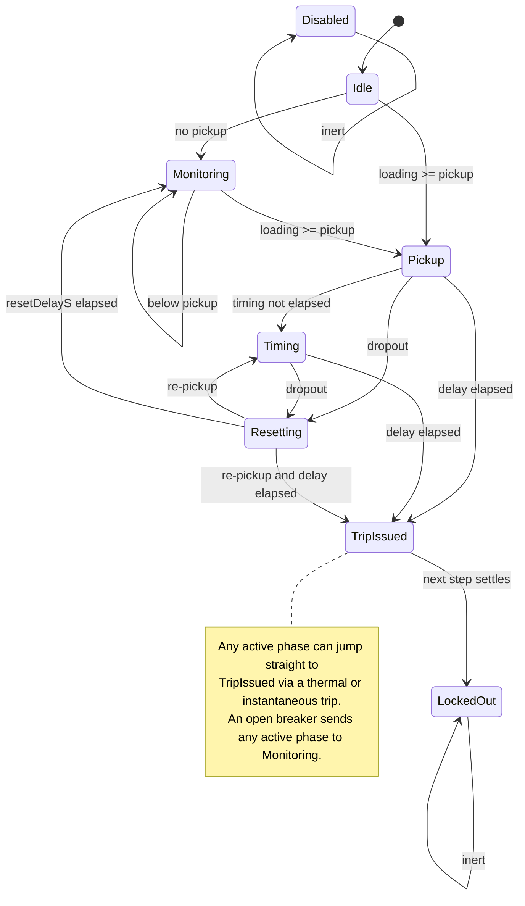
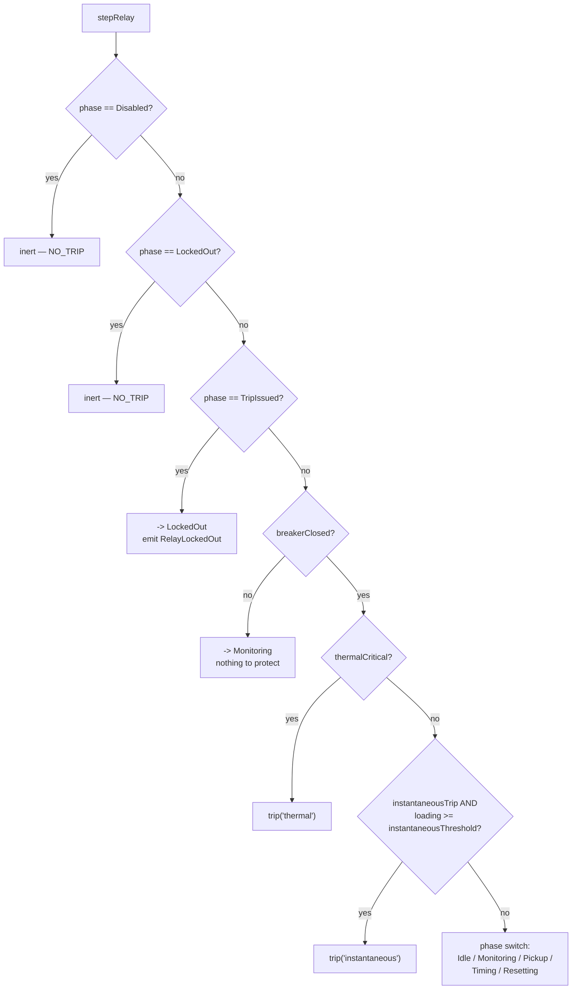

# 02 · Relay Lifecycle

One relay protects one line. Each relay is an **independent, immutable `RelayState`** advanced by the pure function `stepRelay(relay, observation, tick, timestepS)`. There are **no boolean flags** — the relay's situation is fully captured by its `phase`.

## `RelayState`

```ts
interface RelayState {
  id: string;
  line: LineId;
  phase: RelayPhase;
  config: RelayConfig;
  lastPickupTick: number | null;
  lastTripTick: number | null;
  timingStartedTick: number | null;
  resetStartedTick: number | null;
  operationCount: number;
  health: RelayHealth;   // 'healthy' | 'degraded' | 'failed'
}
```

- `createRelay(id, line, config)` starts a relay in `Idle`, all tick fields `null`, `operationCount` 0, `health` `'healthy'`.
- `disableRelay(relay)` returns a copy in `Disabled`.

## What the relay observes

Each tick the engine feeds the relay a `RelayObservation`:

| Field | Source | Meaning |
| --- | --- | --- |
| `loading` | power-flow result (per-unit) | how loaded the line is |
| `thermalCritical` | this tick's `stepThermal` (`level === 'critical'`) | line temperature exceeds max-safe |
| `breakerClosed` | breaker phase (`Closed`) | whether there is anything energised to protect |

`stepRelay` returns `{ relay, decision: { trip, reason }, events }`.

## `RelayPhase` state machine



> **Reserved phase:** `RelayPhase.TripPending` is declared in the enum, but the current `stepRelay` transitions `Timing → TripIssued` directly — no transition enters `TripPending`. It is reserved for future use.

## Evaluation order inside `stepRelay`

The function checks conditions in a strict priority order. The first that matches wins:



## Transitions table

| From phase | Condition (evaluated in order) | To phase | Decision | Events / side effects |
| --- | --- | --- | --- | --- |
| `Disabled` | always | `Disabled` | no trip | inert |
| `LockedOut` | always | `LockedOut` | no trip | inert |
| `TripIssued` | always (settles) | `LockedOut` | no trip | emit `RelayLockedOut` |
| *any active* | `!breakerClosed` | `Monitoring` | no trip | de-energised line, nothing to protect |
| *any active* | `thermalCritical` | `TripIssued` | **trip** `thermal` | see *trip action* below |
| *any active* | `instantaneousTrip && loading >= instantaneousThreshold` | `TripIssued` | **trip** `instantaneous` | see *trip action* below |
| `Idle` | `loading >= pickupThreshold` | `Pickup` | no trip | set `lastPickupTick`, `timingStartedTick`; emit `RelayPickup` |
| `Idle` | below pickup | `Monitoring` | no trip | emit `RelayMonitoring` |
| `Monitoring` | `loading >= pickupThreshold` | `Pickup` | no trip | set `lastPickupTick`, `timingStartedTick`; emit `RelayPickup` |
| `Monitoring` | below pickup | `Monitoring` | no trip | — |
| `Pickup` | `loading < pickup·resetRatio` (dropout) | `Resetting` | no trip | set `resetStartedTick` |
| `Pickup` | `elapsed >= requiredDelayS` | `TripIssued` | **trip** `timed` | see *trip action* below |
| `Pickup` | otherwise | `Timing` | no trip | continue timing |
| `Timing` | dropout | `Resetting` | no trip | set `resetStartedTick` |
| `Timing` | `elapsed >= requiredDelayS` | `TripIssued` | **trip** `timed` | see *trip action* below |
| `Timing` | otherwise | `Timing` | no trip | (emit `RelayTiming` only on a resumed timer) |
| `Resetting` | `loading >= pickupThreshold` (re-pickup) | `Timing` or `TripIssued` | maybe **trip** `timed` | resume timing from this tick; may emit `RelayTiming` |
| `Resetting` | `elapsed >= resetDelayS` | `Monitoring` | no trip | clear `timingStartedTick` & `resetStartedTick`; emit `RelayReset` |
| `Resetting` | otherwise | `Resetting` | no trip | keep waiting out reset |

**Timing definitions:**

- `pickup` ⇔ `loading >= pickupThreshold`
- `dropout` ⇔ `loading < pickupThreshold * resetRatio`
- `elapsed` (seconds) = `(tick − timingStartedTick) * timestepS`
- `requiredDelayS` = `getProtectionCurve(config.curve).tripDelayS(loading, config)` **+** `(config.role === 'backup' ? config.coordinationDelayS : 0)`

The backup coordination term is what makes a backup relay wait longer than the primary — see [06 · Coordination](./06-coordination.md).

### The trip action

Whenever the relay trips (`thermal`, `instantaneous`, or `timed`) it produces the **same** state change:

- `phase → TripIssued`
- `lastTripTick = tick`
- `operationCount += 1`
- `decision = { trip: true, reason }`
- emit `RelayTripIssued` with `{ relay, line, reason, tick }`

On the *next* step the relay settles `TripIssued → LockedOut` (emitting `RelayLockedOut`) and stays inert thereafter. So a trip is a **one-shot latch**: the relay does not re-arm itself in Phase 5.

## Trip reasons (`TripReason`)

| Reason | Fires when | Timed? |
| --- | --- | --- |
| `'thermal'` | this tick's thermal step reported `critical` (temperature above max-safe) | instant — from any active phase |
| `'instantaneous'` | `instantaneousTrip` enabled **and** `loading >= instantaneousThreshold` | instant — no timing stage |
| `'timed'` | the timing stage's `elapsed >= requiredDelayS` (curve delay + optional coordination delay) | yes — via `Pickup`/`Timing` |

Thermal and instantaneous trips bypass the timing stage entirely; the timed trip is the normal inverse/definite-time behaviour driven by the selected [protection curve](./05-protection-curves.md).
