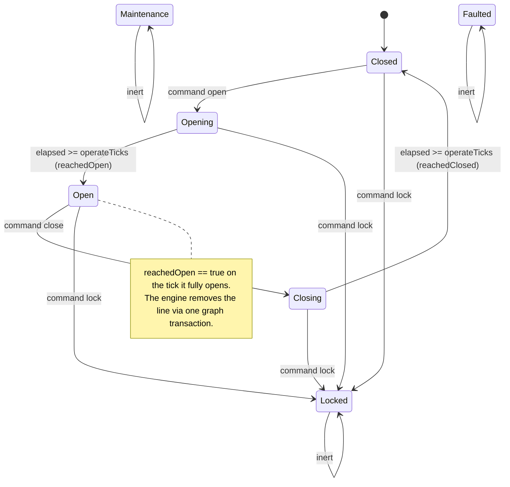
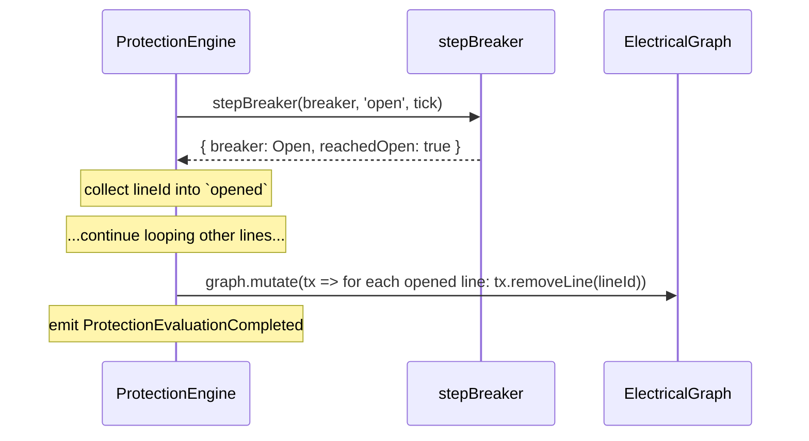

# 03 · Breaker Lifecycle

One breaker sits on one line. A breaker is the **muscle**: it only executes the command the relay's decision produces and travels between mechanical states over a configured operate time. **Breakers never compute electrical conditions.**

## `ProtectionBreaker`

```ts
interface ProtectionBreaker {
  id: string;
  line: LineId;
  phase: BreakerPhase;
  config: BreakerConfig;              // { operateTicks }
  transitionStartedTick: number | null;
  operationCount: number;
}
```

- `createProtectionBreaker(id, line, config, phase = Closed)` starts a breaker `Closed`, `transitionStartedTick` `null`, `operationCount` 0.
- `stepBreaker(breaker, command, tick)` returns `{ breaker, events, reachedOpen, reachedClosed }`.

## Commands (`BreakerCommand`)

| Command | Meaning | Who sends it in Phase 5 |
| --- | --- | --- |
| `'open'` | begin opening | the engine, when `decision.trip` is true |
| `'none'` | no action | the engine, every non-tripping tick |
| `'close'` | begin closing (from Open) | *not issued by the Phase-5 engine* |
| `'lock'` | latch to `Locked` (from any non-inert phase) | *not issued by the Phase-5 engine* |

The engine maps the relay decision to a command with exactly `command = decision.trip ? 'open' : 'none'`. `'close'` and `'lock'` are part of the breaker's vocabulary but the Phase-5 engine never issues them — there is no auto-reclose yet.

## `BreakerPhase` state machine



> **Reserved phases:** `Maintenance` and `Faulted` are declared and are treated as **inert** (like `Locked`), but the Phase-5 engine never transitions a breaker into them; they can only be set externally at construction. They are reserved for future out-of-service modelling.

## Transitions table

`elapsed = transitionStartedTick === null ? 0 : tick − transitionStartedTick`

| From phase | Command | Condition | To phase | Flags / effects |
| --- | --- | --- | --- | --- |
| `Locked` / `Maintenance` / `Faulted` | any | — | *unchanged* | inert, no events, no flags |
| *any non-inert* | `'lock'` | — | `Locked` | emit `BreakerLocked` |
| `Closed` | `'open'` | — | `Opening` | set `transitionStartedTick`; emit `BreakerOpening` |
| `Closed` | other | — | `Closed` | idempotent, no event |
| `Opening` | any | `elapsed >= operateTicks` | `Open` | `reachedOpen = true`; `operationCount += 1`; clear `transitionStartedTick`; emit `BreakerOpened` |
| `Opening` | any | `elapsed < operateTicks` | `Opening` | still travelling; emit `BreakerOpening` |
| `Open` | `'close'` | — | `Closing` | set `transitionStartedTick`; emit `BreakerClosing` |
| `Open` | other | — | `Open` | idempotent, no event |
| `Closing` | any | `elapsed >= operateTicks` | `Closed` | `reachedClosed = true`; clear `transitionStartedTick`; emit `BreakerClosed` |
| `Closing` | any | `elapsed < operateTicks` | `Closing` | still travelling; emit `BreakerClosing` |

Notes:

- **`lock` is checked before the phase switch**, so a lock from any of `Closed`/`Opening`/`Open`/`Closing` latches immediately to `Locked`.
- **Redundant commands are idempotent** — an `'open'` to an already-opening/open breaker, or a `'none'` to a closed one, changes nothing meaningful.
- **`operationCount` increments only on a completed open** (reaching `Open`), matching how a real breaker's operation counter works.

## Operate time

`operateTicks` is the number of ticks the breaker takes to travel open or closed. Timing is measured from `transitionStartedTick`:

- Tick *T*: `Closed` receives `'open'` → `Opening`, `transitionStartedTick = T`.
- Tick *T + operateTicks*: `elapsed = operateTicks` ⇒ `Opening → Open`, `reachedOpen = true`.

With the default `operateTicks = 1`, a breaker commanded open on tick *T* reaches `Open` on tick *T + 1*. Closing works the same way in reverse.

## `reachedOpen` → the one graph transaction

`reachedOpen` is the **only** signal that couples the breaker back to the network. The engine collects every line whose breaker reported `reachedOpen` this tick, then — after the whole per-line loop — issues **one** controlled transaction:



The removal is guarded (`graph.getLine(lineId) !== undefined`) so a line already gone is skipped. This is the sole write path from the protection layer into the frozen graph. See [01 · Architecture](./01-protection-architecture.md) for the full pipeline.
