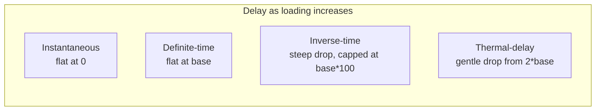

# 05 · Protection Curves

A **protection curve** maps a sustained per-unit loading to a trip *delay* in seconds. It is the timing law behind a relay's `'timed'` trip. Curves are a **plug-in strategy**: a relay names its curve in `RelayConfig.curve`, and the relay engine never changes when a curve is added.

## The `ProtectionCurve` contract

```ts
interface ProtectionCurve {
  type: ProtectionCurveType;                        // registry key
  tripDelayS(loading: number, config: RelayConfig): number;  // delay for a sustained loading
}
```

`ProtectionCurveType` is one of `'instantaneous'`, `'definite-time'`, `'inverse-time'`, `'thermal-delay'`.

## The four curves

All formulas use `pickup = config.pickupThreshold` and `base = config.tripDelayS`. Two guard constants shape the edges:

- `MAX_INVERSE_MULTIPLE = 100` — a delay cap so a loading barely above pickup yields a finite (very long) delay.
- `MIN_RATIO = 1e-6` — a floor on the loading ratio to avoid division by zero.

| Curve | `ProtectionCurveType` | `tripDelayS(loading, config)` | Behaviour |
| --- | --- | --- | --- |
| Instantaneous | `'instantaneous'` | `0` | trips with no delay |
| Definite-time | `'definite-time'` | `config.tripDelayS` | fixed delay, **loading-independent** |
| Inverse-time | `'inverse-time'` | see below | **faster as loading rises**; capped |
| Thermal-delay | `'thermal-delay'` | `(base · 2) / max(loading/pickup, 1e-6)` | inverse in loading, gentler slope |

### Inverse-time, precisely

```
ratio = loading / pickup
if ratio <= 1:  delay = base · 100                       (capped floor case)
else:           delay = min( base / (ratio − 1), base · 100 )
```

The `base / (ratio − 1)` shape is the classic inverse characteristic: the further above pickup, the shorter the delay. The `× 100` cap keeps a near-pickup loading from producing an infinite delay.

### Thermal-delay, precisely

```
ratio = max(loading / pickup, 1e-6)
delay = (base · 2) / ratio
```

Also inverse in loading but with a shallower slope and no `(ratio − 1)` singularity — it starts from `2 · base` at pickup and falls off smoothly.

## Delay-vs-loading comparison

Using `DEFAULT_RELAY_CONFIG` (`pickupThreshold = 1.0`, `tripDelayS = 2`), the trip delay each curve returns:

| Loading (pu) | Instantaneous | Definite-time | Inverse-time | Thermal-delay |
| --- | --- | --- | --- | --- |
| 1.00 | 0 s | 2 s | 200 s *(cap)* | 4.00 s |
| 1.10 | 0 s | 2 s | 20.0 s | 3.64 s |
| 1.25 | 0 s | 2 s | 8.00 s | 3.20 s |
| 1.50 | 0 s | 2 s | 4.00 s | 2.67 s |
| 2.00 | 0 s | 2 s | 2.00 s | 2.00 s |
| 3.00 | 0 s | 2 s | 1.00 s | 1.33 s |
| 5.00 | 0 s | 2 s | 0.50 s | 0.80 s |



Reading the table: at exactly pickup, inverse-time is essentially disabled (200 s cap) while definite-time still trips in 2 s; as overload grows, inverse-time overtakes and becomes the fastest of the delayed curves. This is what gives a network its natural **selectivity** — heavily overloaded lines trip sooner (see [06 · Coordination](./06-coordination.md)).

## The plug-in registry

```ts
const PROTECTION_CURVES: Record<ProtectionCurveType, ProtectionCurve> = {
  [ProtectionCurveType.Instantaneous]: instantaneous,
  [ProtectionCurveType.DefiniteTime]:  definiteTime,
  [ProtectionCurveType.InverseTime]:   inverseTime,
  [ProtectionCurveType.ThermalDelay]:  thermalDelay,
};

function getProtectionCurve(type: ProtectionCurveType): ProtectionCurve {
  return PROTECTION_CURVES[type];
}
```

The relay resolves its curve at timing time with `getProtectionCurve(config.curve).tripDelayS(loading, config)`. Because selection is a registry lookup keyed by `RelayConfig.curve`, a **new curve registers without any engine change** — you add a `ProtectionCurve` object and a `ProtectionCurveType` key, and every relay can select it immediately. See [09 · Extension Guide](./09-extension-guide.md#adding-a-protection-curve) for the step-by-step.
