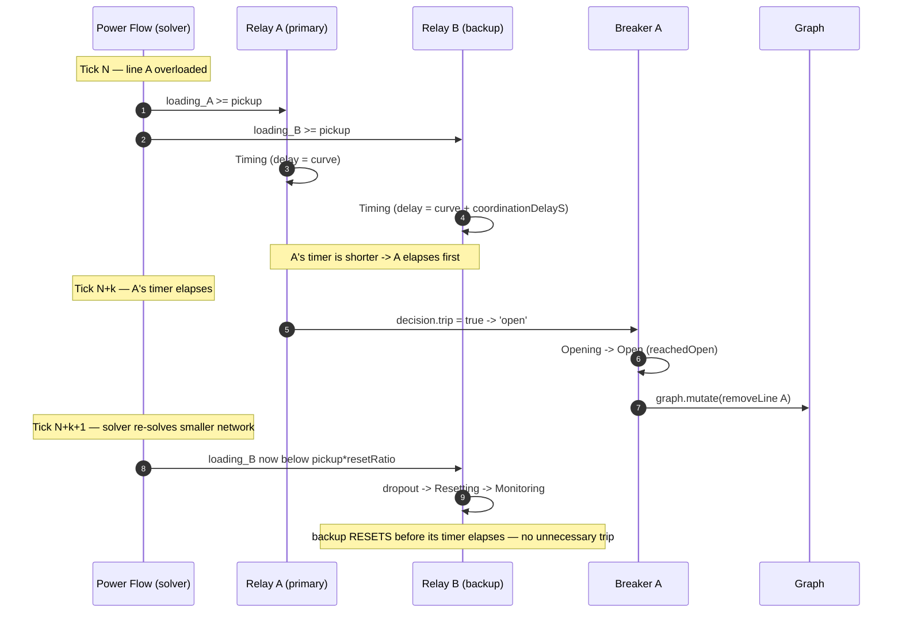

# 06 · Coordination

Real protection schemes are **selective**: when a line is overloaded, the relay closest to the problem trips first, and backup relays only act if the primary fails. GridGuard achieves this with two mechanisms working together — an explicit **coordination delay** on backup relays, and **emergent selectivity** that falls out of the tick-by-tick pipeline.

## Roles and the coordination delay

Every relay has a `role` of `'primary'` or `'backup'`, and a `coordinationDelayS`. The backup delay is added to the curve delay when the relay times a trip:

```
requiredDelayS = getProtectionCurve(config.curve).tripDelayS(loading, config)
               + (config.role === 'backup' ? config.coordinationDelayS : 0)
```

| Role | Extra delay applied | Intent |
| --- | --- | --- |
| `'primary'` | none | trips first for a fault in its own zone |
| `'backup'` | `+ coordinationDelayS` (default `0.5 s`) | waits longer, so the primary clears the fault first |

The coordination delay guarantees a **time margin**: for the same loading the backup's timer is always longer than the primary's, so the primary reaches its trip threshold first.

## Emergent selectivity across ticks

The coordination delay is only half the story. The pipeline's structure means a primary trip *changes the network* before the backup's timer expires — so the backup usually never needs to trip at all.

Consider an overloaded line **A** with a primary relay, and an adjacent line **B** whose backup relay also sees the overload:



The chain that produces selectivity without any central orchestration:

1. **Both relays pick up** and start timing, but the backup's `requiredDelayS` is longer by `coordinationDelayS`.
2. **The primary's timer elapses first**, it trips, and its breaker opens.
3. **The engine removes line A** in one graph transaction.
4. **Next tick's power flow re-solves** the smaller/split network; the overload on B is relieved.
5. **B's loading falls below `pickupThreshold · resetRatio`** → B drops out → `Resetting` → `Monitoring`, resetting *before* its longer timer would have elapsed.

The result: **no simultaneous unnecessary trips.** The backup only completes its trip if the primary fails to clear the overload in time (the primary trips, but B is still overloaded because the fault is elsewhere), which is exactly the backup's job.

## Why this needs both mechanisms

| Mechanism | Alone it gives… | Missing without the other |
| --- | --- | --- |
| Coordination delay | a guaranteed time margin (primary elapses first) | but by itself would still let both trip if the overload persisted |
| Cross-tick removal + re-solve | relief of the overload after the primary clears | but without the delay the backup might trip in the *same* window before relief arrives |

Together they produce time-graded, self-correcting selectivity that is **emergent** — a property of the deterministic pipeline (power flow → protection → one transaction → next power flow), not of any cascade controller. Phase 5 has no cascade orchestrator; see [09 · Extension Guide](./09-extension-guide.md) for how Phase 6 builds on this.
