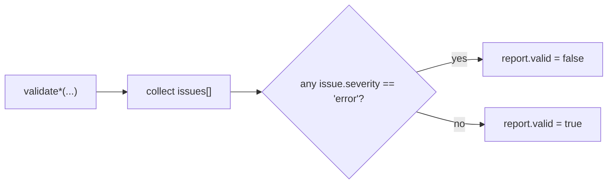

# 08 · Validation

Validation is **fail-loud**: it reports every problem it finds and **never repairs**. A misconfigured relay/thermal/breaker, or a physically impossible live state, is surfaced before it can silently corrupt a run. There are two entry points — one for configuration, one for live engine state.

## Report shape

```ts
type ProtectionIssueSeverity = 'error' | 'warning';

interface ProtectionValidationIssue {
  code: string;
  severity: ProtectionIssueSeverity;
  message: string;
  ref?: string;   // e.g. relay id or line id
}

interface ProtectionValidationReport {
  valid: boolean;                       // true only if NO issue has severity 'error'
  issues: ProtectionValidationIssue[];
}
```

`valid` is `true` only when **every** issue is below `'error'` severity. All issues emitted by the current checks are `'error'`.

## Config validation — `validateProtectionConfig(relay, thermal, breaker)`

| Code | Checked condition (failure ⇒ issue) | Meaning |
| --- | --- | --- |
| `INVALID_THRESHOLD` | `warning ≤ pickup ≤ trip ≤ emergency` must hold | relay thresholds out of order |
| `INVALID_THRESHOLD` | `instantaneousThreshold ≥ pickupThreshold` | instant trip below pickup makes no sense |
| `INVALID_CONFIG` | `resetRatio ∈ (0, 1]` | dropout fraction out of range |
| `IMPOSSIBLE_TIMING` | `tripDelayS`, `resetDelayS`, `coordinationDelayS` all `≥ 0` | negative relay delay |
| `IMPOSSIBLE_TIMING` | `timeConstantS > 0` | non-positive thermal time constant |
| `INVALID_CONFIG` | `ratedRiseC ≥ 0` | negative rated temperature rise |
| `INVALID_THRESHOLD` | `warningC < maxSafeC` | thermal warning not below max-safe |
| `INVALID_THRESHOLD` | `maxSafeC > ambientC` | max-safe not above ambient |
| `NEGATIVE_TEMPERATURE` | `ambientC ≥ −273.15` | ambient below absolute zero |
| `IMPOSSIBLE_TIMING` | `operateTicks ≥ 0` | negative breaker operate time |

All are severity `'error'`, so any single failure makes the report `invalid`.

## State validation — `validateProtectionState(engine)`

Runs over a live `ProtectionEngine`, cross-checking relays, breakers, and thermal values.

| Code | Checked condition (failure ⇒ issue) | `ref` | Meaning |
| --- | --- | --- | --- |
| `MISSING_BREAKER` | every relay's line has a breaker (`breakerFor` defined) | relay id | relay with no breaker to command |
| `INVALID_CONFIG` | thermal `temperatureC` is not `NaN` | line id | temperature became `NaN` |
| `NEGATIVE_TEMPERATURE` | `temperatureC ≥ −273.15` | line id | temperature below absolute zero |
| `THERMAL_OVERFLOW` | `temperatureC ≤ 10000` | line id | runaway/overflowed temperature (> 10000 °C) |

The thermal checks are mutually exclusive per line (`NaN` → else `< −273.15` → else `> 10000`), each severity `'error'`.

## Severity model



## Fail-loud philosophy

- **Never repairs.** Validation only *reports*; it does not clamp, default, or fix values. The caller decides what to do.
- **Reports everything.** Both functions accumulate *all* issues rather than throwing on the first, so one pass surfaces the complete picture.
- **Catches the impossible early.** Config checks stop bad thresholds/timings before a run starts; state checks catch `NaN`/overflow/absolute-zero violations that indicate a numerical or wiring bug while it runs.
- **Physical sanity, not policy.** The bounds encode physics and internal consistency (absolute zero, ordering, non-negative timing), not tuning preferences — a valid config can still be operationally aggressive.
