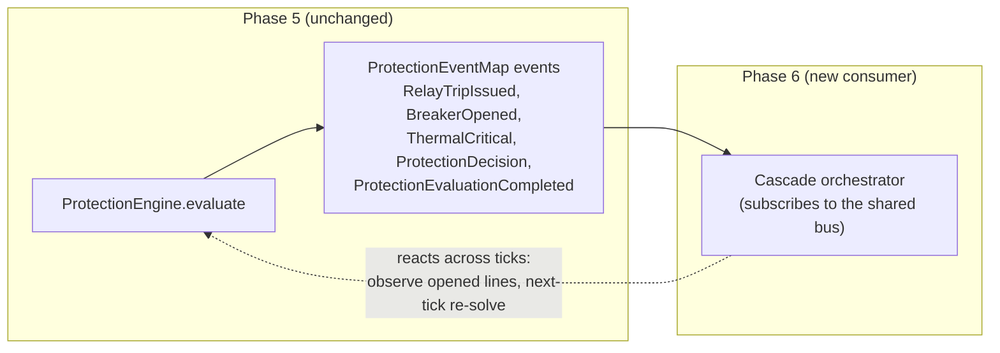

# 09 · Extension Guide

The protection layer is built to grow **without touching the frozen substrate** — the `ElectricalGraph`, the DC solver, and the simulation kernel all stay closed for modification. This guide covers the three extensions you are most likely to make: adding a curve, wiring protection into the kernel tick as a `SimulationSystem`, and feeding a cascade engine in Phase 6.

## Adding a protection curve

Curves are a plug-in strategy keyed by `ProtectionCurveType`. A new curve is a data change plus a registry entry — the relay engine never changes.

1. **Add a type key** in `config.ts`:

   ```ts
   export const ProtectionCurveType = {
     Instantaneous: 'instantaneous',
     DefiniteTime:  'definite-time',
     InverseTime:   'inverse-time',
     ThermalDelay:  'thermal-delay',
     VeryInverse:   'very-inverse', // new
   } as const;
   ```

2. **Implement the `ProtectionCurve`** in `curves.ts`:

   ```ts
   const veryInverse: ProtectionCurve = {
     type: ProtectionCurveType.VeryInverse,
     tripDelayS: (loading, config) => {
       const ratio = loading / config.pickupThreshold;
       if (ratio <= 1) return config.tripDelayS * 100;
       return Math.min(config.tripDelayS / ((ratio - 1) * (ratio - 1)), config.tripDelayS * 100);
     },
   };
   ```

3. **Register it** in `PROTECTION_CURVES`:

   ```ts
   export const PROTECTION_CURVES: Record<ProtectionCurveType, ProtectionCurve> = {
     // ...existing curves...
     [ProtectionCurveType.VeryInverse]: veryInverse,
   };
   ```

Any relay can now select it via `RelayConfig.curve`. `stepRelay` resolves it through `getProtectionCurve(config.curve)` — no relay, engine, or kernel change required. See [05 · Protection Curves](./05-protection-curves.md).

## Wiring protection into the kernel tick as a `SimulationSystem`

In Phase 5 the engine is registered at composition but **unwired from the domain event bus**. To run it every tick, wrap it in a `SimulationSystem` that produces the loadings, calls `evaluate`, and re-emits protection events onto the shared bus. The kernel itself is not edited — you register the system before boot.

```ts
import type { SimulationSystem, SystemContext, TickContext } from '@core';
import type { SystemId } from '@app-types';
import { createProtectionEngine, PROTECTION_ENGINE } from '@engine/protection';

class ProtectionSystem implements SimulationSystem<GridEventMap> {
  readonly id = 'protection' as SystemId;
  // Run AFTER the power-flow system so loadings are current this tick.
  readonly dependencies = ['power-flow'] as const;

  private ctx!: SystemContext<GridEventMap>;
  private engine = createProtectionEngine(/* { events, relayConfig, ... } */);

  init(ctx: SystemContext<GridEventMap>): void {
    this.ctx = ctx;
    this.engine.register(/* graph */);
  }

  step(tick: TickContext): void {
    // 1. read the latest power-flow result (loadings) — never solve here
    const flows = /* result.flows: { line, loading }[] */;
    // 2. evaluate; the engine advances thermal -> relay -> breaker and
    //    issues at most one graph.mutate for fully-opened breakers
    const cycle = this.engine.evaluate({ graph, flows, tick: tick.tick, timestepS: tick.dt });
    // 3. surface results as domain facts (ids + scalars) for consumers
    //    (the engine also emits its own events if given an event bus)
  }

  reset(): void { /* recreate engine / clear state */ }
  dispose(): void { /* release */ }
}
```

Ordering rules that keep the per-tick pipeline intact:

| Requirement | How |
| --- | --- |
| Protection sees *this tick's* loadings | declare `dependencies` on the power-flow system so it runs first |
| Solver sees the removed lines *next tick* | the engine's single `graph.mutate` runs inside `evaluate`; the next tick's power-flow system re-solves the changed graph |
| Determinism preserved | `evaluate` iterates `graph.lines()` in id order and uses only pure step functions |

The engine already accepts a `TypedEventBus<ProtectionEventMap>` via `createProtectionEngine({ events })`; passing the shared bus is what "wires events onto the shared bus." Resolve the engine through the `PROTECTION_ENGINE` DI token rather than constructing a second instance.

## Feeding a cascade engine in Phase 6

Phase 5 intentionally has **no** cascade orchestration, load shedding, or restoration — selectivity is emergent across ticks (see [06 · Coordination](./06-coordination.md)). Phase 6 wires protection events onto the shared bus and adds cascade orchestration *on top*, still without editing the graph, solver, or kernel.



The seam for Phase 6:

- **Consume, don't reach in.** The cascade engine subscribes to `ProtectionEvaluationCompleted` (with `{ tick, relaysEvaluated, trips, opened }`) and the individual relay/breaker/thermal events — it does not call protection internals.
- **Let the pipeline drive.** A trip removes a line via the existing one transaction; the next tick's power flow re-solves the smaller/split network, and *that* is what can cascade. The cascade engine watches this unfold rather than forcing simultaneous changes.
- **New behaviour is additive.** Load shedding, generator dispatch, restoration, and crisis scenarios (all currently deferred) arrive as *new systems/consumers*, leaving Phase 5's observe-never-compute contract intact.

## The invariants any extension must preserve

| Invariant | Why it must hold |
| --- | --- |
| Protection **observes** loadings, never computes power flow | keeps the solver the single source of electrical truth |
| Topology changes **only** through `graph.mutate` transactions | the graph stays the single write path; no entity self-mutates |
| At most **one** transaction per evaluation, after the per-line loop | no instant chain reactions; changes span ticks |
| State is **immutable**, step functions are **pure** | determinism and replayability |
| `graph`, DC solver, and kernel stay **unedited** | extensions compose; the substrate stays frozen |
