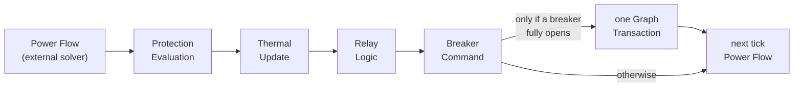

# GridGuard — Phase 5 Protection System

The protection layer models the **relays, circuit breakers, and thermal behaviour** of a transmission network. It sits *on top of* the frozen graph engine and DC power-flow solver and gives the simulation the ability to detect overloads, run protection timing, and trip lines out of service — the way real protective relaying does.

## The one principle that governs everything

> **Protection observes, never computes. It changes topology only through controlled graph transactions.**

Concretely:

- The protection layer **observes** power-flow loadings (`result.flows` → `{ line, loading }`). It **never** runs power flow itself.
- The only way it changes the network is through a single controlled graph transaction — `graph.mutate(tx => tx.removeLine(...))` — and that happens **only when a breaker fully opens**.
- There is **no** cascade orchestration, load shedding, generator dispatch, or restoration in this layer. Those are deferred to later phases.
- The whole layer compiles standalone (`typecheck:engine`) and is built from **immutable state + pure step functions** — the same input always produces the same output.

## The per-tick pipeline

Everything the protection layer does is a fixed, ordered pipeline. Nothing happens instantly across the whole grid in one tick — a fault detected on one tick becomes a topology change that the *next* tick's power flow sees.

| Stage | Who runs it | What it does |
| --- | --- | --- |
| Power Flow | external DC solver | produces per-line loadings; protection only *reads* the result |
| Protection Evaluation | `ProtectionEngine.evaluate` | drives thermal → relay → breaker for every line in id order |
| Thermal Update | `stepThermal` | advances the RC line-temperature model one tick |
| Relay Logic | `stepRelay` | decides whether to trip and why |
| Breaker Command | `stepBreaker` | executes `open`/`none`; reports when it reaches Open |
| Graph Transaction | `graph.mutate` | removes every fully-opened line — **once**, after the loop |

Because changes span ticks, there are **no instant chain reactions**. A trip on tick *N* removes a line; the solver re-solves the smaller (or split) network on tick *N+1*, and only then can the protection layer react to the new loadings.

## Document index

| # | Document | Covers |
| --- | --- | --- |
| — | [README](./README.md) | principle + pipeline (this page) |
| 01 | [Protection Architecture](./01-protection-architecture.md) | layered design, pipeline internals, relay-decides / breaker-switches split |
| 02 | [Relay Lifecycle](./02-relay-lifecycle.md) | `RelayPhase` state machine, transitions, trip reasons |
| 03 | [Breaker Lifecycle](./03-breaker-lifecycle.md) | `BreakerPhase` state machine, command execution, operate time |
| 04 | [Thermal Physics](./04-thermal-physics.md) | first-order RC model, steady-state curve, worked heating example |
| 05 | [Protection Curves](./05-protection-curves.md) | the four trip-delay curves, comparison table, plug-in registry |
| 06 | [Coordination](./06-coordination.md) | primary/backup, coordination delay, emergent selectivity |
| 07 | [Configuration](./07-configuration.md) | `RelayConfig` / `ThermalConfig` / `BreakerConfig` fields + defaults |
| 08 | [Validation](./08-validation.md) | config + state checks, codes, fail-loud philosophy |
| 09 | [Extension Guide](./09-extension-guide.md) | adding a curve, wiring as a `SimulationSystem`, feeding cascade in Phase 6 |

## Where it fits

- **Below it:** the frozen `ElectricalGraph` and the DC solver. Protection never edits either — it reads flows and issues one transaction.
- **At composition:** the Phase-1 protection *placeholder* was removed; composition now registers the real `PROTECTION_ENGINE`, currently **unwired from the domain event bus**.
- **Above it (Phase 6):** wires protection events onto the shared bus and orchestrates cascading failure. See the [Extension Guide](./09-extension-guide.md).

## Scope

**Implemented in Phase 5:** thermal model, protection curves, relay state machine, breaker state machine, the protection engine, configuration, validation, diagnostics. **199 tests total (38 new).**

**Deferred (not implemented):** cascading-failure engine, load shedding, generator dispatch, restoration, black-start, crisis scenarios.
